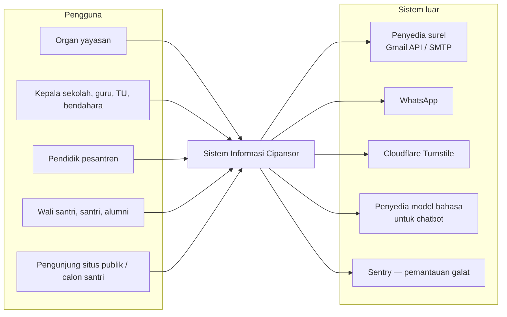
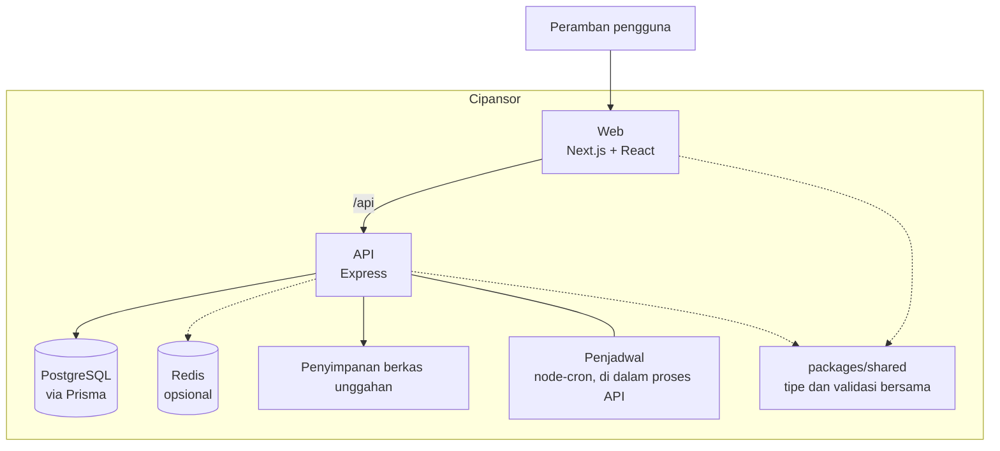
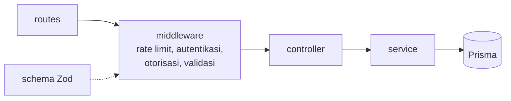
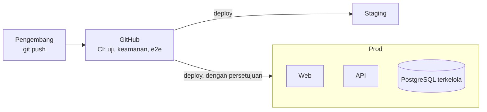
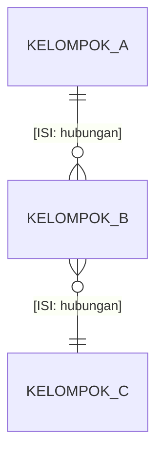

<!--
TEMPLAT DOKUMEN TEKNIS — Sistem Informasi Cipansor (kerangka arc42).
Salin ke folder kerja, lalu isi tiap [ISI: …] dari sumber yang disebut di
references/dokumen-teknis.md. Hapus komentar HTML ini. Jangan biarkan [ISI]
tersisa pada dokumen final. Judul dokumen, versi, dan sampul diberikan lewat
opsi build_docs.py — jangan diulang di sini.
Diagram di bawah adalah RANGKA yang diverifikasi terhadap kode pada 2026-09-28;
periksa lagi terhadap commit yang sedang dikerjakan sebelum dipercaya.
-->

# Riwayat Revisi

| Versi | Tanggal | Basis kode | Perubahan | Penyusun |
|---|---|---|---|---|
| [ISI: 0.1] | [ISI: tanggal] | commit [ISI: hash] | Penyusunan awal | [ISI: nama] |

> **Catatan.** Angka dalam dokumen ini dihitung dari kode pada commit yang tertera dan akan bergeser
> seiring pengembangan. Dokumen diperbarui dengan menjalankan ulang pengukuran, bukan dengan menyunting angka.

# Ringkasan Eksekutif

[ISI: satu halaman untuk pengurus/donor, tanpa jargon — apa itu Cipansor, siapa memakainya,
apa yang sudah berjalan di produksi, apa yang masih di staging atau cabang, dan seberapa sehat
pemeliharaannya. Sumber: README.md, progress.md, facts.md.]

# 1. Pendahuluan dan Tujuan

## 1.1 Tujuan sistem

[ISI: 2–4 kalimat.]

## 1.2 Pemangku kepentingan dan pengguna

| Kelompok | Unit / lingkup | Kepentingan utama |
|---|---|---|
| [ISI: organ yayasan] | Seluruh yayasan | [ISI] |
| [ISI: kepala sekolah, guru, TU, bendahara] | Per unit | [ISI] |
| [ISI: pendidik pesantren] | Pesantren | [ISI] |
| [ISI: wali santri, santri, alumni, komite] | Data sendiri / terbatas | [ISI] |

## 1.3 Tujuan mutu utama

[ISI: 3–5 tujuan mutu, urutkan menurut kepentingan. Contoh bentuk: "Data santri tidak bocor lintas unit".]

# 2. Batasan

| Jenis | Batasan | Sumber |
|---|---|---|
| Teknis | [ISI: stack dan versi dari facts.md] | package.json |
| Organisasi | [ISI: tim kecil; tools hibah nonprofit; repo publik sampai rilis] | AGENTS.md |
| Hukum | [ISI: hanya yang tercatat di repo — UU Yayasan, UU PDP, PP 71/2019 untuk TTE] | decisions/, tata-kelola-yayasan |
| Konvensi | [ISI: istilah (santri), ejaan yayasan, portal berbahasa Indonesia] | istilah-dan-penamaan.md |

# 3. Konteks dan Lingkup

[ISI: satu kalimat — apa yang harus dilihat pembaca dari diagram ini.]

## 3.1 Di luar lingkup

[ISI: yang sengaja tidak dilakukan sistem — dari roadmap.md dan decisions/.]

# 4. Strategi Solusi

| Tujuan / masalah | Pendekatan | Keputusan terkait |
|---|---|---|
| [ISI: satu baris per keputusan besar — monorepo dan modul per ranah; web dan API terpisah; satu basis data; tipe dan validasi bersama; RBAC dua lapis; pengujian berlapis] | [ISI] | [ISI: tautan ke bab 9] |

# 5. Tampak Blok Bangunan

## 5.1 Tingkat 1 — Kontainer

[ISI: verifikasi terhadap kode — mis. bagaimana web memanggil API di produksi (asal yang sama) dan
apa yang dipakai Redis (mis. realtime). Sumber: app.ts, lib/redis.ts, lib/realtime.ts, main.ts.]

## 5.2 Tingkat 2 — Lapisan modul API

[ISI: jelaskan aturan lapisan dari apps/api/AGENTS.md dan **jarak antara aturan dan kenyataan**
(jumlah modul yang memanggil Prisma dari route/controller — dari facts.md).]

## 5.3 Modul menurut ranah

| Ranah | Contoh modul | Catatan |
|---|---|---|
| [ISI: kelompokkan modul dari facts.md — Akademik, Kesantrian, Keuangan, Persuratan, Tata Kelola, Situs publik, …] | [ISI] | [ISI] |

Katalog lengkap ada di Lampiran A.

# 6. Tampak Runtime

[ISI: 4–6 skenario, tiap skenario: satu diagram urutan (Mermaid `sequenceDiagram`) dan satu paragraf.
**Baca kodenya** untuk tiap alur; sebutkan berkas rujukan di Lampiran E.]

## 6.1 Masuk, verifikasi dua langkah, dan penyegaran sesi

[ISI]

## 6.2 Perjalanan satu permintaan API

[ISI]

## 6.3 Persetujuan dokumen yayasan (RPJP → Renstra → RKA)

[ISI]

## 6.4 Persuratan dan verifikasi naskah

[ISI]

## 6.5 Pendaftaran santri baru (SPMB) publik

[ISI]

## 6.6 Pekerjaan terjadwal

[ISI: daftar pekerjaan dari facts.md dan apa yang dilakukan masing-masing dalam satu baris.]

# 7. Tampak Penempatan

[ISI: verifikasi dengan docs/deploy-azure.md dan .github/workflows/. Sebut **jenis** layanan, bukan nama sumber daya.]

## 7.1 Variabel lingkungan

Nama dan fungsi saja; nilai tidak pernah ditulis. Lihat Lampiran C.

# 8. Konsep Lintas-Bidang

[ISI: satu subbagian pendek per konsep — autentikasi dan sesi; otorisasi (bucket + kode peran + lingkup unit);
validasi; amplop respons; penanganan galat; data pribadi; bahasa (i18n); migrasi basis data; pengujian;
pekerjaan terjadwal. Sumber: panduan-peran, lessons/, middleware/, prisma/.]

# 9. Keputusan Arsitektur

| Keputusan | Ringkasan | Berkas |
|---|---|---|
| [ISI: salin dari facts.md → "Keputusan tercatat"; kelompokkan menurut tema] | [ISI] | [ISI] |

# 10. Persyaratan Kualitas

| Mutu | Skenario | Bukti | Status |
|---|---|---|---|
| Keamanan | [ISI] | [ISI: uji, CI, kebijakan — atau "belum terbukti"] | [ISI] |
| Ketersediaan dan pemulihan | [ISI] | [ISI] | [ISI] |
| Kinerja | [ISI] | [ISI] | [ISI] |
| Keterpeliharaan | [ISI] | [ISI] | [ISI] |
| Kemudahan pakai | [ISI] | [ISI] | [ISI] |

# 11. Risiko dan Utang Teknis

> **Catatan.** Bab ini merangkum kategori dan tingkat dampak. Butir keamanan yang masih terbuka di
> produksi tidak diuraikan dalam dokumen ini dan dilacak secara internal.

| Kategori | Ringkasan | Dampak | Arah penanganan |
|---|---|---|---|
| [ISI: dari known-issues.md dan roadmap.md] | [ISI] | [ISI] | [ISI] |

# 12. Glosarium

| Istilah | Arti |
|---|---|
| [ISI: istilah pesantren dan teknis yang dipakai dokumen ini] | [ISI] |

# Lampiran A — Katalog Modul API

[ISI: tabel dari facts.md — modul, ranah, jumlah rute, anotasi Swagger. Sebut commit dan tanggal ukur.]

# Lampiran B — Model Data Tingkat Ranah

[ISI: 6–12 entitas *kelompok* (bukan ratusan model) dan hubungan utamanya. Ganti dua baris contoh di bawah.
Sumber: apps/api/prisma/schema.prisma.]

# Lampiran C — Variabel Lingkungan

| Kelompok | Nama | Fungsi |
|---|---|---|
| [ISI: dari facts.md → env; nama dan fungsi, tanpa nilai] | | |

# Lampiran D — Prosedur Operasional

[ISI: ringkas — membangun, menjalankan, migrasi basis data, cadangan, pemulihan; tautkan docs/DEPLOYMENT.md
dan docs/deploy-azure.md untuk rincian. Jangan menyalin.]

# Lampiran E — Sumber dan Basis Pengukuran

| Hal | Sumber |
|---|---|
| Commit dan tanggal ukur | [ISI: dari facts.md] |
| Berkas yang dibaca untuk bab 6 | [ISI: daftar berkas per skenario] |
