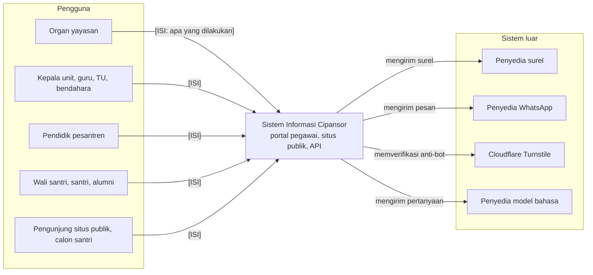
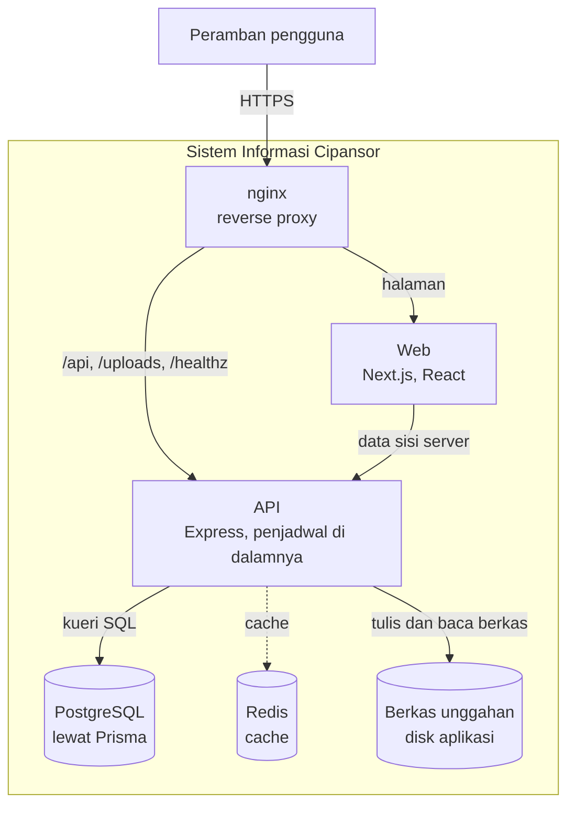
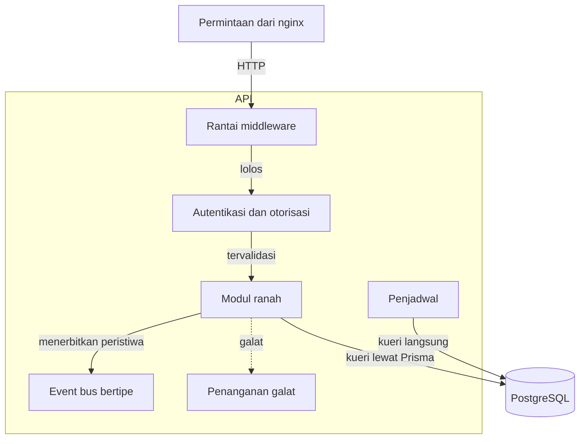
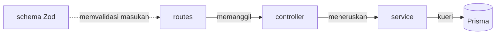
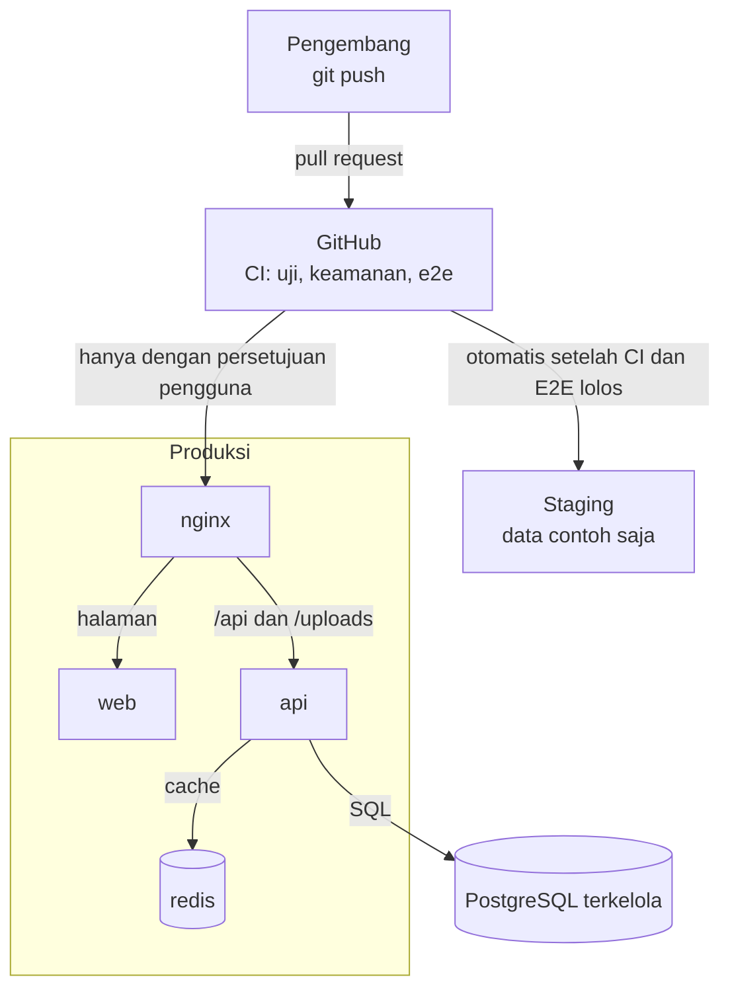
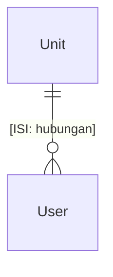

<!--
TEMPLAT DOKUMEN TEKNIS — Sistem Informasi Cipansor (kerangka arc42 + C4).

CARA PAKAI
1. Salin ke folder kerja. Pecah per bab bila nyaman (naskah/00-….md, 01-….md), gabungkan dengan `cat`.
2. Isi tiap [ISI: …] dari sumber yang disebut di komentar bab. Hapus komentar HTML ini dan komentar bab.
3. Setelah TIAP bab selesai: `python scripts/check_docs.py naskah.md --kind teknis --repo <repo> --facts facts.json`.
   Perbaiki semua ERROR sebelum mulai bab berikutnya.
4. Judul dokumen, versi, dan sampul diberikan lewat opsi build_docs.py — jangan diulang di sini.

DIAGRAM DI TEMPLAT INI adalah rangka yang cocok dengan kode pada 2026-09-29. Bacalah kode lagi untuk
commit yang sedang dikerjakan; nama, alamat, dan hubungan yang tidak lagi cocok harus diganti. Aturan
yang tidak boleh dilanggar: setiap panah diberi label; id simpul tidak boleh sama dengan id subgraph;
titik koma tidak boleh ada di teks sequenceDiagram; keterangan `%% caption:` di baris pertama.
-->

# Riwayat Revisi

| Versi | Tanggal | Basis kode | Perubahan | Penyusun |
|---|---|---|---|---|
| [ISI: 0.1] | [ISI: tanggal] | commit [ISI: hash] | Penyusunan awal | [ISI: nama] |

> **Catatan.** Angka dalam dokumen ini dihitung dari kode pada commit yang tertera dan akan bergeser
> seiring pengembangan. Dokumen diperbarui dengan menjalankan ulang pengukuran, bukan dengan menyunting angka.

# Ringkasan Eksekutif

<!--
WAJIB: ≤ 1 halaman, tanpa jargon; empat paragraf dengan pembuka tebal —
  (1) apa itu Cipansor dan siapa memakainya,
  (2) angka kunci (modul, model, peran, halaman) dengan commit,
  (3) **Yang sudah berjalan.** produksi/staging, per KEMAMPUAN,
  (4) **Yang perlu diketahui pembaca.** utang teknis dalam kategori, tanpa merinci kelemahan terbuka.
Sumber: README.md, progress.md, facts.md. Jangan menyebut perbaikan atau nomor PR yang belum di produksi.
-->

[ISI]

# 1. Pendahuluan dan Tujuan

<!-- WAJIB: 1.1 Tujuan sistem (2–4 kalimat) · 1.2 tabel pemangku kepentingan · 1.3 tujuan mutu (3–5, berurutan) · 1.4 Cara membaca dokumen ini (angka, status, sumber, hal sensitif). -->

## 1.1 Tujuan sistem

[ISI: 2–4 kalimat.]

## 1.2 Pemangku kepentingan dan pengguna

| Kelompok | Unit / lingkup | Kepentingan utama |
|---|---|---|
| [ISI: organ yayasan] | Seluruh yayasan | [ISI] |
| [ISI: kepala sekolah, guru, TU, bendahara] | Per unit | [ISI] |
| [ISI: pendidik pesantren] | Pesantren | [ISI] |
| [ISI: wali santri, santri, alumni, komite] | Data sendiri / terbatas | [ISI] |
| [ISI: pengunjung situs publik] | Umum | [ISI] |

## 1.3 Tujuan mutu utama

[ISI: 3–5 tujuan mutu, urutkan menurut kepentingan. Bentuk: "**Data santri tidak bocor lintas unit.** Alasan satu kalimat."]

## 1.4 Cara membaca dokumen ini

[ISI: tiga butir — angka selalu disertai commit; status kemampuan (di cabang / di main / di staging / di produksi); hal sensitif hanya dilaporkan sebagai kategori.]

# 2. Batasan

<!-- WAJIB: tabel Jenis | Batasan | Sumber dengan baris Teknis, Organisasi, Hukum (hanya yang tercatat di repo), Konvensi, Operasional. -->

| Jenis | Batasan | Sumber |
|---|---|---|
| Teknis | [ISI: stack dan versi dari facts.md] | package.json |
| Organisasi | [ISI: tim kecil; perkakas hibah; repositori publik sampai rilis] | AGENTS.md |
| Hukum | [ISI: hanya yang tercatat di repo] | decisions/ |
| Konvensi | [ISI: istilah santri, ejaan yayasan, portal Indonesia, situs publik tiga bahasa] | istilah-dan-penamaan.md |
| Operasional | [ISI: mis. penjadwal tanpa kunci → satu instans API] | docs/deploy-azure.md |

# 3. Konteks dan Lingkup

<!-- WAJIB: diagram C4-1 (keterangan diawali "C4-1"), satu kalimat "apa yang harus dilihat", subbab 3.1 Di luar lingkup. Sistem luar = hanya yang NYATA dipanggil kode (cek prefiks env di facts.md). -->

[ISI: satu kalimat — apa yang harus dilihat pembaca dari diagram ini.]

## 3.1 Di luar lingkup

[ISI: yang sengaja tidak dilakukan sistem — dari roadmap.md dan decisions/. Setiap butir: apa · mengapa · rujukan.]

# 4. Strategi Solusi

<!-- WAJIB: tabel Tujuan/masalah | Pendekatan | Keputusan terkait; 6–8 baris. -->

| Tujuan / masalah | Pendekatan | Keputusan terkait |
|---|---|---|
| [ISI: monorepo dan modul per ranah] | [ISI] | [ISI: bab atau berkas] |

# 5. Tampak Blok Bangunan

<!-- WAJIB: 5.1 C4-2 Kontainer · 5.2 C4-3 Komponen API + diagram lapisan modul + ukuran tata letak (DUA definisi dari facts.md) · 5.3 tabel modul menurut ranah (SETIAP modul dari facts.md tercantum). -->

## 5.1 Tingkat 1 — Kontainer

[ISI: verifikasi dengan docs/deploy-azure.md dan app.ts. Sebut bahwa packages/shared adalah PUSTAKA (bukan kontainer). Redis/berkas: jelaskan apa yang benar-benar terjadi bila hilang.]

## 5.2 Tingkat 2 — Komponen API dan lapisan modul

[ISI: aturan lapisan dari apps/api/AGENTS.md dan **jarak antara aturan dan kenyataan**. Sebut DUA ukuran dari facts.md
(modul dengan empat berkas; modul dengan lima bagian termasuk index.ts) dan jumlah modul yang memanggil Prisma dari
route/controller. Jangan menulis "tata letak lengkap" tanpa definisi.]

## 5.3 Modul menurut ranah

| Ranah | Contoh modul | Catatan |
|---|---|---|
| [ISI: kelompokkan SEMUA modul dari facts.md — Akademik, Kesantrian, Tahfidz, Keuangan, Persuratan, Tata Kelola, Publik, Platform] | [ISI] | [ISI] |

Katalog lengkap ada di Lampiran A.

# 6. Tampak Runtime

<!--
WAJIB: 4–6 skenario, TIAP skenario = judul + diagram sequenceDiagram + satu paragraf + berkas rujukan di Lampiran E.
Setiap alamat di diagram ditulis lengkap "METODE /api/…" dan HARUS ada di router (check_docs.py memeriksanya).
Cara menemukan alamat yang benar: `grep -n "router\." apps/api/src/modules/<modul>/*.routes.ts`.
JANGAN mengarang langkah. Bila sebuah langkah tidak punya rute (mis. "tandatangani"), cari rutenya, jangan menulis kata kerja bebas.
-->

## 6.1 Masuk, verifikasi dua langkah, dan penyegaran sesi

[ISI: sequenceDiagram + paragraf]

## 6.2 Perjalanan satu permintaan API

[ISI]

## 6.3 Persetujuan dokumen yayasan (RPJP → Renstra → RKA)

[ISI]

## 6.4 Persuratan dan verifikasi naskah

[ISI]

## 6.5 Pendaftaran santri baru (SPMB) publik

[ISI]

## 6.6 Pekerjaan terjadwal

<!-- WAJIB: kalimat "N entri jadwal atas M berkas" (facts.md → jobs), tabel Berkas | Jadwal | Yang dilakukan dari scheduler.ts, dan catatan bagi berkas job yang TIDAK dijadwalkan. -->

[ISI]

# 7. Tampak Penempatan

<!-- WAJIB: diagram penempatan; kalimat rilis tiga tahap; 7.1 variabel lingkungan (jumlah kunci dari facts.md, kelompok, rujuk Lampiran C). Sebut JENIS layanan, bukan nama sumber daya. -->

[ISI: verifikasi dengan docs/deploy-azure.md dan .github/workflows/.]

## 7.1 Variabel lingkungan

Nama dan fungsi saja; nilai tidak pernah ditulis. Lihat Lampiran C.

# 8. Konsep Lintas-Bidang

<!-- WAJIB: satu butir bertebal per konsep — autentikasi dan sesi; otorisasi; validasi; amplop respons; penanganan galat; data pribadi; bahasa; migrasi; pengujian; pekerjaan terjadwal. Tiap butir 2–4 kalimat dan menyebut berkas kodenya. -->

[ISI]

# 9. Keputusan Arsitektur

<!-- WAJIB: TEPAT SATU baris per berkas di .claude/memory/decisions/ (check_docs.py: keputusan-hilang / keputusan-ganda). Ringkasan ≤ 30 kata, bahasa Indonesia, apa yang diputuskan bukan mengapa. -->

| Keputusan | Ringkasan | Berkas |
|---|---|---|
| [ISI] | [ISI] | [ISI: `nama.md`] |

# 10. Persyaratan Kualitas

<!-- WAJIB: kolom PERSIS seperti di bawah. Skenario = pemicu → respons. Ukuran = angka/ambang, atau "belum ditetapkan". Bukti = berkas uji/CI/kebijakan yang nyata. -->

| Mutu | Skenario (pemicu → respons) | Ukuran / ambang | Bukti | Status |
|---|---|---|---|---|
| Keamanan | [ISI] | [ISI] | [ISI] | [ISI: Terbukti / Sebagian / Belum terbukti] |
| Ketersediaan dan pemulihan | [ISI] | [ISI] | [ISI] | [ISI] |
| Kinerja | [ISI] | [ISI: atau "belum ditetapkan"] | [ISI] | [ISI] |
| Keterpeliharaan | [ISI] | [ISI] | [ISI] | [ISI] |
| Kemudahan pakai | [ISI] | [ISI] | [ISI] | [ISI] |

# 11. Risiko dan Utang Teknis

> **Catatan.** Bab ini merangkum kategori dan tingkat dampak. Butir keamanan dan privasi yang masih terbuka di
> produksi tidak diuraikan dalam dokumen ini dan dilacak secara internal.

<!-- Tulis KATEGORI dan DAMPAK. Dilarang: angka rinci tentang kontrol akses, nama kolom/tabel yang bocor, cara memanfaatkan, atau apa yang belum ditambal di produksi. Ragu → jangan tulis, laporkan ke pengguna. -->

| Kategori | Ringkasan | Dampak | Arah penanganan |
|---|---|---|---|
| [ISI: dari known-issues.md dan roadmap.md] | [ISI] | [ISI: Rendah / Sedang / Tinggi] | [ISI] |

# 12. Glosarium

| Istilah | Arti |
|---|---|
| [ISI: istilah pesantren dan teknis yang benar-benar dipakai dokumen ini] | [ISI] |

# Lampiran A — Katalog Modul API

<!-- Tabel dari facts.md; jumlah baris = jumlah modul (check_docs.py: lampiran-a-jumlah). -->

[ISI]

# Lampiran B — Model Data Tingkat Ranah

<!-- Nama entitas = nama MODEL di schema.prisma (PascalCase, tanpa terjemahan). Relasi dibaca dari bidang @relation. check_docs.py: erd-model-fiktif. -->

# Lampiran C — Variabel Lingkungan

| Kelompok | Nama | Fungsi |
|---|---|---|
| [ISI: dari facts.md → env; nama dan fungsi, tanpa nilai] | | |

# Lampiran D — Prosedur Operasional

[ISI: ringkas — membangun, menjalankan, migrasi, cadangan, pemulihan; tautkan docs/DEPLOYMENT.md dan docs/deploy-azure.md. Jangan menyalin.]

# Lampiran E — Sumber dan Basis Pengukuran

| Hal | Sumber |
|---|---|
| Commit dan tanggal ukur | [ISI: dari facts.md] |
| Alamat rute yang disebut | `apps/api/src/modules/*/*.routes.ts` |
| Berkas yang dibaca untuk bab 6 | [ISI: daftar berkas per skenario] |
