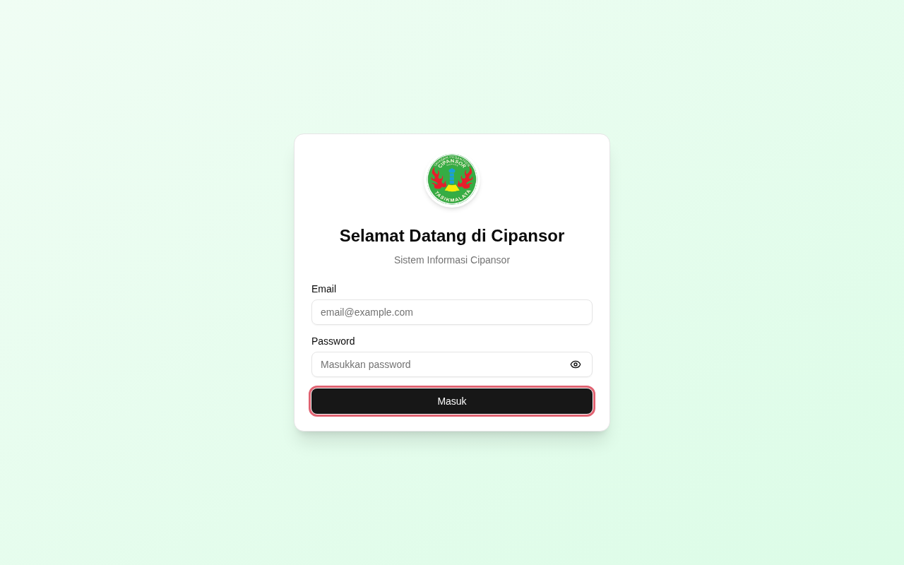
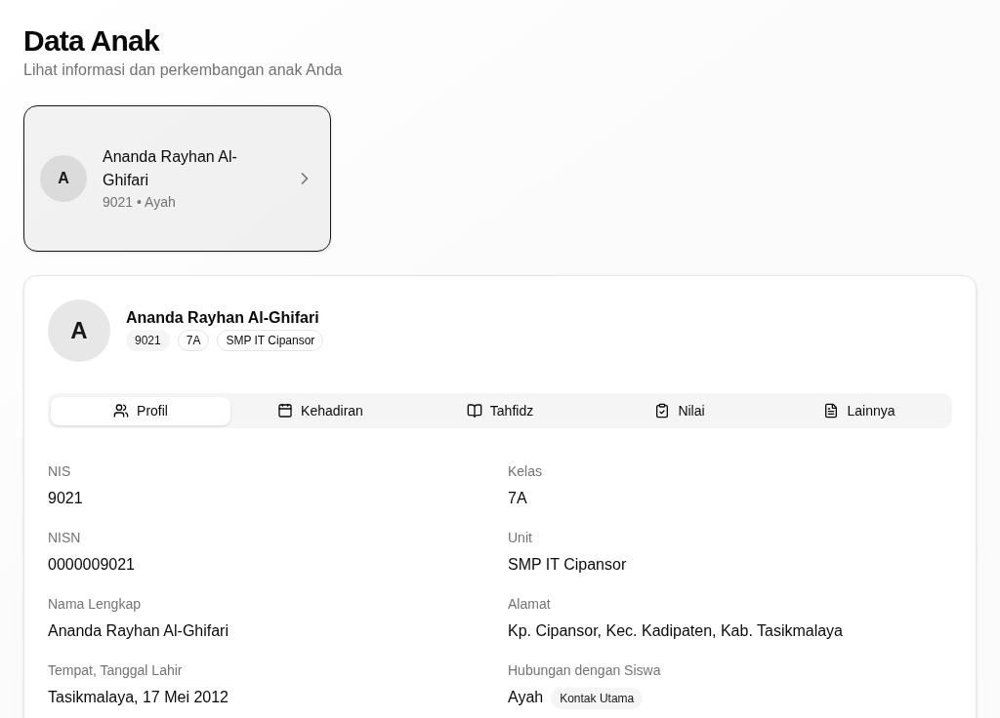
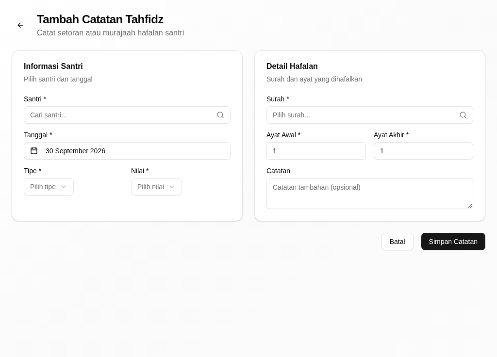
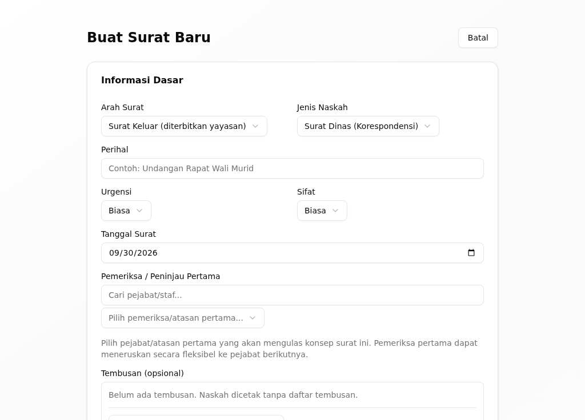

# CIPANSOR

> **Sistem Informasi Cipansor** — satu portal untuk **TK Qur'an, SD IT, SMP IT,
> SMA Qur'an, dan pesantren** (tahfidz, takhosus, asrama) di bawah Yayasan
> Pesantren Cipansor, Tasikmalaya, ditambah situs publik yayasan.

[](https://www.typescriptlang.org/)
[](https://nodejs.org/)
[](https://nextjs.org/)
[](https://react.dev/)
[](https://www.prisma.io/)
[](https://expressjs.com/)
[](https://www.postgresql.org/)
[](LICENSE)

---

## Daftar Isi

- [Ikhtisar](#ikhtisar)
- [Sekilas Tampilan](#sekilas-tampilan)
- [Siapa Memakainya](#siapa-memakainya)
- [Fitur Utama](#fitur-utama)
- [Arsitektur Singkat](#arsitektur-singkat)
- [Angka Proyek](#angka-proyek)
- [Teknologi](#teknologi)
- [Menjalankan Secara Lokal](#menjalankan-secara-lokal)
- [Pengujian dan Gerbang Mutu](#pengujian-dan-gerbang-mutu)
- [QA Visual dan Galeri Tampilan](#qa-visual-dan-galeri-tampilan)
- [Dokumentasi](#dokumentasi)
- [Kontribusi](#kontribusi)
- [Lisensi](#lisensi)

---

## Ikhtisar

Cipansor menyatukan tiga pekerjaan yayasan dalam satu aplikasi:

1. **Akademik sekolah** — santri, rombel, jadwal, absensi harian, penilaian,
   rapor (K13 dan Kurikulum Merdeka), ujian daring, dan bimbingan konseling.
2. **Kepesantrenan** — tahfidz (ziyadah, murojaah, simaan), takhosus, ibadah
   harian, kitab kuning, muhadhoroh, asrama, perizinan santri, serta catatan
   pelanggaran dan penghargaan.
3. **Tata kelola dan administrasi yayasan** — perencanaan (RPJP → Renstra →
   RKA), perjanjian kinerja, keuangan (SPP, tagihan, ZIS/wakaf), kepegawaian,
   sarana, naskah dinas dengan tanda tangan elektronik (E-Office), penjaminan
   mutu, dan penerimaan santri baru (SPMB).

Satu build web melayani **dua host**: situs publik (`cipansor.or.id`, tiga bahasa
— Indonesia, Inggris, Arab) dan portal internal (`portal.cipansor.or.id`, hanya
bahasa Indonesia, bisa dipasang sebagai PWA).

---

## Sekilas Tampilan

|                                                                                         |                                                                                          |
| --------------------------------------------------------------------------------------- | ---------------------------------------------------------------------------------------- |
|       |                |
| **Masuk** — satu pintu untuk semua peran                                                | **Wali santri** — profil, kehadiran, tahfidz, dan nilai anak                             |
|  |  |
| **Musyrif/muhafidz** — mencatat setoran hafalan                                         | **Tata usaha** — menyusun naskah dinas untuk diparaf dan ditandatangani                  |

Tangkapan layar per tugas ada di [panduan pengguna](docs/README.md) tiap peran.
Galeri seluruh halaman dibangun ulang dari kode dan tidak disimpan di git (lihat
[QA Visual dan Galeri Tampilan](#qa-visual-dan-galeri-tampilan)).

---

## Siapa Memakainya

Ada **53 kode peran** (`RoleCode`). Sebagian besar adalah fungsi yang sama yang
diulang per unit (`TKQ_`, `SDIT_`, `SMPIT_`, `SMAQ_`). Menu dipilih per keluarga
peran:

| Keluarga               | Siapa                                                                            |
| ---------------------- | -------------------------------------------------------------------------------- |
| Super Admin            | pengelola sistem: akun, peran, kunci tanda tangan elektronik                     |
| Organ yayasan          | Pembina, Pengurus (Ketua, Sekretaris, Bendahara, anggota), Pengawas              |
| Admin unit             | operator sistem tiap sekolah                                                     |
| Kepala sekolah         | kepala unit: RKA unit, penanda tangan naskah unit, atasan penilai                |
| Guru                   | guru mata pelajaran, wali kelas, guru BK                                         |
| Pimpinan Pesantren     | Kiai, kepala unit pesantren                                                      |
| Pendidik pesantren     | ustadz, musyrif (wali kamar), muhafidz                                           |
| Staf                   | tata usaha, bendahara unit, pustakawan, perawat, keamanan, laboran, unit usaha   |
| Komite                 | komite sekolah (membaca, tidak mengelola)                                        |
| Orang tua              | wali santri: data anaknya sendiri                                                |
| Santri                 | santri SD IT, SMP IT, SMA Qur'an                                                 |
| Alumni                 | direktori, dokumen, sanad                                                        |

Setiap peran punya akun demo (65 akun) di
[`packages/shared/src/types/demo-accounts.ts`](packages/shared/src/types/demo-accounts.ts),
dipakai bersama oleh seed dan uji e2e. Menu tiap peran dicetak langsung dari kode
dengan `apps/web/scripts/role-menus.ts`.

---

## Fitur Utama

- **Banyak unit, satu portal.** Unit menjadi cakupan data. Organ yayasan dan
  layanan lintas unit (asrama, klinik, perpustakaan, keamanan) melihat semua
  unit; peran lain terkunci pada unitnya.
- **Tahfidz dan kepesantrenan.** Target dan setoran hafalan dari SD sampai SMA,
  simaan, takhosus, ibadah harian, kitab kuning, asrama, dan perizinan yang
  diputuskan musyrif atau wali kelas santri itu.
- **Akademik.** Absensi harian dengan tindak lanjut otomatis, penilaian, rapor
  K13 dan Kurikulum Merdeka, ujian daring, konseling.
- **Keuangan.** SPP dan tagihan massal, verifikasi pembayaran, tabungan santri,
  payroll, ZIS/wakaf, laporan yayasan.
- **Kepegawaian.** Data pegawai, cuti, dan perjanjian kinerja yang terikat pada
  RKA unit yang sudah disahkan.
- **E-Office.** Agenda surat masuk dan keluar, paraf berjenjang, disposisi,
  tanda tangan elektronik Ed25519, PDF yang diarsipkan saat ditandatangani,
  verifikasi publik dengan mengunggah PDF, dan pencabutan naskah yang ditandatangani.
- **Wali santri.** Kehadiran, tahfidz, nilai, tagihan, dan buku penghubung anak,
  dengan notifikasi Web Push.
- **Situs publik dan SPMB.** Profil yayasan dan unit, program, fasilitas,
  kegiatan, berita, serta pendaftaran santri baru langsung di portal.

---

## Arsitektur Singkat

```
apps/
  api/        Express 5 + Prisma 7: REST API dan pekerjaan terjadwal
  web/        Next.js 16 (App Router) + React 19 + React Query
packages/
  shared/     @cipansor/shared — kontrak DTO dan skema Zod untuk kedua aplikasi
```

- **API** tersusun per modul: rute → controller tipis → service (satu-satunya
  lapisan yang menyentuh Prisma) → skema Zod. Standarnya di
  [`apps/api/AGENTS.md`](apps/api/AGENTS.md); modul lama sedang dirapikan ke
  standar itu.
- **Web** mengambil data hanya lewat hook React Query di `src/hooks/*`. Setiap
  panggilan diperiksa terhadap router API yang sebenarnya oleh
  `web-api-contract.guard.test.ts`; daftar panggilan lama yang belum terjawab
  dicatat sebagai baseline yang hanya boleh menyusut.
- **Akses berlapis:** menu (`config/navigation.ts`), halaman
  (`lib/rbac.ts` + `middleware.ts`), rute API (`authorize`), dan cakupan baris
  di service (mis. `studentScope`). Izin per fitur yang diturunkan dari
  penugasan ("Model A") sedang dibangun bertahap.
- **Kontrak** request/response tinggal sekali di `@cipansor/shared`.

Rinciannya di [`docs/ARCHITECTURE.md`](docs/ARCHITECTURE.md) dan dokumen teknis
[`docs/DOKUMEN-TEKNIS.md`](docs/DOKUMEN-TEKNIS.md) (arc42 + C4).

---

## Angka Proyek

Diukur dari kode pada 2026-10-10:

| Metrik                                   | Jumlah  |
| ---------------------------------------- | ------- |
| Modul API (`apps/api/src/modules`)       | **95**  |
| Model Prisma                             | **294** |
| Enum Prisma                              | **163** |
| Halaman web (`page.tsx`)                 | **434** |
| Kode peran (`RoleCode`)                  | **53**  |
| Akun demo                                | **65**  |
| Berkas uji API (vitest)                  | **395** |
| Berkas uji web (vitest)                  | **67**  |
| Spesifikasi e2e (Playwright)             | **128** |

Angka bergeser setiap kali kode berubah. Kode adalah sumber kebenarannya,
bukan tabel ini.

---

## Teknologi

**API (`apps/api`)** — Express 5, TypeScript 5, Zod, Prisma 7
(`@prisma/adapter-pg`) di atas PostgreSQL 16, Redis (ioredis), JWT dengan
cookie HttpOnly dan 2FA (TOTP), node-cron, Vitest.

**Web (`apps/web`)** — Next.js 16 (App Router), React 19, Tailwind CSS + Radix UI,
React Query, Zustand, PWA dengan Web Push, Playwright dan Vitest.

**Repo dan infrastruktur** — pnpm 9 workspaces + Turborepo 2, Docker,
GitHub Actions, Azure App Service ([`docs/deploy-azure.md`](docs/deploy-azure.md)).

---

## Menjalankan Secara Lokal

### Prasyarat

- Node.js 22 dan pnpm 9 (lewat Corepack)
- Docker, untuk PostgreSQL 16 dan Redis 7 (layanan `db` dan `redis` di `docker-compose.yml`)

### Langkah

```bash
pnpm install
cp .env.example .env                             # isi DATABASE_URL, REDIS_URL, JWT_SECRET
pnpm --filter @cipansor/shared build

docker compose up -d db redis                    # Postgres + Redis
pnpm --filter api db:generate
pnpm --filter api db:push
# Seed MENGOSONGKAN SEMUA TABEL sebelum mengisi data demo — jangan pernah ke produksi.
ALLOW_DESTRUCTIVE_SEED=1 E2E_FIXED_2FA=1 pnpm --filter api db:seed

pnpm dev                                          # API + web
```

- Web: `http://localhost:3000`
- API: `http://localhost:3001` (`/health`; dokumentasi interaktif di `/api/docs`
  di luar produksi)

Akun demo dan kata sandinya ada di `demo-accounts.ts`; halaman masuk tidak
menampilkannya. Akun admin meminta kode 2FA. Dengan `E2E_FIXED_2FA=1`, seed
memakai rahasia TOTP tetap untuk uji lokal.

---

## Pengujian dan Gerbang Mutu

Jalankan seluruh gerbang **secara lokal** sebelum push. CI hanya jaring pengaman.

```bash
pnpm --filter @cipansor/shared build
pnpm --filter api db:generate
pnpm --filter api build && pnpm --filter api build:strict
pnpm --filter api test
pnpm --filter web build && pnpm --filter web test
pnpm --filter web test:e2e      # butuh stack lokal yang sudah di-seed
pnpm format && pnpm lint
```

Aturan yang dijaga (lengkapnya di [`AGENTS.md`](AGENTS.md)):

- service/controller baru membawa uji vitest, dan alur web baru membawa uji
  e2e, di commit yang sama;
- fitur tersambung dari ujung ke ujung: endpoint baru bersama konsumen web-nya,
  halaman baru bersama endpoint-nya, tanpa data tiruan;
- perbaikan cacat membawa uji yang gagal sebelum perbaikan;
- `apps/api/prisma/schema.prisma` disunting secara bedah, tidak pernah ditimpa;
- migrasi hanya memakai fungsi bawaan PostgreSQL.

Alur PR, peninjauan otomatis, dan rilis dijelaskan di
[`docs/SDLC-FLOW.md`](docs/SDLC-FLOW.md) dan [`docs/LABELS.md`](docs/LABELS.md).

---

## QA Visual dan Galeri Tampilan

Dua skrip menyapu **setiap** halaman pada stack lokal yang sudah di-seed, lalu
menandai halaman yang kosong, melempar galat, terpental ke rute lain, atau
meluber ke samping:

```bash
cd apps/web
../api/node_modules/.bin/tsx scripts/screenshot-all.ts .qa-all        # semua rute, sebagai Super Admin
../api/node_modules/.bin/tsx scripts/screenshot-roles.ts .qa-screens  # menu setiap peran
cd ../..
python3 scripts/audit-screenshots.py apps/web/.qa-all
python3 scripts/build-page-gallery.py   # galeri per halaman → docs/images/pages, docs/_gallery.md
python3 scripts/build-role-gallery.py   # galeri per peran → docs/images/roles, docs/_roles-gallery.md
```

**Galeri hasil sapuan tidak di-commit.** Ribuan gambar yang dibuat ulang setiap
kali tampilan berubah akan menetap di riwayat git selamanya. GitHub sendiri
menyarankan berkas yang dihasilkan program disimpan di luar git. Karena itu
keluaran kedua skrip galeri di-ignore dan dibangun ulang secara lokal bila
dibutuhkan. Yang di-commit hanya tangkapan layar yang dipakai panduan pengguna
(`docs/screens/`). Peta seluruh halaman (rute → modul → peran) ada sebagai teks
di dokumen teknis.

`dynamic-routes.json` adalah kontrak cakupan rute dinamis untuk sapuan. Isi
ulang dengan `scripts/resolve-dynamic-routes.ts` saat stack menyala;
`dynamic-routes.guard.test.ts` memastikan setiap pola dinamis terjawab atau
dicatat beralasan.

---

## Dokumentasi

| Dokumen                                                         | Isi                                                       |
| --------------------------------------------------------------- | --------------------------------------------------------- |
| [`docs/README.md`](docs/README.md)                              | indeks dokumen dan panduan pengguna per peran             |
| [`docs/DOKUMEN-TEKNIS.md`](docs/DOKUMEN-TEKNIS.md)              | dokumen teknis (arc42 + C4)                               |
| [`docs/ARCHITECTURE.md`](docs/ARCHITECTURE.md)                  | peta sistem, alur request, dua host                       |
| [`docs/deploy-azure.md`](docs/deploy-azure.md)                  | rilis dan operasi di Azure App Service                    |
| [`docs/SDLC-FLOW.md`](docs/SDLC-FLOW.md)                        | alur issue → PR → tinjauan → staging → rilis              |
| [`docs/LABELS.md`](docs/LABELS.md)                              | label dan siklus hidup issue/PR                           |
| [`docs/EOFFICE_ESIGN_PLAN.md`](docs/EOFFICE_ESIGN_PLAN.md)      | E-Office dan tanda tangan elektronik                      |
| [`docs/MOBILE_API.md`](docs/MOBILE_API.md)                      | kontrak API aplikasi wali (PWA)                           |
| [`docs/EMAIL_SETUP.md`](docs/EMAIL_SETUP.md)                    | email keluar                                              |
| [`AGENTS.md`](AGENTS.md)                                        | aturan kanonik untuk agen dan pengembang                  |
| [`.claude/memory/`](.claude/memory/)                            | progres, roadmap, cacat yang diketahui, keputusan, pelajaran |

---

## Kontribusi

Pengembangan dilakukan oleh pihak yang ditugaskan atau dikontrak Yayasan
Pesantren Cipansor. Repositori ini tidak menerima kontribusi dari luar.

Alur kerjanya ada di [`AGENTS.md`](AGENTS.md): kerjakan di branch fitur, jalankan
gerbang mutu lokal, lalu buka Pull Request ke `main` — tidak pernah push langsung
ke `main`.

---

## Lisensi

Hak Cipta © 2025–2026 Yayasan Pesantren Cipansor.

Kode sumber dan dokumentasinya dilisensikan di bawah
[Apache License 2.0](LICENSE). Lisensi itu **tidak** mencakup nama dan logo
Cipansor serta unit-unitnya, foto dan isi brosur Yayasan, maupun data pribadi
dalam data demo/seed — rinciannya di [`NOTICE`](NOTICE). Komponen pihak ketiga
tetap tunduk pada lisensinya masing-masing.
