# Riwayat Revisi

| Versi | Tanggal | Basis kode | Perubahan | Penyusun |
|---|---|---|---|---|
| 0.1 | 29 September 2026 | commit `aefc719` | Penyusunan awal | Agen OpenHands |
| 0.2 | 29 September 2026 | commit `aefc719` (kode identik dengan `ab82539`) | Koreksi hasil audit: alamat rute SPMB dan alur persuratan dibaca ulang dari kode; hitungan pekerjaan terjadwal; ukuran tata letak modul disebut dua-duanya; ERD memakai nama model Prisma yang nyata; diagram C4 berlabel tingkat 1–3; bab 9–11 disusun ulang; rincian kontrol akses dan data pribadi dikeluarkan dari bab 11 | Agen OpenHands; audit oleh Claude |
| 0.3 | 29 September 2026 | commit `1a0e6b1e` (kode `apps/` dan `packages/` identik dengan `aefc719`) | Diperiksa ulang dengan pemeriksa skill terbaru: baris keputusan `dokumentasi-bergambar.md` ditambahkan ke bab 9; sebutan pekerjaan terjadwal dirapikan. Angka diukur ulang, tidak berubah | Agen OpenHands |
| 0.4 | 30 September 2026 | commit `40780b26` (kode `apps/` dan `packages/` menyatukan cabang README/galeri visual) | Angka diukur ulang setelah modul `certificates` masuk: 94 modul API, 67 modul empat berkas, 25 lengkap lima bagian, ~1.412 handler; `certificates` ditambahkan ke tabel ranah 5.3 dan Lampiran A; perbaikan `params` Next 16 diserahkan ke implementasi cabang ini dan dikunci uji penjaga `next-dynamic-params.guard.test.ts` | Agen OpenHands |
| 0.5 | 30 September 2026 | commit `a4735001` (kode `apps/` dan `packages/` identik dengan `40780b26`) | Diperiksa ulang dengan pemeriksa skill terbaru: seluruh bab, Lampiran A, dan bab 9–11 lolos `check_docs.py --final` 0 ERROR. Angka diukur ulang, tidak berubah | Agen OpenHands |
| 0.6 | 30 September 2026 | commit `a4735001` (kode tidak berubah) | Lampiran B: versi arc42 disebut tegas (v9, Juli 2025 — 12 bab tetap) setelah pemeriksaan ulang standar; pemeriksa `check_docs.py --final` tetap 0 ERROR/0 WARN | Agen OpenHands |
| 0.7 | 30 September 2026 | commit `18f853f2` (termasuk rute `POST /api/certificates/:id/generate-pdf` yang belum dikomit) | Pemeriksaan ulang standar 2026 (arc42 v9, C4, Diátaxis, MADR 4.0, ISO/IEC/IEEE 26514:2022, 42010:2022, IEC/IEEE 82079-1:2019) tanpa perubahan kerangka; angka diukur ulang: ~1.413 hulu rute API (dari ~1.412). Pemeriksa `check_docs.py` kini juga mencocokkan angka hulu rute terhadap `facts.json` | Agen OpenHands |

> **Catatan.** Angka dalam dokumen ini dihitung dari kode pada commit yang tertera dan akan bergeser
> seiring pengembangan. Dokumen diperbarui dengan menjalankan ulang pengukuran, bukan dengan menyunting angka.

# Ringkasan Eksekutif

Cipansor adalah Sistem Informasi Manajemen (SIM) milik Yayasan Pesantren
Cipansor untuk mengelola TK Qur'an, SD IT, SMP IT, SMA Qur'an, dan pesantren
Tahfidz. Aplikasi ini menyatukan pekerjaan harian unit pendidikan dan pesantren:
data santri, kehadiran, penilaian, tahfidz, keuangan dan SPP, kepegawaian,
persuratan, perencanaan dan penganggaran yayasan, sampai layanan publik berupa
situs profil, pendaftaran santri baru (SPMB), dan donasi.

Penggunanya adalah seluruh jenjang peran yayasan: organ yayasan (Pembina,
Pengurus, Pengawas), kepala sekolah dan pengelola unit, guru dan pendidik
pesantren (ustadz, musyrif, muhafidz), tenaga administrasi dan bendahara, serta
wali santri dan santri. Sistem mencatat **53 kode peran** yang dikelompokkan ke
dalam **13 keluarga menu** (diukur pada commit `40780b26`, 30 September 2026);
setiap peran melihat menu, dasbor, dan data yang berbeda.

Pada commit ini, basis kode berisi **94 modul API**, **289 model data** dan
**157 enum**, sekitar **1.413 hulu rute API**, **435 halaman web**, serta
**15 entri jadwal** (dari 13 berkas pekerjaan). Data disimpan di satu basis data PostgreSQL dan
diakses lewat Prisma 7. Aplikasi berjalan sebagai dua layanan: API (Express 5)
dan web (Next.js 16), dengan paket tipe bersama `@cipansor/shared`.

**Yang sudah berjalan di produksi.** Produksi berada di `cipansor.or.id` dan
`portal.cipansor.or.id`, di-host pada Azure App Service sejak 24 September 2026.
Staging (`staging.cipansor.or.id`) menyajikan data contoh dan menyusul setiap
`main` yang lolos CI dan E2E. Setiap rilis produksi memerlukan persetujuan
eksplisit pengguna; staging dan produksi karena itu bisa berbeda versi.

**Yang perlu diketahui pembaca.** Basis kode tumbuh lebih cepat daripada
kerapiannya: sejumlah modul belum mengikuti lapisan baku, sejumlah halaman web
memanggil alamat API yang belum ada, dan pekerjaan terjadwal mengandaikan
satu instans API. Bab 11 mendaftar utang teknis ini secara jujur tanpa membuka
celah yang masih terbuka di produksi. Dokumen ini memakai angka terukur dan
menyebut status setiap kemampuan (di cabang, di `main`, di staging, atau di
produksi), sesuai aturan repositori.

# 1. Pendahuluan dan Tujuan

## 1.1 Tujuan sistem

Cipansor menyediakan satu sistem terpadu agar unit-unit pendidikan dan pesantren
di bawah Yayasan Pesantren Cipansor tidak lagi bekerja pada berkas dan aplikasi
terpisah. Sistem menata data santri dan pegawai, mencatat kehadiran, penilaian,
dan capaian tahfidz, menangani keuangan dan tagihan, mengelola kepegawaian,
persuratan beserta tanda tangan elektronik, perencanaan dan penganggaran
yayasan, serta melayani publik (situs, SPMB, donasi) dengan tetap membatasi
setiap orang pada data yang berhak dilihatnya.

## 1.2 Pemangku kepentingan dan pengguna

| Kelompok | Unit / lingkup | Kepentingan utama |
|---|---|---|
| Organ yayasan (Pembina, Ketua, Sekretaris, Bendahara, Anggota, Pengawas) | Seluruh yayasan | Mengesahkan dokumen strategis dan anggaran, mengawasi, kepatuhan syariah, manajemen risiko |
| Kepala sekolah / kepala unit | Per unit | Menyusun RKA unit, memimpin akademik, menilai kinerja guru |
| Guru, guru BK, wali kelas | Per kelas / unit | Mengajar, mengisi absensi, menilai, membina |
| Pendidik pesantren (ustadz, musyrif, muhafidz) dan Pimpinan Pesantren | Pesantren | Tahfidz, ibadah, perizinan santri mukim, asrama |
| Tata usaha, bendahara, pustakawan, perawat, keamanan, laboran, pengelola unit usaha | Per unit / layanan | Administrasi, keuangan, layanan, keamanan |
| Wali santri | Data anaknya sendiri | Memantau perkembangan, tagihan, perizinan, laporan harian |
| Santri / siswa | Data diri sendiri | Capaian hafalan, ujian, jadwal, portofolio |
| Alumni dan komite | Terbatas | Direktori, dokumen, kontribusi; komite membaca laporan |
| Pengunjung situs publik | Umum | Profil yayasan, berita, unit, program, donasi, verifikasi dokumen |

## 1.3 Tujuan mutu utama

1. **Data pribadi santri tidak bocor lintas unit.** Setiap pembacaan dibatasi
   pada unit dan baris yang berhak (keputusan peran dan lingkup, bukan sekadar
   hak buka halaman).
2. **Satu sumber kebenaran per konsep.** Tipe dan validasi bersama hidup sekali
   di `@cipansor/shared`; database dan model Prisma adalah sumber kebenaran
   enum.
3. **Keterlacakan keputusan.** Keputusan penting dicatat sebagai berkas di
   `.claude/memory/decisions/` dan diringkas pada bab 9.
4. **Sistem dapat dipelihara oleh tim kecil.** Satu basis kode monorepo,
   konvensi modul yang seragam, dan uji otomatis sebagai jaring pengaman.
5. **Situs publik tetap dapat diakses tanpa sesi.** Halaman publik di
   `cipansor.or.id` tidak boleh dibelokkan ke halaman masuk pegawai.

## 1.4 Cara membaca dokumen ini

- **Angka** ditulis dengan basis pengukurannya ("pada commit `40780b26`"). Bila
  angka tidak bersumber, ia tidak dicantumkan.
- **Status kemampuan** selalu disebut: **di cabang**, **di `main`**, **di
  staging**, atau **di produksi**. Sebuah perbaikan di `main` yang belum
  dirilis bukan sesuatu yang dapat diklik pengguna.
- **Setiap klaim arsitektur merujuk berkasnya** (mis. `apps/api/src/app.ts`,
  `decisions/…`) pada Lampiran E, agar dapat diperiksa ulang.
- **Hal sensitif tidak dibahas isinya** (kredensial, host, IP, kelemahan yang
  masih terbuka). Yang dilaporkan adalah kategori dan tingkat dampaknya.

# 2. Batasan

| Jenis | Batasan | Sumber |
|---|---|---|
| Teknis | Monorepo pnpm + Turborepo. API: Express 5, Prisma 7.10.0, Zod 4, PostgreSQL, Redis (opsional), Node 22, TypeScript 6. Web: Next.js 16, React 19, React Query 5, Tailwind 4. Manajer paket `pnpm@9.15.9`. | `package.json` |
| Organisasi | Tim pengembang kecil; yayasan nirlaba memakai perkakas hibah; satu basis data untuk semua unit; repositori bersifat **publik sampai rilis** (lisensi proprietary, menjadi privat saat rilis). | `AGENTS.md`, `LICENSE` |
| Hukum (yang tercatat di repo) | UU 16/2001 (Yayasan) untuk wewenang organ; UU 27/2022 (PDP) untuk data pribadi; PP 71/2019 untuk tanda tangan elektronik. | `decisions/pengesahan-dokumen-yayasan.md`, `decisions/esign-standards-ceiling.md`, `skills/tata-kelola-yayasan` |
| Konvensi | Portal berbahasa Indonesia; situs publik tiga bahasa (Indonesia, Inggris, Arab; Arab ditulis kanan ke kiri). Istilah pesantren tidak diterjemahkan; istilah umum berbahasa Inggris di kode/URL, label berbahasa Indonesia. | `decisions/istilah-dan-penamaan.md` |
| Operasional | Pekerjaan terjadwal berjalan di dalam proses API tanpa kunci, sehingga setiap aplikasi dijaga **satu instans**. | `docs/ARCHITECTURE.md`, `docs/deploy-azure.md` |

# 3. Konteks dan Lingkup

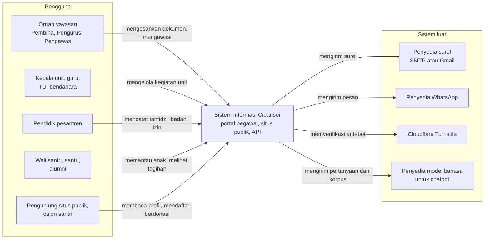

Diagram di atas harus dibaca sebagai batas sistem: semua peran masuk melalui
web atau API, dan sistem keluar hanya ke empat jenis layanan luar —
pengiriman surel, pesan WhatsApp, verifikasi anti-bot, dan model bahasa untuk
chatbot. Berkas unggahan disimpan di disk aplikasi sendiri, bukan layanan luar
(pemindahan ke penyimpanan objek privat sudah diputuskan, belum dibangun;
lihat bab 9).

## 3.1 Di luar lingkup

- **Aplikasi mobile asli.** Target seluler dilayani sebagai PWA dari basis web
  yang sama; tidak ada basis kode Flutter terpisah (`docs/MOBILE_API.md`).
- **Kanal dorong (WebSocket/SSE/Socket.IO).** Web melakukan polling; kanal
  dorong dihapus dan hanya akan dipertimbangkan bila ada kebutuhan tingkat
  detik, setelah Model A (`decisions/realtime-polling.md`).
- **Pemantauan galat pihak ketiga.** Sentry dihapus pada 28 September 2026;
  pilihan pemantauan galat ditunda sampai sebelum peluncuran.
- **SRS formal penuh.** Kebutuhan hidup di `roadmap.md` dan berkas keputusan;
  dokumen ini memuat tujuan dan mutu utama saja.
- **Layanan pembayaran daring (payment gateway).** Pembayaran SPP direkam dari
  bukti transfer dengan verifikasi berjenjang, bukan integrasi gateway.

# 4. Strategi Solusi

| Tujuan / masalah | Pendekatan | Keputusan terkait |
|---|---|---|
| Banyak unit dengan kebutuhan mirip | Monorepo Turborepo, satu basis kode; modul per ranah di API | Bab 5; `AGENTS.md` |
| Web dan API berbagi kontrak | Paket `@cipansor/shared` sebagai satu-satunya tempat DTO dan skema Zod | `packages/shared/AGENTS.md` |
| Satu basis data, banyak unit | Lingkup unit ditegakkan di API (helper `resolve-unit-id`) dan di web (`rbac.ts`) | Bab 8; `panduan-peran` |
| Konsistensi penulisan modul | Lapisan baku routes → controller → service → schema; tanggapan lewat `ApiResponse` | Bab 5; `apps/api/AGENTS.md` |
| Perubahan aman | Uji berlapis (unit, e2e, uji penjaga) dan gerbang mutu lokal sebelum push | Bab 10; `.claude/skills/gate` |
| Situs publik dan portal berbagi satu build | Pemisahan host di kode (`host-split.ts`), bukan di konfigurasi proxy | Bab 7; `docs/ARCHITECTURE.md` |

# 5. Tampak Blok Bangunan

## 5.1 Tingkat 1 — Kontainer

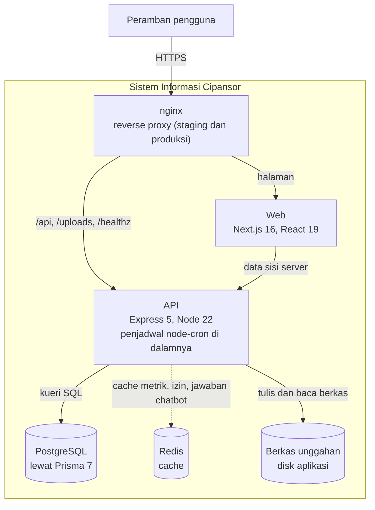

Peramban hanya berbicara dengan nginx: `/api`, `/uploads`, dan `/healthz` diteruskan
ke API, sisanya ke web. Di pengembangan lokal (`docker-compose.yml`) tidak ada nginx;
web dan API dipanggil langsung. Web memanggil API pada asal (origin) yang sama di
produksi (`NEXT_PUBLIC_API_URL` dibiarkan kosong sehingga dasar Axios menjadi
relatif, `/api`), dan satu image melayani kedua host. Redis menyimpan cache
(metrik dasbor, izin, jawaban chatbot) dan isinya boleh hilang; kegagalan
sambungan ke Redis hanya dicatat. Penjadwal bukan layanan terpisah: `node-cron`
berjalan di dalam proses API. Paket `@cipansor/shared` (tipe dan skema Zod
bersama) adalah pustaka yang ikut dibangun ke web dan API, bukan kontainer.

## 5.2 Tingkat 2 — Komponen API dan lapisan modul

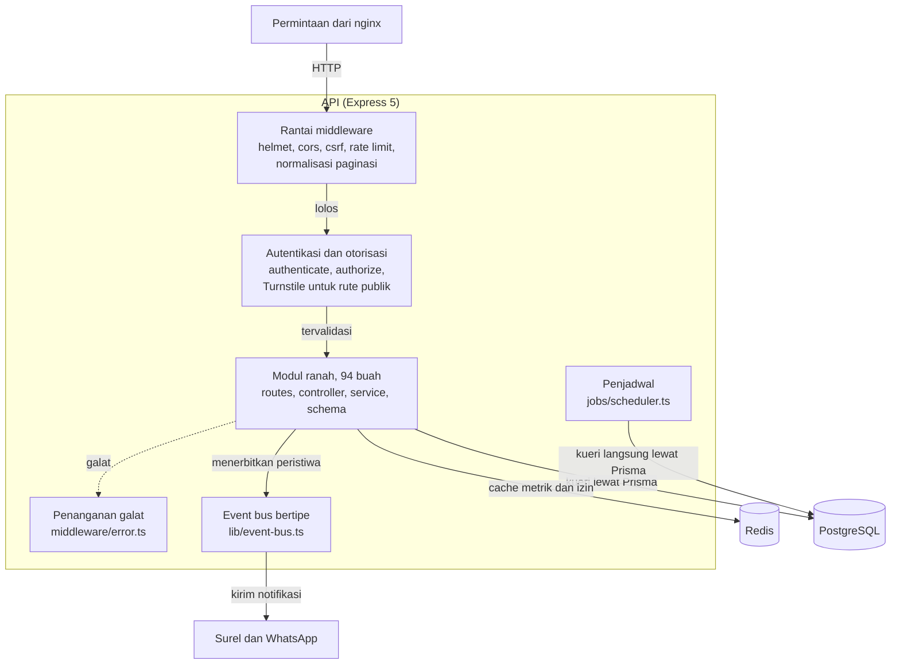

Modul-modul itu saling berbicara lewat event bus bertipe atau lewat `index.ts`
modul lain, bukan dengan mengimpor berkas service-nya (aturan `AGENTS.md`).
Di dalam satu modul, satu permintaan mengalir seperti pada diagram berikut.

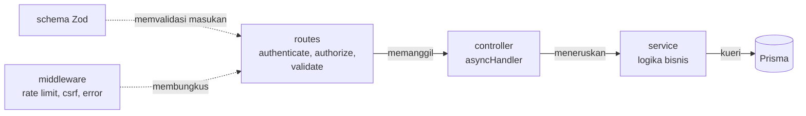

Aturan lapisannya: **rute tidak pernah memanggil Prisma; controller tidak memuat
logika bisnis.** Aturan itu belum sepenuhnya menjadi kenyataan. Pada pengukuran
commit ini, **67 dari 94 modul** memiliki empat berkas inti (routes, controller,
service, schema), tetapi hanya **25** yang lengkap lima bagian, yaitu keempatnya
ditambah `index.ts` (ukuran yang dipakai `known-issues.md`, yang mencatat 22
pada 25 September 2026). **12 modul** memanggil Prisma langsung dari rute atau
controller. Perbaikannya adalah fase 6 rencana audit (`roadmap.md`). Tanggapan
memakai satu amplop `{ success, data, meta? }` lewat `src/utils/response.ts`.

## 5.3 Modul menurut ranah

| Ranah | Contoh modul | Catatan |
|---|---|---|
| Akademik | `students`, `parent`, `classes`, `curriculum`, `kurikulum-merdeka`, `assessment`, `cbt`, `paud-assessment`, `paud-report`, `rapor-pesantren`, `daily-report` | Rapor, ujian, kurikulum, laporan harian TK |
| Kehadiran & kesantrian | `attendance`, `homeroom`, `violations`, `rewards`, `counseling`, `permits`, `health`, `meals` | Absensi harian, perizinan, catatan perilaku, UKS |
| Tahfidz & pesantren | `tahfidz`, `takhosus`, `murojaah`, `simaan`, `sanad-certificate`, `kitab-progress`, `muhadatsah`, `muhadhoroh`, `muhasabah`, `ibadah`, `dormitories` | Lima modul menyentuh tabel tahfidz; konsolidasi fase 3 |
| Penerimaan & data negara | `admissions`, `dapodik`, `emis`, `wilayah` | SPMB publik memakai Turnstile |
| Keuangan | `finance`, `finance-enhancement`, `wallet`, `donation`, `payroll`, `procurement`, `suppliers`, `canteen`, `laundry`, `scholarship` | Verifikasi pembayaran berjenjang; `scholarship` hanya pustaka penilaian tanpa rute |
| Sarana & aset | `inventory`, `facilities`, `library` | Inventaris adalah aset tetap |
| Kepegawaian & kinerja | `hr`, `performance-management` | PK dan evaluasi periodik |
| Sertifikat & piagam | `certificates`, `sanad-certificate` | Penerbitan bernomor dan verifikasi publik lewat kode/QR; nomor memakai CSPRNG |
| Tata kelola yayasan | `foundation`, `perencanaan`, `pengawasan`, `risk`, `syariah`, `quality`, `organisasi`, `tatalaksana`, `business-unit`, `lingkungan` | Rantai RPJP → Renstra → RKA |
| Komunikasi | `announcements`, `messages`, `notifications`, `chatbot` | Chatbot memakai penyedia model bahasa |
| Persuratan & TTE | `correspondence`, `esign`, `reception`, `complaints` | Verifikasi naskah dengan unggah PDF |
| Publik & lainnya | `marketing`, `alumni`, `portfolio`, `project`, `social-service`, `non-formal`, `practicum`, `research`, `talenta`, `extracurricular`, `student-org`, `student-compliance`, `teacher-compliance`, `assignments`, `duty-roster`, `calendar`, `academic-years` | Beberapa nama menyimpang dari isinya (lihat bab 11) |
| Platform | `auth`, `users`, `roles`, `units`, `upload`, `analytics`, `dashboard`, `dashboard-enhancement`, `reporting` | Fondasi lintas ranah |

Katalog lengkap ada di Lampiran A.

# 6. Tampak Runtime

Empat skenario di bawah dibaca langsung dari kode pada commit `40780b26`. Berkas
rujukan tiap skenario ada di Lampiran E.

## 6.1 Masuk, verifikasi dua langkah, dan penyegaran sesi

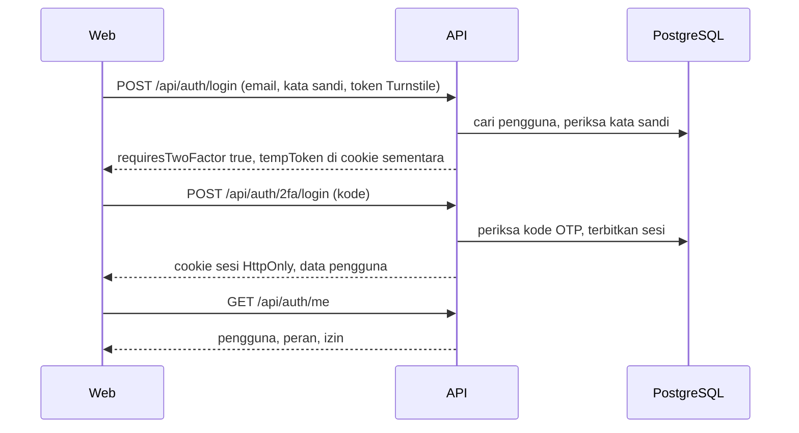

Masuk memakai Turnstile (`requireTurnstile('login')`). Bila akun wajib 2FA,
langkah pertama tidak menerbitkan sesi penuh, melainkan cookie sementara
(`tempToken`) dan jawaban `requiresTwoFactor`; langkah kedua memverifikasi kode
TOTP. Sesi dikirim sebagai cookie `HttpOnly; Secure; SameSite=Lax`
(`cipansor_at`, `cipansor_rt`), bukan di badan JSON, sehingga JavaScript halaman
tidak dapat membacanya. Klien tanpa cookie (aplikasi mobile) mengirim header
`X-Client: bearer` agar token dikembalikan di badan. Penyegaran sesi
(`POST /auth/refresh`) memakai token dari cookie dan dilimit lajunya; akses
token yang ditolak memicu penyegaran sekali lalu pengalihan ke `/login`.

## 6.2 Perjalanan satu permintaan API

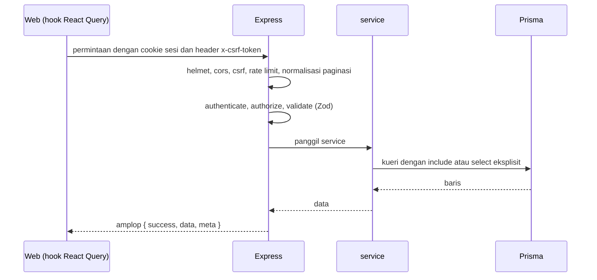

Tiap permintaan melewati berurutan: `helmet`, CORS, perlindungan CSRF
(double-submit cookie), pembatasan laju (kecuali pengembangan dan uji), lalu
`authenticate`, `authorize`/`hasPermission`, dan `validate` (Zod) sebelum
mencapai controller dan service. Penanganan galat terpusat memetakan galat
Prisma, Zod, dan JWT ke `Errors.*`.

## 6.3 Persetujuan dokumen yayasan (RPJP → Renstra → RKA)

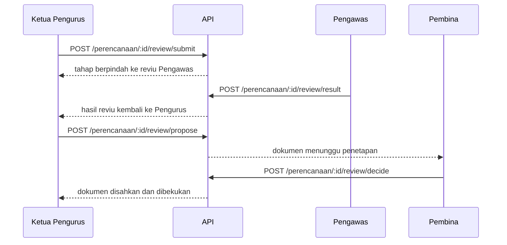

Rantai perencanaannya dua tingkat pada level tahunan: RPJP → Renstra → RKA
Yayasan (konsolidasi) → RKA Unit. Hanya satu RPJP dan satu Renstra aktif untuk
yayasan, dan satu RKA Yayasan per tahun. Pengesahan dokumen yayasan melewati
empat langkah di atas; setiap langkah adalah compare-and-set atomik
(`updateMany` dengan tahap asal) plus baris riwayat yang hanya ditambah. Selama
di tangan Pengawas/Pembina, dokumen terkunci; dokumen yang sudah disahkan beku.
Super Admin sengaja tidak dapat mengajukan, mereviu, atau menetapkan.

## 6.4 Persuratan dan verifikasi naskah

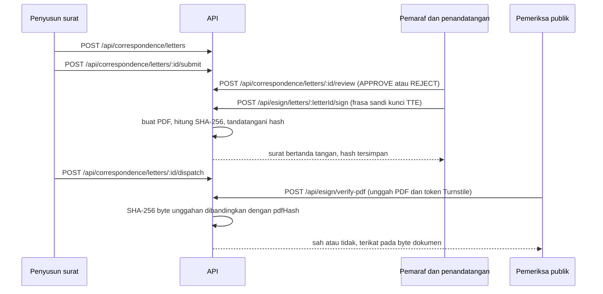

Surat dibuat, diajukan ke pemaraf (`submit`), lalu tiap pemaraf menyetujui atau
menolak (`review`); penandatangan akhir menandatangani dengan kunci TTE pribadi
(`esign/letters/:letterId/sign`), baru surat dikirim (`dispatch`) dan diarsipkan.
Verifikasi publik **sengaja** memakai unggah PDF (`POST /api/esign/verify-pdf`,
dijaga Turnstile), bukan pemindaian QR ke token: halaman token hanya
membuktikan ada surat bertoken itu, bukan bahwa dokumen yang dipegang orang
adalah surat itu. Server menghitung SHA-256 byte unggahan dan membandingkannya
dengan `LetterSignature.pdfHash`, sehingga jawabannya terikat pada isi
dokumen. QR pada PDF memuat alamat halaman verifikasi (tanpa token) agar
pemindai sampai ke tempat menyerahkan berkas. Pencabutan naskah
(`esign/letters/:letterId/revoke`) adalah pernyataan bertanda tangan dengan
kewenangan yang diatur (Pengawas, bukan Ketua dan bukan Super Admin).

## 6.5 Pendaftaran santri baru (SPMB) publik

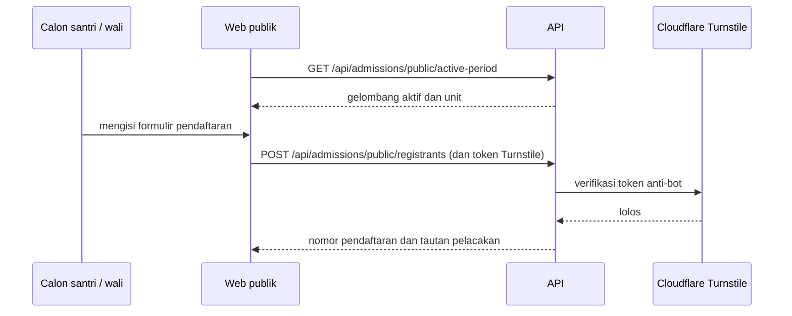

Rute publik didaftarkan **sebelum** middleware `authenticate`, memakai pembatas
laju yang lebih ketat dan Turnstile (`requireTurnstile('spmb-daftar')`).
Pendaftar mendapat nomor pendaftaran dan dapat melacak statusnya lewat
`GET /api/admissions/public/track`. Keputusan
penerimaan berada di ranah panel (dan masih menunggu satu keputusan pengguna
tentang siapa yang berhak memutuskan).

## 6.6 Pekerjaan terjadwal

`jobs/scheduler.ts` memuat **15 entri jadwal** atas **13 berkas pekerjaan**
(diukur pada commit `40780b26`), berzona waktu `Asia/Jakarta` dan berjalan di
dalam proses API. Satu berkas bisa dijadwalkan lebih dari sekali
(`dashboard-snapshot` tiga kali).

| Berkas | Jadwal | Yang dilakukan |
|---|---|---|
| `dashboard-metrics.job` | tiap menit | Menghitung dan menyimpan metrik dasbor |
| `dashboard-snapshot.job` | harian 01:00; Minggu 02:00; harian 03:00 | Cuplikan harian; ringkasan mingguan; memangkas cuplikan lama |
| `finance-billing.job` | tanggal 1, 04:00 | Penagihan otomatis bulanan |
| `spp-reminder.job` | tanggal 1, 06:00 | Pengingat SPP bulanan |
| `attendance-register-reminder.job` | tiap 5 menit, pukul 05:00–16:55 | Pengingat mengisi register kelas |
| `attendance-follow-up.job` | harian 15:00 | Pengingat tindak lanjut Alpa |
| `attendance-pattern.job` | harian 16:00 | Menandai pola kehadiran |
| `accreditation-reminder.job` | harian 07:00 | Pengingat akreditasi unit 12 bulan sebelum berakhir |
| `identity-purge.job` | harian 02:30 | Menghapus dokumen identitas yang habis masa simpannya |
| `permit-note-erasure.job` | harian 01:15 | Menghapus surat dokter izin setelah tahun ajaran berakhir |
| `chatbot-spend.job` | harian 07:00 | Memeriksa belanja chatbot terhadap anggaran |
| `chatbot-transcript-purge.job` | harian 03:15 | Memangkas transkrip chatbot |
| `chatbot-escalation-retry.job` | tiap 30 menit | Mengulang eskalasi chatbot yang gagal |

Berkas keempat belas — penyusutan aset bulanan — **tidak dijadwalkan**; modul
`inventory` memanggilnya.

> **Batasan.** Pekerjaan berjalan tanpa kunci, sehingga desainnya mengandaikan
> **satu instans API**; menambah instans akan menjalankan tiap pekerjaan dua
> kali. Kunci (`pg_try_advisory_lock`) atau worker terpisah harus ada sebelum
> penskalaan. `SCHEDULER_ENABLED=false` mematikannya (dipakai di staging).

# 7. Tampak Penempatan

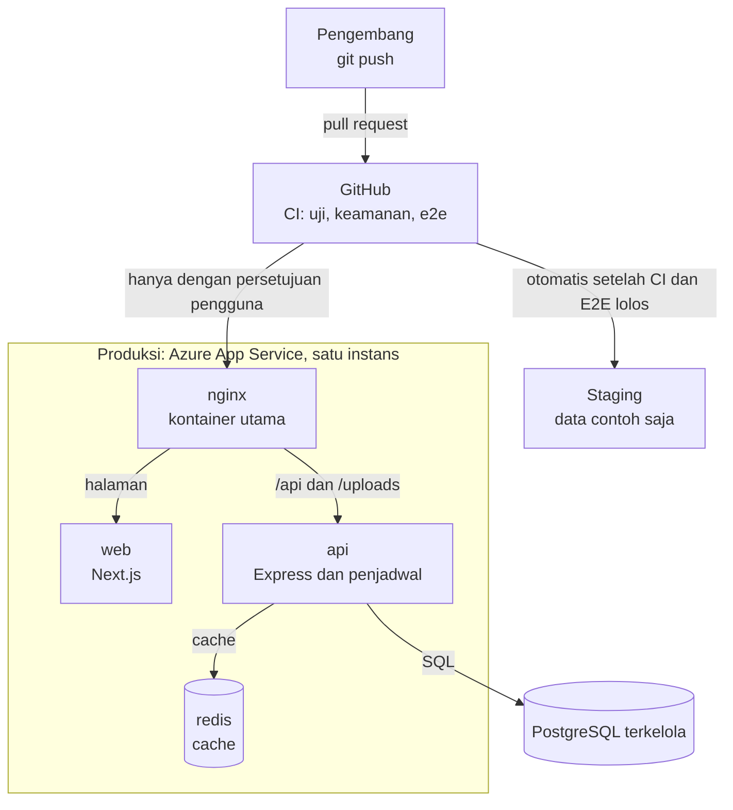

Produksi dan staging berjalan di Azure App Service sebagai kumpulan sidecar
(empat kontainer berbagi `localhost`: nginx, web, api, redis): nginx sebagai kontainer utama yang
menerima seluruh lalu lintas dan mengarahkan `/api`, `/uploads`, dan `/healthz`
ke API, sisanya ke web. Rilis menempuh tiga tahap: pull request (CI dan E2E
hijau), merge ke `main` (staging menyusul otomatis), lalu produksi hanya ketika
pengguna meminta, dengan cadangan dan pra-pemeriksaan migrasi. Status "sudah
ter-deploy" dibuktikan oleh `/healthz` yang melaporkan SHA gambar, bukan sekadar
kontainer yang menyala.

## 7.1 Variabel lingkungan

Nama dan fungsi saja; nilai tidak pernah ditulis. Ada **78 kunci** di
`.env.example`, dikelompokkan menurut awalan (CHATBOT, SMTP, WA, RATE, DB, JWT,
TURNSTILE, GOOGLE, NEXT, REDIS, COOKIE, MAIL, dan lain-lain). Daftar nama dan
fungsinya ada di Lampiran C. Setiap variabel baru harus ditambahkan ke blok
`environment:` di `docker-compose.yml` (bukan hanya `.env`) atau ia tidak akan
sampai ke kontainer; pada Azure App Service, ke app settings tiap kontainer.

# 8. Konsep Lintas-Bidang

- **Autentikasi & sesi.** Sesi berupa cookie `HttpOnly` (`cipansor_at`,
  `cipansor_rt`) plus cookie routing `cipansor_principal` berisi
  `{id, role, roleCode}` yang dibaca middleware Next tanpa perjalanan ke API.
  Tidak ada token di `localStorage`. CSRF memakai double-submit
  (`cipansor_csrf` diheader `x-csrf-token`).
- **Otorisasi dua lapis.** Lapis API: `authorize(RoleCode…)` dan
  `hasPermission(perm)`; lapis web: kode peran memilih menu (`navigation.ts`),
  bucket lama memilih halaman yang boleh dibuka (`rbac.ts`). Lingkup baris data
  ditentukan di service (`resolve-unit-id`, `studentScope`).
- **Validasi.** Zod di tepi (`validate`, `validateQuery`, `validateParams`);
  skema bersama di `@cipansor/shared`; kontrak yang sama dipakai web.
- **Amplop respons.** `{ success, data, meta? }` lewat `ApiResponse`; galat
  memakai `{ success:false, error:{ code, message } }`.
- **Penanganan galat.** `src/middleware/error.ts` memetakan galat Prisma, Zod,
  dan JWT; `Errors.notFound/badRequest/…` di service.
- **Data pribadi.** Pilih kolom eksplisit (`select`) alih-alih `include` relasi
  penuh; `include: { student }` pernah mengirim 69 kolom data anak
  (`lessons/prisma-include-leaks-pii.md`).
- **Bahasa (i18n).** Portal Indonesia saja; situs publik tiga bahasa dengan
  Arab RTL; uji cakupan i18n menjaga agar tak ada string satu bahasa.
- **Migrasi basis data.** Di-squash ke baseline `0_init`; `migrate deploy`
  dapat diputar dari basis data kosong; migrasi dijalankan saat kontainer
  mulai (`MIGRATE_ON_START`).
- **Pengujian.** Uji unit (vitest, Prisma dimock), e2e Playwright, dan uji
  penjaga (kontrak web↔API, route shadowing, sinkron peran).
- **Pekerjaan terjadwal.** `node-cron` di dalam proses API (lihat 6.6).

# 9. Keputusan Arsitektur

Tiap baris merujuk berkas keputusan aslinya (di `.claude/memory/decisions/`),
yang memuat alasan dan dasar hukumnya. Ringkasan di bawah ditulis ulang dalam
satu kalimat; buka berkasnya untuk alasannya.

| Keputusan | Ringkasan | Berkas |
|---|---|---|
| Rantai perencanaan | Empat tingkat: RPJP → Renstra → RKA Yayasan → RKA Unit, tidak pernah tiga. | `rka-dua-tingkat.md` |
| Pengesahan dokumen yayasan | RPJP/Renstra/RKA Yayasan disahkan Pengurus → Pengawas (reviu) → Pengurus → Pembina; RKA Unit disahkan Ketua; dokumen yang disahkan beku. | `pengesahan-dokumen-yayasan.md` |
| PK organ yayasan | Pembina, Pengurus, dan Pengawas tidak membuat Perjanjian Kinerja. | `pk-organ-yayasan-tanpa-kontrak.md` |
| Kiai & Direktur | Tidak ada Direktur Pesantren; Kiai adalah Pimpinan Pesantren sekaligus Pembina. | `pimpinan-pesantren-kiai.md` |
| Unit, asrama, takhosus | Asrama bukan unit; takhosus memakai `UnitType.PESANTREN`; unit pesantren dikelola Pimpinan, TU Pesantren, dan Super Admin. | `unit-vs-asrama-vs-takhosus.md` |
| Struktur organisasi | Satu pohon organisasi maksimal tiga tingkat, jabatan terpisah dari pemegangnya; Model A bertahap tetapi menyeluruh. | `struktur-organisasi-dan-identitas.md` |
| Peran & tugas tambahan | Kode peran = fungsi; wakasek/wali kelas/guru wali adalah relasi atau penugasan, bukan kode peran. | `peran-dan-tugas-tambahan.md` |
| Pemutus izin santri | Izin diputuskan musyrif atau wali kelas santri itu; kepala unit hanya untuk izin panjang, tanpa pembimbing, atau ambil alih. | `pemutus-izin-santri.md` |
| Absensi harian | Register diisi di kelas oleh wali kelas atau guru yang mengajar di sana; satu halaman; tindak lanjut otomatis; tanpa guru piket. | `absensi-harian.md` |
| Menu | Menu maksimal tiga tingkat dan sembilan kelompok menurut disiplin; tidak ada sub-sub-menu. | `menu-ia-tiga-tingkat.md` |
| Penamaan | PPDB/PSB menjadi SPMB dengan pengalihan permanen; istilah pesantren tidak diterjemahkan. | `route-naming.md` |
| Istilah | *Santri* di semua layar portal; ejaan yayasan; portal Indonesia, situs publik tiga bahasa. | `istilah-dan-penamaan.md` |
| Autentikasi & sandi | 2FA wajib untuk admin, organ, dan kepala unit; staf serta wali diundang; panjang sandi mengikuti NIST 800-63B-4. | `autentikasi-2fa-dan-sandi.md` |
| Kanal realtime | Tidak ada kanal dorong; web melakukan polling. | `realtime-polling.md` |
| Penyimpanan berkas | Satu tabel berkas, Blob privat lewat managed identity dan SAS delegasi pengguna; yang tak tertaut dihapus. | `penyimpanan-berkas.md` |
| Akreditasi unit | Akreditasi tiap unit tampil di situs publik dari satu catatan resmi di portal, yang juga dibaca ekspor EMIS dan Dapodik serta SKHUN; pengingat 12 bulan sebelum berakhir. | `akreditasi-unit.md` |
| TTE | Batas atas TTE menurut AATL/eIDAS/PP 71; Ed25519 menghalangi PAdES. | `esign-standards-ceiling.md` |
| Verifikasi naskah | Verifikasi dengan mengunggah PDF, tidak pernah lewat halaman token/QR. | `eoffice-verify-by-upload-not-qr.md` |
| Kewenangan cabut naskah | Pencabutan naskah adalah pernyataan bertanda tangan; kewenangannya diatur, bukan Super Admin. | `eoffice-revocation-authority.md`, `eoffice-revocation-mechanics.md` |
| Chatbot | Seluruh korpus dikirim ke tiap prompt; BM25 tidak lagi menjadi gerbang. | `chatbot-retrieval-settled.md` |
| Pengawasan & rapat Pembina | Keputusan Pembina sebagai rapat tercatat atau resolusi tertulis bulat; WBS di Aduan & Aspirasi; TPPK/Satgas per unit. | `pengawasan-dan-rapat-pembina.md` |
| Fotografi situs publik | Foto asli berasal dari pesantrencipansor.com; klaim hanya yang tampak pada foto. | `public-site-photography.md` |
| Dokumentasi bergambar | Dokumen dan tangkapan layar tetap dua skill dengan satu jalur kerja; hanya gambar yang tersemat di naskah masuk git. | `dokumentasi-bergambar.md` |

# 10. Persyaratan Kualitas

Tiap baris adalah skenario (pemicu → respons) dengan ukuran, bukti, dan status
yang diakui apa adanya. Bila belum ada ambang yang ditetapkan, kolom ukuran
berkata demikian; itu jujur, dan itu utang (bab 11).

| Mutu | Skenario (pemicu → respons) | Ukuran / ambang | Bukti | Status |
|---|---|---|---|---|
| Keamanan: akses | Rute tulis yang dapat dijangkau tanpa sesi → dijaga Turnstile | 0 rute tulis publik tanpa Turnstile di luar daftar pengecualian beralasan | `public-routes-gated.test.ts` memindai pohon rute | Terbukti (uji di CI) |
| Keamanan: kode | Perubahan yang memicu peringatan CodeQL tingkat tinggi → tidak dapat digabung ke `main` | 0 peringatan CodeQL tingkat tinggi ke atas yang lolos ke `main` (CodeQL berstatus wajib) | aturan repositori sejak 25 September 2026 (`progress.md`) | Terbukti |
| Keterpeliharaan: kontrak | Halaman web memanggil alamat API yang tak ada → uji merah | jumlah panggilan tak terlayani hanya boleh menyusut dari baseline | `web-api-contract.guard.test.ts` | Sebagian: baseline lama belum nol |
| Keterpeliharaan: rute | Rute berparameter menutupi rute statis → uji merah | 0 rute yang tertutup bayangan | `route-shadowing.guard.test.ts` | Terbukti |
| Kemudahan pakai: bahasa | String situs publik hanya ada di satu bahasa → uji merah | 0 string yang hilang di salah satu dari 3 bahasa | `i18n-coverage.test.ts` | Terbukti |
| Pemulihan | Basis data rusak atau migrasi gagal → dipulihkan dari cadangan | pemulihan titik-waktu 7 hari di server, ditambah `pg_dump` sebelum tiap rilis; RTO dan RPO belum ditetapkan | `docs/deploy-azure.md` | Sebagian: pemulihan dilatih hanya untuk uji migrasi |
| Ketersediaan: penjadwal | Pekerjaan terjadwal berjalan satu kali per jadwal | tepat 1 instans API | `docs/deploy-azure.md` | Terbukti selama satu instans |
| Kinerja | Halaman dimuat dalam waktu wajar | belum ditetapkan | tidak ada | Belum ada ambang (lihat optimasi gambar, bab 11) |

# 11. Risiko dan Utang Teknis

Setiap baris menyebut gejala, dampak, dan arah penanganan. Daftar ini
ditinjau ulang setiap kuartal.

> **Catatan.** Bab ini merangkum kategori dan tingkat dampak. Butir keamanan
> dan privasi yang masih terbuka di produksi tidak diuraikan dalam dokumen ini
> dan dilacak secara internal.

| Kategori | Ringkasan | Dampak | Arah penanganan |
|---|---|---|---|
| Kontrak web↔API | Sejumlah panggilan web belum terlayani API; jumlahnya tercatat di baseline uji yang hanya boleh menyusut. | Sedang | Fase 1 rencana audit, area demi area; uji penjaga mencegah yang baru |
| Konsistensi lapisan | 12 modul memanggil Prisma dari rute atau controller; hanya 25 dari 94 modul lengkap lima bagian; bentuk respons belum seragam. | Sedang | Fase 6: satukan ke lapisan baku |
| Pekerjaan terjadwal | Mengandaikan satu instans API; penskalaan menjalankan pekerjaan dua kali. | Tinggi bila diskalakan | Kunci advisory atau worker terpisah sebelum scale-out |
| Optimasi gambar | Optimizer `next/image` tidak pernah mengecilkan gambar; gambar harus disajikan pada ukuran tampil. | Rendah–Sedang | Perbaikan image runtime |
| Konsep ganda | Tahfidz di lima modul, rapor di lima tempat, P5 di dua modul. | Sedang | Fase 3: konsolidasi berdasar desain |
| Penamaan | Beberapa modul bernama lain daripada isinya (mis. `practicum` berisi Amaliyah Tadris; sufiks `-enhancement`). | Rendah | Glosarium lalu ganti nama |
| Kontrol akses | Daftar izin yang dapat disunting belum sejalan dengan pemeriksaan sebenarnya; akses masih banyak diatur per kelompok peran lama. | Sedang | Model A (izin per fitur), bertahap dengan baseline yang menyusut |
| Data pribadi | Minimalisasi data pribadi belum merata di seluruh modul. | Sedang–Tinggi | Pilih kolom eksplisit; ditangani per modul; dilacak internal |
| Integritas skema | Skema dan riwayat migrasi belum sepenuhnya sepakat. | Rendah | Migrasi korektif tersendiri |
| Pemantauan galat | Belum ada layanan pemantauan galat; pilihan ditunda sampai sebelum peluncuran. | Sedang | Pilih sebelum peluncuran (`progress.md`) |

# 12. Glosarium

| Istilah | Arti |
|---|---|
| Santri | Sebutan pelajar di seluruh portal Cipansor (bukan *murid*; *murid* hanya pada format negara seperti rapor, SPMB, Dapodik/EMIS). |
| Wali santri | Orang tua/penanggung jawab santri; melihat data anaknya sendiri. |
| Tahfidz, Tahsin, Takhosus, Kitab Kuning | Istilah pesantren; ejaan mengikuti yayasan, tidak diterjemahkan. |
| Musyrif, Muhafidz, Ustadz | Pendidik pesantren: pembimbing asrama, pembimbing hafalan, pengajar. |
| RPJP, Renstra, RKA | Rencana Jangka Panjang, Rencana Strategis, dan Rencana Kerja dan Anggaran yayasan. |
| PK | Perjanjian Kinerja. |
| SPMB | Sistem Penerimaan Murid Baru (dahulu PPDB/PSB). |
| TTE | Tanda Tangan Elektronik. |
| Naskah dinas | Surat resmi yayasan/unit. |
| RoleCode | Kode peran DB, mis. `SDIT_GURU`, `YAYASAN_KETUA`. |
| Bucket / legacy role | Enam kelompok lama (SUPER_ADMIN, UNIT_ADMIN, TEACHER, STAFF, STUDENT, PARENT) yang memilih halaman web. |
| RBAC | Kendali akses berbasis peran. |
| DTO | Objek pemindahan data; kontrak API di `@cipansor/shared`. |
| Zod | Pustaka validasi skema TypeScript. |
| Prisma | ORM dan alat migrasi basis data. |
| Middleware | Fungsi Express antara permintaan dan penangan. |
| Service | Lapisan logika bisnis; satu-satunya yang menyentuh Prisma. |
| ApiResponse | Pembantu amplop tanggapan baku. |
| E2E | Uji ujung-ke-ujung dengan Playwright. |
| CI | Integrasi berkelanjutan (GitHub Actions). |
| Cold start | Waktu tunggu saat kontainer App Service bangun. |

# Lampiran A — Katalog Modul API

Diukur pada commit `40780b26` (30 September 2026). "Handler" adalah perkiraan
jumlah `router.get/post/put/patch/delete`. "Layering" menandai modul yang
memanggil Prisma dari rute/controller.

| Modul | Mount | Handler | Swagger | Layering |
|---|---|---|---|---|
| academic-years | /api/academic-years | 6 | ya | ok |
| admissions | /api/admissions | 38 | ya | ok |
| alumni | /api/alumni | 30 | ya | ok |
| analytics | /api/analytics | 26 | ya | ok |
| announcements | /api/announcements | 7 | ya | ok |
| assessment | /api/assessment | 49 | ya | Prisma di route/controller |
| assignments | /api/assignments | 8 | - | ok |
| attendance | /api/attendance | 12 | ya | ok |
| auth | /api/auth | 13 | ya | ok |
| business-unit | /api/business-units | 7 | - | ok |
| calendar | /api/calendar | 12 | - | ok |
| canteen | /api/canteen | 19 | - | ok |
| certificates | /api/certificates | 9 | - | ok |
| cbt | /api/cbt | 20 | - | Prisma di route/controller |
| chatbot | /api/chatbot | 9 | - | Prisma di route/controller |
| classes | /api/classes | 9 | ya | ok |
| complaints | /api/complaints | 6 | - | Prisma di route/controller |
| correspondence | /api/correspondence | 15 | - | ok |
| counseling | /api/counseling | 14 | - | ok |
| curriculum | /api/curriculum | 21 | ya | ok |
| daily-report | /api/daily-report | 9 | ya | ok |
| dapodik | /api/dapodik | 6 | - | ok |
| dashboard | /api/dashboard | 8 | - | ok |
| dashboard-enhancement | /api/dashboard-enhancement | 8 | - | ok |
| donation | /api/donation | 20 | - | ok |
| dormitories | /api/dormitories | 23 | ya | ok |
| duty-roster | /api/duty-roster | 18 | - | ok |
| emis | /api/emis | 5 | - | ok |
| esign | /api/esign | 18 | - | ok |
| extracurricular | /api/extracurricular | 17 | - | ok |
| facilities | /api/facilities | 21 | - | ok |
| finance | /api/finance | 47 | ya | ok |
| finance-enhancement | /api/finance-enhancement | 34 | - | Prisma di route/controller |
| foundation | /api/foundation | 26 | ya | ok |
| health | /api/health | 25 | ya | ok |
| homeroom | /api/homeroom | 14 | - | ok |
| hr | /api/hr | 37 | ya | Prisma di route/controller |
| ibadah | /api/ibadah | 25 | - | ok |
| inventory | /api/inventory | 34 | - | ok |
| kitab-progress | /api/kitab-progress | 16 | - | ok |
| kurikulum-merdeka | /api/kurikulum-merdeka | 45 | - | ok |
| laundry | /api/laundry | 13 | - | ok |
| library | /api/library | 16 | ya | ok |
| lingkungan | /api/lingkungan | 12 | - | ok |
| marketing | /api/marketing | 14 | - | ok |
| meals | /api/meals | 18 | - | ok |
| messages | /api/messages | 6 | - | ok |
| muhadatsah | /api/muhadatsah | 12 | - | ok |
| muhadhoroh | /api/muhadhoroh | 11 | - | ok |
| muhasabah | /api/muhasabah | 13 | - | ok |
| murojaah | /api/murojaah | 15 | - | ok |
| non-formal | /api/non-formal | 5 | - | ok |
| notifications | /api/notifications | 29 | ya | Prisma di route/controller |
| organisasi | /api/organisasi | 11 | - | ok |
| parent | /api/parent | 17 | ya | ok |
| paud-assessment | /api/paud-assessment | 22 | ya | ok |
| paud-report | /api/paud-report | 13 | - | ok |
| payroll | /api/payroll | 24 | - | ok |
| pengawasan | /api/pengawasan | 12 | - | ok |
| perencanaan | /api/perencanaan | 22 | - | ok |
| performance-management | /api/performance-agreements | 24 | - | ok |
| permits | /api/permits | 14 | ya | ok |
| portfolio | /api/portfolio | 15 | - | ok |
| practicum | /api/practicum | 8 | - | Prisma di route/controller |
| procurement | /api/procurement | 6 | - | ok |
| project | /api/projects | 12 | - | ok |
| quality | /api/quality | 9 | - | ok |
| rapor-pesantren | /api/rapor-pesantren | 9 | ya | ok |
| reception | /api/reception | 10 | - | ok |
| reporting | /api/reports | 7 | ya | ok |
| research | /api/research | 8 | - | Prisma di route/controller |
| rewards | /api/rewards | 9 | ya | ok |
| risk | /api/risk | 8 | - | ok |
| roles | /api/roles | 10 | - | Prisma di route/controller |
| sanad-certificate | /api/sanad | 11 | - | ok |
| scholarship | tidak ter-mount | 0 | - | ok |
| simaan | /api/simaan | 12 | - | ok |
| social-service | /api/social-service | 5 | - | ok |
| student-compliance | /api/student-compliance | 5 | - | Prisma di route/controller |
| student-org | /api/student-org | 6 | - | Prisma di route/controller |
| students | /api/students | 13 | ya | ok |
| suppliers | /api/suppliers | 5 | - | ok |
| syariah | /api/syariah | 7 | - | ok |
| tahfidz | /api/tahfidz | 9 | - | ok |
| takhosus | /api/takhosus | 29 | - | ok |
| talenta | /api/talenta | 19 | - | ok |
| tatalaksana | /api/tata-laksana | 9 | - | ok |
| teacher-compliance | /api/teacher-compliance | 6 | - | ok |
| units | /api/units | 13 | ya | ok |
| upload | /api/upload | 1 | - | ok |
| users | /api/users | 5 | ya | ok |
| violations | /api/violations | 7 | ya | ok |
| wallet | /api/wallet | 10 | - | ok |
| wilayah | /api/wilayah | 12 | - | ok |

Modul tanpa routes (pustaka internal, bukan endpoint): `scholarship`.

# Lampiran B — Model Data Tingkat Ranah

Skema Prisma adalah rujukan tunggal (**289 model, 157 enum** pada commit ini).
Berikut kelompok entitas utama dan hubungannya, bukan ratusan model satu per satu.

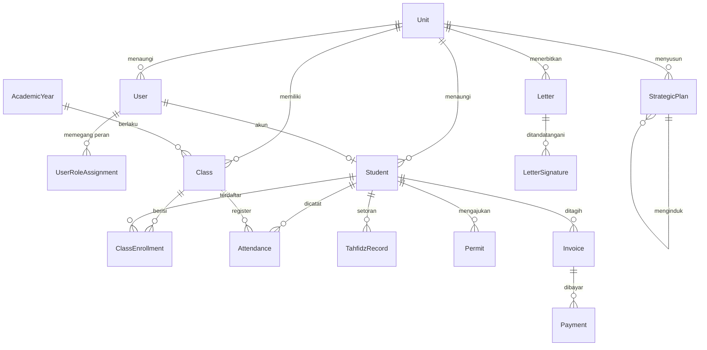

Nama entitas adalah nama model di `schema.prisma` (`Class` ditulis dengan tanda kutip karena kata kunci Mermaid); relasi dibaca dari bidang
`@relation` model-model itu. Pendaftaran siswa ke kelas adalah `ClassEnrollment`;
pendaftaran ke unit adalah `StudentUnitEnrollment` (tidak digambar).

# Lampiran C — Variabel Lingkungan

Diukur dari `.env.example` (78 kunci). Nama dan fungsi saja, tanpa nilai.

| Kelompok | Nama | Fungsi |
|---|---|---|
| Database | `DATABASE_URL`, `DB_USER`, `DB_PASSWORD`, `DB_PORT` | Koneksi basis data PostgreSQL |
| JWT/sesi | `JWT_SECRET`, `JWT_EXPIRES_IN`, `JWT_REFRESH_EXPIRES_IN` | Menandatangani dan masa berlaku token |
| Cookie | `COOKIE_SECURE`, `COOKIE_DOMAIN` | Atribut cookie sesi |
| Rate limit | `RATE_LIMIT_*` | Batas laju umum dan khusus autentikasi |
| Turnstile | `TURNSTILE_SECRET_KEY`, `TURNSTILE_TIMEOUT_MS`, `TURNSTILE_ALLOWED_HOSTNAMES` | Anti-bot pada rute publik |
| SMTP/surel | `SMTP_*`, `MAIL_FROM`, `MAIL_REPLY_TO`, `GMAIL_SENDER` | Pengiriman surel |
| WhatsApp | `WA_*` | Provider dan kredensial pesan WhatsApp |
| Redis | `REDIS_URL`, `REDIS_PORT` | Cache opsional |
| Chatbot | `CHATBOT_*` (banyak) | Provider model, persona, batas laju, belanja, eskalasi |
| Google | `GOOGLE_SERVICE_ACCOUNT_*`, `GOOGLE_ANALYTICS_ID` | Integrasi layanan Google |
| Web/Next | `NEXT_PUBLIC_API_URL`, `NEXT_PUBLIC_TURNSTILE_SITE_KEY` | URL API dan site key Turnstile di klien |
| Alamat publik | `PUBLIC_SITE_URL`, `PORTAL_URL`, `API_INTERNAL_URL`, `CORS_ORIGIN` | Alamat situs publik, portal, API internal, dan CORS |
| Operasional | `PORT`, `NODE_ENV`, `WEB_PORT`, `LOG_LEVEL`, `MAX_FILE_SIZE`, `UPLOAD_DIR` | Server dan unggahan |
| Sakelar | `SCHEDULER_ENABLED`, `OUTBOUND_MESSAGES_ENABLED`, `MIGRATE_ON_START` | Penjadwal, pesan keluar, migrasi saat mulai |
| Keamanan/privasi | `STUDENT_CARD_HMAC_SECRET`, `PASSWORD_RESET_RATE_LIMIT_MAX`, `IDENTITY_DOCUMENT_RETENTION_YEARS` | HMAC kartu santri, batas reset sandi, retensi dokumen identitas |

# Lampiran D — Prosedur Operasional

Ringkas; rincian di `docs/DEPLOYMENT.md` (VM) dan `docs/deploy-azure.md` (Azure).

- **Membangun & menjalankan lokal:** `pnpm install`; `docker compose -f
  docker-compose.dev.yml up -d` (PostgreSQL + Redis); `pnpm --filter api
  db:push`; `pnpm --filter api db:seed` (menghapus seluruh tabel), dengan
  `E2E_FIXED_2FA=1` untuk suite e2e; `pnpm dev`.
- **Migrasi basis data:** edit `schema.prisma`, lalu `pnpm --filter api
  db:generate` dan `db:migrate` (migrasi tersimpan) atau `db:push` (dev).
  Baseline `0_init` dapat diputar dari basis data kosong.
- **Cadangan & pemulihan:** basis data terkelola menyediakan pemulihan
  point-in-time; rilis produksi mengambil `pg_dump` tambahan. Langkah pemulihan
  ada di `docs/DEPLOYMENT.md`.
- **Rilis:** lihat bab 7.

# Lampiran E — Sumber dan Basis Pengukuran

| Hal | Sumber |
|---|---|
| Commit dan tanggal ukur | `40780b26`, 30 September 2026 (skrip `collect_facts.py`) |
| Ringkasan sistem | `README.md`, `docs/ARCHITECTURE.md` |
| Alamat rute yang disebut | `apps/api/src/modules/*/*.routes.ts` (dicek otomatis oleh `check_docs.py`) |
| Model data | `apps/api/prisma/schema.prisma` |
| Kontainer dan sidecar | `docs/deploy-azure.md`, `docker-compose.yml` |
| Status & utang | `.claude/memory/progress.md`, `known-issues.md`, `roadmap.md` |
| Urutan masuk & sesi | `apps/api/src/modules/auth/auth.controller.ts`, `auth.routes.ts`, `auth.service.ts`, `auth.cookies.ts` |
| Middleware & rute | `apps/api/src/app.ts`, `apps/api/src/middleware/{auth,rate-limit,csrf,error}.ts` |
| Perencanaan & pengesahan | `apps/api/src/modules/perencanaan/perencanaan.service.ts`, `perencanaan.routes.ts`, `decisions/pengesahan-dokumen-yayasan.md` |
| Persuratan & TTE | `apps/api/src/modules/correspondence/*`, `modules/esign/*`, `decisions/eoffice-verify-by-upload-not-qr.md`, `docs/EOFFICE_ESIGN_PLAN.md` |
| SPMB publik | `apps/api/src/modules/admissions/admissions.routes.ts` |
| Pekerjaan terjadwal | `apps/api/src/jobs/scheduler.ts` |
| Penempatan | `docker-compose.yml`, `.github/workflows/*`, `docs/deploy-azure.md`, `docs/DEPLOYMENT.md`, `deploy/azure/nginx/` |
| Keputusan | `.claude/memory/decisions/*.md`, `.claude/memory/INDEX.md` |
| Diagram & kerangka | arc42 v9 (arc42.org, Juli 2025 — 12 bab tetap), Model C4 (c4model.com) |
