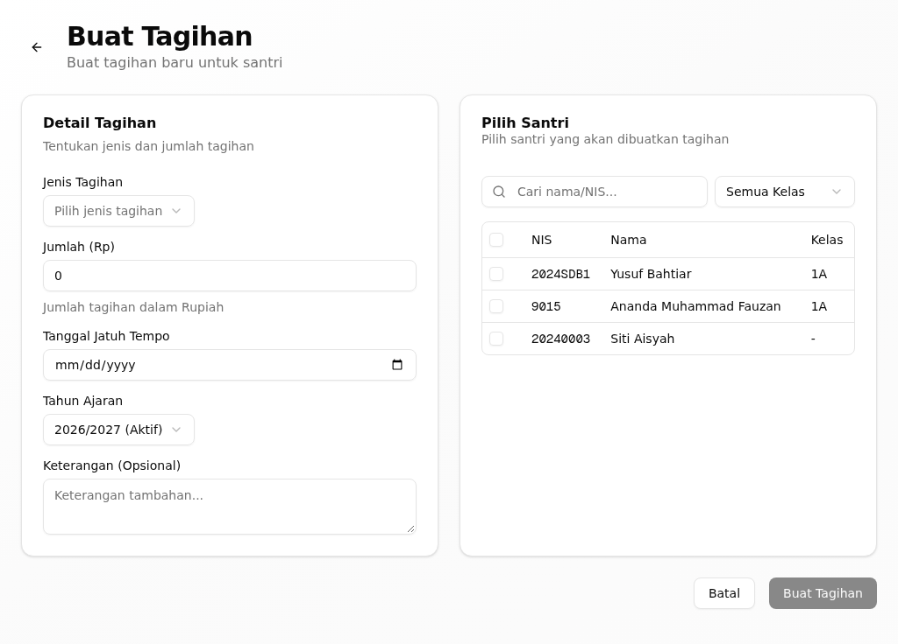
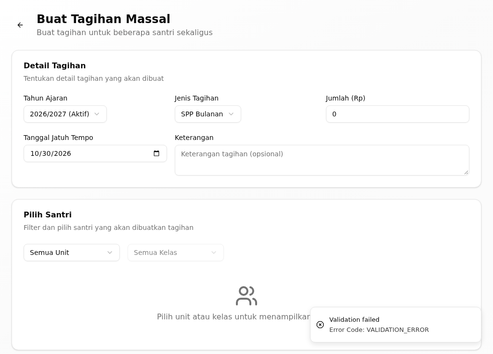
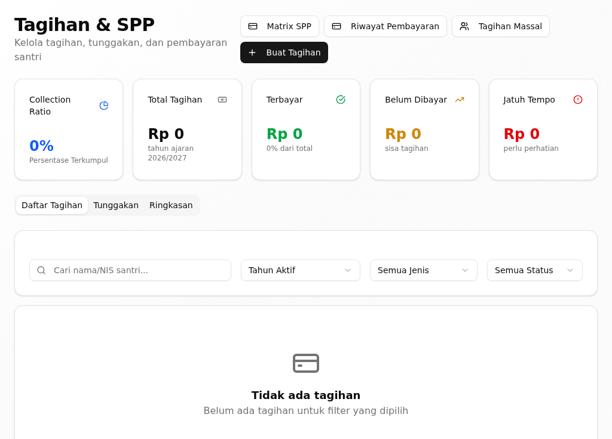
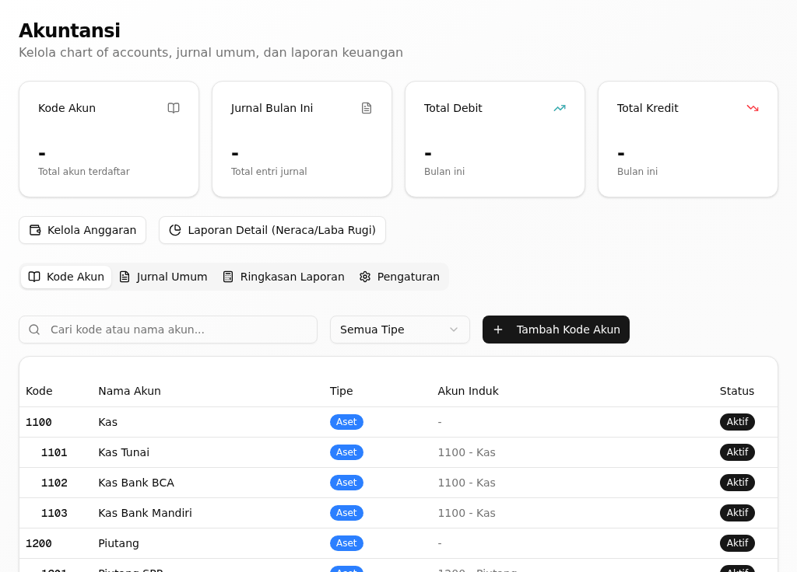
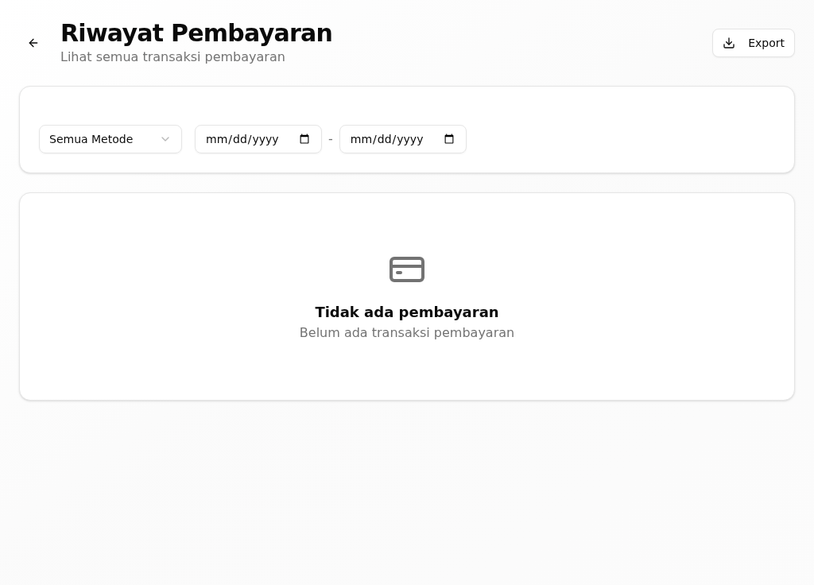
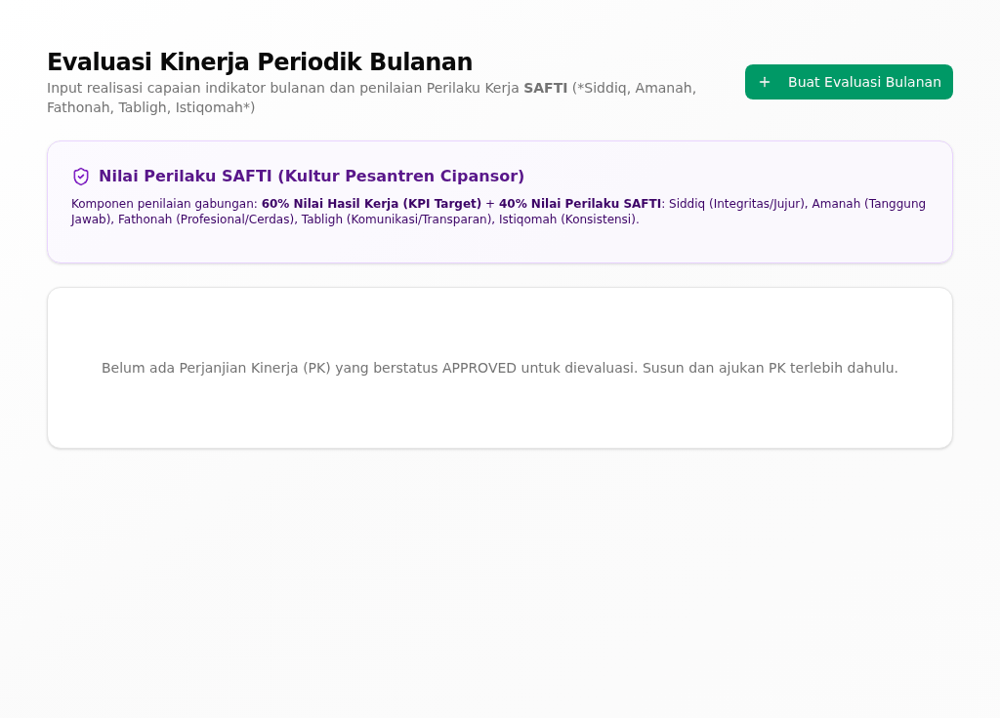

# Riwayat Revisi

| Versi | Tanggal | Basis aplikasi | Tingkat verifikasi | Perubahan |
|---|---|---|---|---|
| 0.1 | 30 September 2026 | aplikasi berjalan dari kode commit `a4735001` | **T1 — terverifikasi di aplikasi berjalan** | Penyusunan awal; tiap kartu dijalankan dengan akun demo bendahara unit pada tumpukan lokal (PostgreSQL + API :3001 + web :3000) dan memuat tangkapan layar asli |

> **Tingkat verifikasi T1.** Semua kartu tugas di bawah sudah **dijalankan pada
> aplikasi berjalan** dengan akun demo bendahara unit, dan tiap kartu memuat
> tangkapan layar asli. Bila Anda menemukan layar yang berbeda dari gambar di
> sini, laporkan kepada admin unit.

# 1. Tentang Buklet Ini

Buklet ini untuk **bendahara unit** (`*_BENDAHARA`) — pegawai yang menetapkan
tagihan santri, memeriksa bukti pembayaran, dan mencatat jurnal unit. Bagian
umum (masuk, dasbor, konsep, glosarium) ada di *Panduan Pengguna — Bagian Umum*.

Buklet ini menjelaskan versi aplikasi terbaru per 30 September 2026. Aplikasi
yang Anda pakai mungkin belum memuat semua perubahan itu; bila layar Anda
berbeda dari yang dijelaskan, tanyakan kepada admin unit.

## 1.1 Siapa Anda di aplikasi

Sebagai bendahara unit, dasbor awal Anda adalah halaman **Dashboard** di
`/staff`. Menu **Keuangan** Anda memuat **Tagihan & SPP** (`/finance`), dengan
anak **Verifikasi Pembayaran** (`/finance/verification`) dan **Riwayat
Pembayaran** (`/finance/payments`), serta **Laporan Keuangan**
(`/finance/accounting`). Anda melayani **satu unit** — tagihan dan jurnal yang
tampil terbatas pada unit Anda.

## 1.2 Yang bisa dan tidak bisa Anda lakukan

- Anda **membuat tagihan** satuan maupun massal dan memantau tunggakan.
- Anda **memeriksa bukti pembayaran** yang diunggah keluarga dan mencatat
  kuitansinya.
- Anda **mencatat jurnal** unit pada bagan akun.
- Anda **tidak** memutuskan penerimaan santri baru; itu tugas tata usaha dan
  pimpinan unit.
- Anda **tidak** mengubah nilai akademik santri.

## 1.3 Tugas dalam buklet ini

| Tugas | Seberapa sering | Menu |
|---|---|---|
| Membuat tagihan santri | Bulanan | Keuangan → Tagihan & SPP |
| Membuat tagihan massal | Bulanan | Keuangan → Tagihan & SPP |
| Memantau tunggakan | Mingguan | Keuangan → Tagihan & SPP |
| Memeriksa bukti pembayaran | Harian | Keuangan → Verifikasi Pembayaran |
| Mencatat jurnal unit | Harian | Keuangan → Laporan Keuangan |
| Melihat riwayat dan kuitansi | Sesuai kebutuhan | Keuangan → Riwayat Pembayaran |
| Membuat pengumuman unit | Sesuai kebutuhan | Administrasi → Pengumuman |
| Menyusun Perjanjian Kinerja | Tahunan | Kinerja → Manajemen Kinerja |

# 2. Tugas

## Membuat tagihan santri

**Tujuan.** Menetapkan tagihan (mis. SPP) kepada seorang santri.

**Siapa.** Bendahara unit, untuk santri di unit sendiri.

**Jalur menu.** Keuangan → Tagihan & SPP (`/finance`). Tombol **Buat Tagihan**
ada di halaman itu; formulirnya di `/finance/bills/new`.

**Sebelum mulai.** Santri sudah terdaftar dan jenis tagihannya sudah ada.

**Langkah.**

1. Buka **Tagihan & SPP**, lalu klik **Buat Tagihan**.
   *Formulir **Buat Tagihan** terbuka.*
2. Pilih santri pada **Pilih Santri**.
3. Pilih **Jenis Tagihan**, isi **Jumlah (Rp)**, dan **Tanggal Jatuh Tempo**.
4. Klik **Buat Tagihan**.
   *Muncul pesan "Tagihan berhasil dibuat dan notifikasi dikirim ke santri".*

{width=14cm}

*Gambar 1. Formulir Buat Tagihan: pilih santri, jenis tagihan, jumlah, dan jatuh tempo.*

**Hasilnya, dan giliran siapa berikutnya.** Tagihan tampil di daftar dan
notifikasinya terkirim ke santri. Giliran keluarga membayar; setelah itu bukti
pembayaran masuk ke antrean verifikasi Anda.

**Bila tidak berhasil.**

| Yang terlihat | Penyebab umum | Yang perlu dilakukan |
|---|---|---|
| Tombol **Buat Tagihan** tidak aktif | Santri belum dipilih | Ulangi langkah 2 |
| Isian **Jumlah (Rp)** kosong | Nominal belum diisi | Isi jumlahnya, lalu ulangi |
| Pesan galat dari peladen | Data tidak diterima | Baca pesannya, betulkan, lalu ulangi |

**Ketersediaan.** Ada pada versi aplikasi yang dijelaskan buklet ini (lihat bagian 1).

## Membuat tagihan massal

**Tujuan.** Menetapkan satu tagihan yang sama untuk banyak santri sekaligus.

**Siapa.** Bendahara unit.

**Jalur menu.** Keuangan → Tagihan & SPP (`/finance`). Tombol **Buat Tagihan Massal**
ada di halaman itu; formulirnya di `/finance/bills/bulk`.

**Sebelum mulai.** Jenis tagihan, nominal, dan jatuh temponya sudah ditetapkan.

**Langkah.**

1. Buka **Tagihan & SPP**, lalu klik **Buat Tagihan Massal**.
   *Formulir **Buat Tagihan Massal** terbuka.*
2. Pilih **Jenis Tagihan**, isi **Jumlah (Rp)**, dan **Tanggal Jatuh Tempo**.
3. Pada **Pilih Santri**, centang santri yang akan ditagih.
4. Klik **Buat Tagihan Massal**.
   *Muncul pesan "Berhasil membuat … tagihan".*

{width=14cm}

*Gambar 2. Formulir Buat Tagihan Massal: satu jenis tagihan untuk banyak santri sekaligus.*

**Hasilnya, dan giliran siapa berikutnya.** Tagihan terbentuk untuk setiap
santri yang dicentang. Giliran keluarga membayar.

**Bila tidak berhasil.**

| Yang terlihat | Penyebab umum | Yang perlu dilakukan |
|---|---|---|
| "Pilih minimal 1 santri" | Belum ada santri yang dicentang | Ulangi langkah 3 |
| "Gagal membuat tagihan" | Ada data yang tidak diterima | Periksa jenis tagihan dan nominalnya |

**Ketersediaan.** Ada pada versi aplikasi yang dijelaskan buklet ini (lihat bagian 1).

## Memantau tunggakan

**Tujuan.** Melihat tagihan yang belum dibayar per santri.

**Siapa.** Bendahara unit.

**Jalur menu.** Keuangan → Tagihan & SPP (`/finance`) → Tunggakan.

**Sebelum mulai.** Tagihan sudah dibuat.

**Langkah.**

1. Buka **Tagihan & SPP**.
2. Klik tab **Tunggakan**.
   *Daftar tunggakan per santri tampil.*
3. Klik tab **Ringkasan** untuk melihat total tagihan, pembayaran, dan sisa.

{width=14cm}

*Gambar 3. Daftar Tagihan beserta tab Tunggakan dan Ringkasan unit.*

**Hasilnya, dan giliran siapa berikutnya.** Anda tahu santri mana yang masih
menunggak; langkah berikutnya menagih keluarga atau menunggu pembayaran.

**Bila tidak berhasil.**

| Yang terlihat | Penyebab umum | Yang perlu dilakukan |
|---|---|---|
| "Belum ada data" | Belum ada tagihan di unit ini | Buat tagihan terlebih dahulu |

**Ketersediaan.** Ada pada versi aplikasi yang dijelaskan buklet ini (lihat bagian 1).

## Memeriksa bukti pembayaran

**Tujuan.** Menyetujui atau menolak bukti bayar yang diunggah keluarga.

**Siapa.** Bendahara unit (verifikasi TU), lalu pimpinan unit (pengesahan akhir).

**Jalur menu.** Keuangan → Tagihan & SPP → Verifikasi Pembayaran
(`/finance/verification`).

**Sebelum mulai.** Ada bukti bayar yang diunggah keluarga dan menunggu
verifikasi.

**Langkah.**

1. Buka **Verifikasi Pembayaran**.
   *Antrean bukti bayar yang menunggu tampil.*
2. Klik **Lihat Bukti** untuk membuka bukti bayarnya.
3. Klik **Verifikasi TU** bila buktinya benar.
   *Muncul pesan "Diverifikasi TU — menunggu persetujuan akhir".*
4. Bila buktinya tidak sah, klik **Tolak**, isi **Alasan penolakan (wajib
   diisi)**, lalu klik **Konfirmasi Penolakan**.
   *Muncul pesan "Bukti pembayaran ditolak".*
5. Setelah pimpinan unit mengesahkan, statusnya menjadi **Menunggu Pengesahan**
   lalu tercatat lunas.

{width=14cm}

*Gambar 4. Verifikasi Pembayaran: antrean bukti bayar dengan tombol Lihat Bukti, Verifikasi TU, dan Tolak.*

**Hasilnya, dan giliran siapa berikutnya.** Bukti yang Anda setujui menunggu
pengesahan akhir pimpinan unit; bukti yang ditolak kembali ke keluarga untuk
diperbaiki.

**Bila tidak berhasil.**

| Yang terlihat | Penyebab umum | Yang perlu dilakukan |
|---|---|---|
| "Gagal memproses" | Koneksi atau data bukti bermasalah | Muat ulang halaman, lalu ulangi |
| Tombol **Tolak** tidak memproses | **Alasan penolakan (wajib diisi)** masih kosong | Isi alasannya, lalu ulangi langkah 4 |
| Antrean kosong | Tidak ada bukti bayar baru | Tidak ada yang perlu dikerjakan |

**Ketersediaan.** Ada pada versi aplikasi yang dijelaskan buklet ini (lihat bagian 1).

## Mencatat jurnal unit

**Tujuan.** Mencatat transaksi keuangan unit ke buku jurnal.

**Siapa.** Bendahara unit.

**Jalur menu.** Keuangan → Laporan Keuangan (`/finance/accounting`) → Jurnal Umum.

**Sebelum mulai.** Bagan akun unit sudah tersedia.

**Langkah.**

1. Buka **Laporan Keuangan**, lalu klik tab **Jurnal Umum**.
2. Klik **Catat transaksi keuangan ke buku jurnal**.
3. Isi **Kode Akun**, **Debit (Rp)**, dan **Kredit (Rp)** sesuai transaksinya.
4. Klik **Simpan**.
   *Muncul pesan "Jurnal berhasil dicatat".*

{width=14cm}

*Gambar 5. Akuntansi: bagan akun, Jurnal Umum, dan laporan keuangan unit.*

**Hasilnya, dan giliran siapa berikutnya.** Jurnal tercatat dan saldo akun
diperbarui. Laporan keuangan unit memakai jurnal ini sebagai sumbernya.

**Bila tidak berhasil.**

| Yang terlihat | Penyebab umum | Yang perlu dilakukan |
|---|---|---|
| "Debit atau kredit harus diisi" | Nominal debit dan kredit keduanya kosong | Isi salah satu sisi jurnalnya |
| "Gagal mencatat jurnal" | Kode akun tidak dikenal | Periksa **Kode Akun** pada bagan akun |

**Ketersediaan.** Ada pada versi aplikasi yang dijelaskan buklet ini (lihat bagian 1).

## Melihat riwayat dan kuitansi

**Tujuan.** Menelusuri transaksi yang sudah dicatat dan mencetak kuitansinya.

**Siapa.** Bendahara unit.

**Jalur menu.** Keuangan → Tagihan & SPP → Riwayat Pembayaran
(`/finance/payments`).

**Sebelum mulai.** Sudah ada pembayaran yang tercatat.

**Langkah.**

1. Buka **Riwayat Pembayaran**.
   *Daftar transaksi beserta tagihannya tampil.*
2. Saring dengan **Semua Metode** atau rentang tanggal bila perlu.
3. Klik **Export** untuk mengunduh rekapnya, atau klik **Cetak Kuitansi** pada
   satu baris untuk mencetak kuitansi transaksi itu.

{width=14cm}

*Gambar 6. Riwayat Pembayaran: transaksi yang sudah dicatat beserta tombol Export dan Cetak Kuitansi.*

**Hasilnya, dan giliran siapa berikutnya.** Berkas rekap terunduh atau kuitansi
siap diserahkan kepada keluarga.

**Bila tidak berhasil.**

| Yang terlihat | Penyebab umum | Yang perlu dilakukan |
|---|---|---|
| Daftar kosong | Belum ada pembayaran pada unit ini | Periksa saringan tanggal dan metode |
| Berkas **Export** tidak terunduh | Peramban memblokir unduhan | Izinkan unduhan untuk situs ini |

**Ketersediaan.** Ada pada versi aplikasi yang dijelaskan buklet ini (lihat bagian 1).

## Membuat pengumuman unit

**Tujuan.** Menyiarkan kabar unit, mis. jatuh tempo tagihan.

**Siapa.** Bendahara unit.

**Jalur menu.** Administrasi → Pengumuman (`/announcements`).

**Sebelum mulai.** Isi pengumuman sudah disiapkan.

**Langkah.**

1. Buka **Pengumuman**, lalu klik **Buat Baru**.
   *Formulir **Buat Pengumuman Baru** terbuka.*
2. Isi **Judul*** dan **Konten***.
3. Klik **Simpan**.
   *Muncul pesan "Pengumuman berhasil dibuat".*

{width=14cm}

*Gambar 7. Halaman Pengumuman unit dan formulir Buat Pengumuman Baru.*

**Hasilnya, dan giliran siapa berikutnya.** Pengumuman tampil di halaman
Pengumuman pengguna yang berhak membacanya.

**Bila tidak berhasil.**

| Yang terlihat | Penyebab umum | Yang perlu dilakukan |
|---|---|---|
| "Judul dan konten wajib diisi" | Ada isian wajib yang kosong | Isi **Judul*** dan **Konten*** |

**Ketersediaan.** Ada pada versi aplikasi yang dijelaskan buklet ini (lihat bagian 1).

## Menyusun Perjanjian Kinerja

**Tujuan.** Menyepakati target kerja Anda dengan atasan penilai.

**Siapa.** Bendahara unit.

**Jalur menu.** Kinerja → Manajemen Kinerja → Perjanjian Kinerja
(`/kinerja/pk`).

**Sebelum mulai.** Atasan penilai Anda sudah ditetapkan.

**Langkah.**

1. Buka **Perjanjian Kinerja**, lalu klik **Buat Perjanjian Kinerja**.
2. Isi indikator dan target kerjanya.
3. Ajukan kepada atasan penilai.
   *Muncul pesan "Perjanjian Kinerja berhasil diajukan".*

{width=14cm}

*Gambar 8. Evaluasi Kinerja Periodik: penilaian capaian kerja bulanan.*

**Hasilnya, dan giliran siapa berikutnya.** PK menunggu persetujuan atasan
penilai; setelah disetujui, PK menjadi dasar evaluasi kinerja periodik Anda.

**Bila tidak berhasil.**

| Yang terlihat | Penyebab umum | Yang perlu dilakukan |
|---|---|---|
| PK tidak bisa diajukan | Indikator atau target belum lengkap | Lengkapi indikatornya |

**Ketersediaan.** Ada pada versi aplikasi yang dijelaskan buklet ini (lihat bagian 1).

# 3. Bila Ada Masalah

- **Tagihan tidak tampil.** Data hanya tampil untuk unit Anda; pastikan Anda
  membuka unit yang benar.
- **Bukti bayar tidak masuk antrean.** Pastikan keluarga mengunggahnya lewat
  akun mereka; tanyakan kepada admin unit bila tetap tidak muncul.
- **Layar berbeda dari gambar di buklet.** Aplikasi yang Anda pakai mungkin
  belum memuat semua perubahan; laporkan kepada admin unit.
