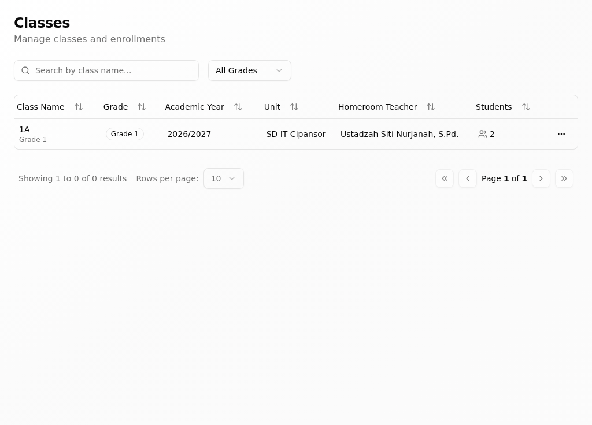
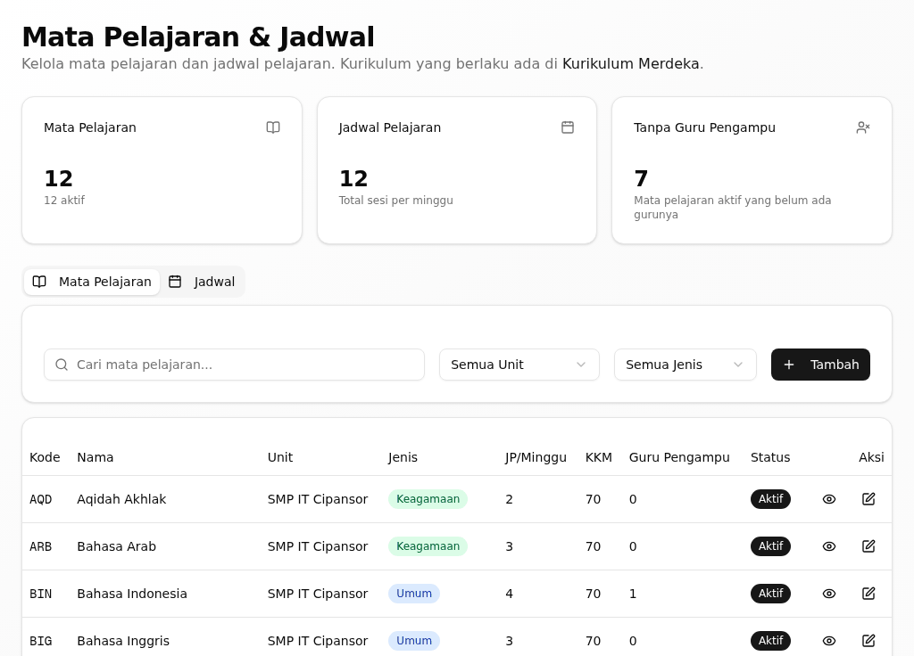
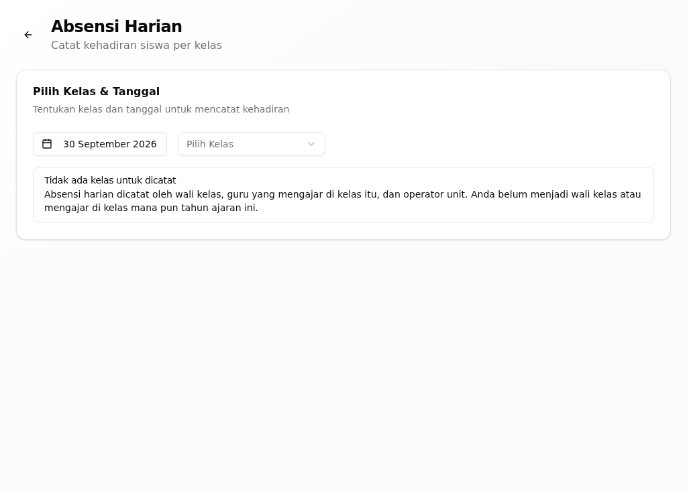
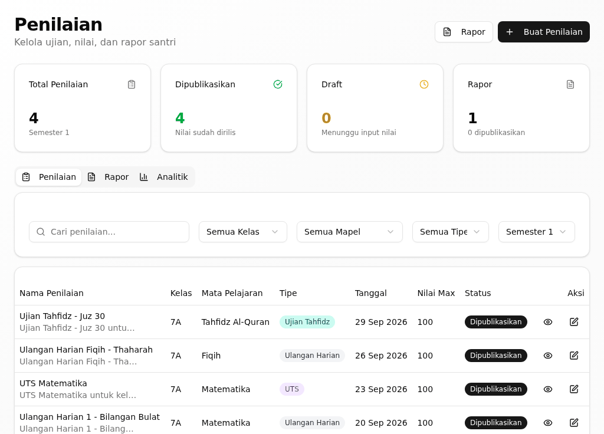
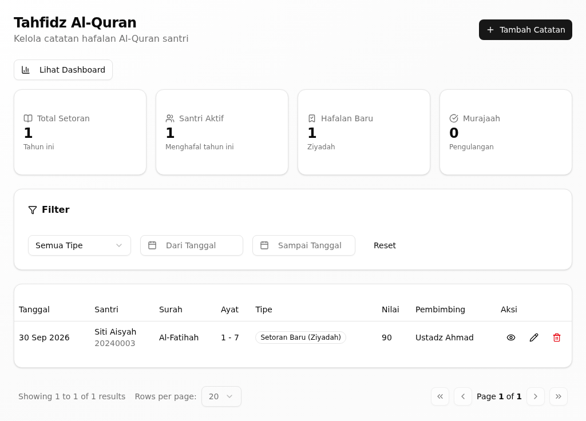
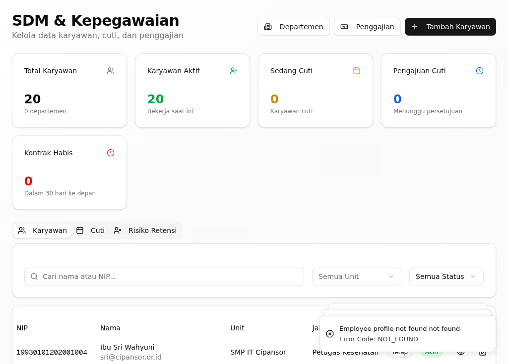
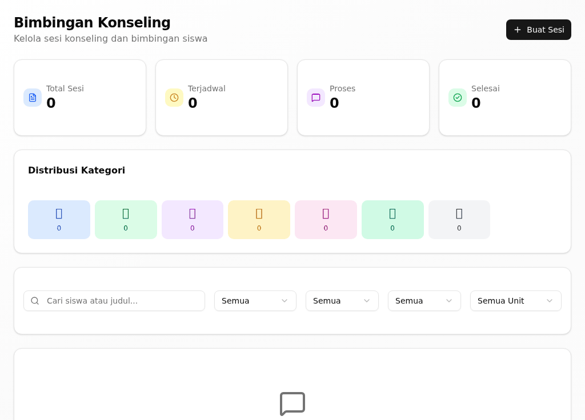
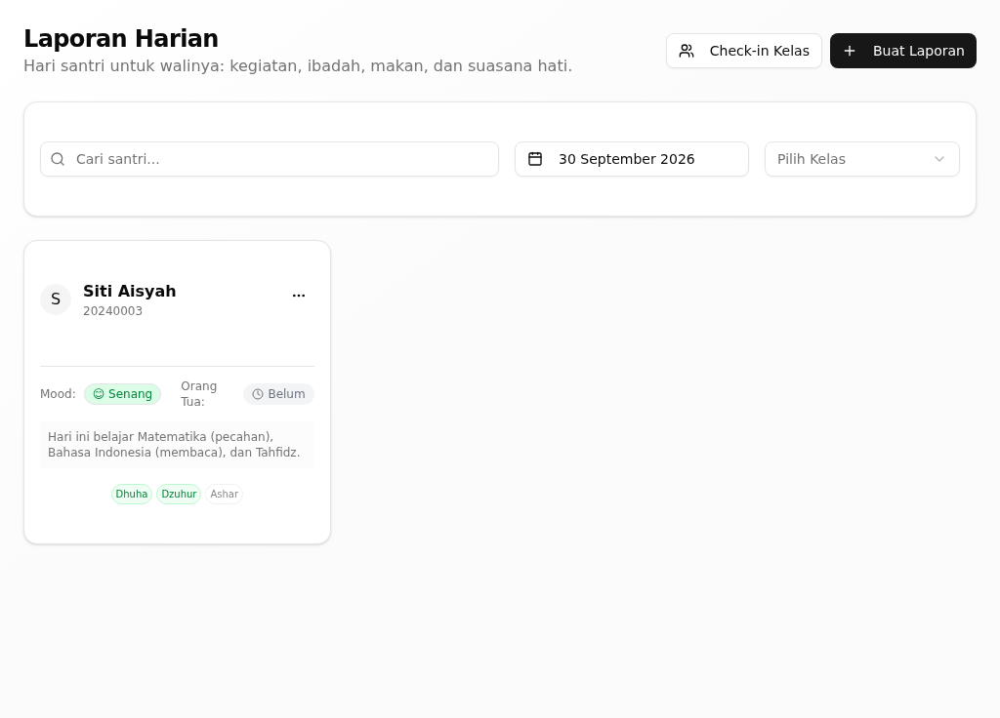

# Riwayat Revisi

| Versi | Tanggal | Basis aplikasi | Tingkat verifikasi | Perubahan |
|---|---|---|---|---|
| 0.1 | 30 September 2026 | aplikasi berjalan dari kode commit `a4735001` | **T1 — terverifikasi di aplikasi berjalan** | Penyusunan awal; tiap kartu dijalankan dengan akun demo kepala unit pada tumpukan lokal (PostgreSQL + API :3001 + web :3000) dan memuat tangkapan layar asli |

> **Tingkat verifikasi T1.** Semua kartu tugas di bawah sudah **dijalankan pada
> aplikasi berjalan** dengan akun demo kepala unit, dan tiap kartu memuat
> tangkapan layar asli. Bila Anda menemukan layar yang berbeda dari gambar di
> sini, laporkan kepada admin unit.

# 1. Tentang Buklet Ini

Buklet ini untuk **kepala unit** (`*_KEPALA`, mis. kepala TK, SD, SMP, SMA) —
pimpinan yang memantau akademik, kepegawaian, dan kinerja unit. Bagian umum
(masuk, dasbor, konsep, glosarium) ada di *Panduan Pengguna — Bagian Umum*.

Buklet ini menjelaskan versi aplikasi terbaru per 30 September 2026. Aplikasi
yang Anda pakai mungkin belum memuat semua perubahan itu; bila layar Anda
berbeda dari yang dijelaskan, tanyakan kepada admin unit.

## 1.1 Siapa Anda di aplikasi

Sebagai kepala unit, dasbor awal Anda adalah halaman **Dashboard** di
`/dashboard`. Menu Anda memuat kelompok **Ringkasan** (Analitik, Laporan,
Profil Unit), **Layanan Siswa** (Data Siswa, Kehadiran, Bimbingan Konseling),
**Akademik** (Mata Pelajaran & Jadwal, Penilaian, Classes, Tahfidz, Laporan
Harian), **SDM & Kepegawaian**, **Kinerja**, dan **Administrasi** (Pengumuman).
Semua data terbatas pada unit yang Anda pimpin.

## 1.2 Yang bisa dan tidak bisa Anda lakukan

- Anda **memantau** santri, kehadiran, nilai, tahfidz, dan keuangan unit.
- Anda **menyusun jadwal**, membuat penilaian, dan mengunduh rapor unit.
- Anda **mengelola kepegawaian** unit dan menilai kinerja pegawai.
- Anda **tidak** menetapkan tagihan atau memeriksa bukti bayar — itu tugas
  bendahara unit.
- Anda **tidak** menyusun naskah dinas — itu tugas tata usaha.

## 1.3 Tugas dalam buklet ini

| Tugas | Seberapa sering | Menu |
|---|---|---|
| Membuat kelas (rombel) baru | Awal tahun ajaran | Akademik → Classes |
| Menyusun jadwal pelajaran | Awal semester | Akademik → Mata Pelajaran & Jadwal |
| Mengisi absensi harian | Harian | Layanan Siswa → Kehadiran |
| Membuat penilaian dan rapor | Akhir semester | Akademik → Penilaian |
| Mencatat setoran tahfidz | Harian | Akademik → Tahfidz |
| Mengelola pegawai dan cuti | Sesuai kebutuhan | SDM & Kepegawaian |
| Membuat sesi bimbingan konseling | Sesuai kebutuhan | Layanan Siswa → Bimbingan Konseling |
| Menulis laporan harian | Harian | Akademik → Laporan Harian |
| Menyetujui Perjanjian Kinerja pegawai | Tahunan | Kinerja → Manajemen Kinerja |
| Membuat pengumuman unit | Sesuai kebutuhan | Administrasi → Pengumuman |

# 2. Tugas

## Membuat kelas (rombel) baru

**Tujuan.** Menyiapkan kelas atau rombongan belajar di unit Anda.

**Siapa.** Kepala unit.

**Jalur menu.** Akademik → Classes (`/classes`). Formulirnya di
`/classes/new`.

**Sebelum mulai.** Tahun ajaran dan tingkat kelasnya sudah ditetapkan.

**Langkah.**

1. Buka **Classes**, lalu klik **Add Class**.
   *Formulir **Tambah Kelas Baru** terbuka.*
2. Isi **Nama Kelas*** dan pilih tingkat serta walinya.
   *(Nama kolom bertanda bintang wajib diisi.)*
3. Klik **Simpan Kelas**.
   *Muncul pesan "Kelas berhasil dibuat" dan kelas tampil di daftar.*

{width=14cm}

*Gambar 1. Daftar kelas (rombel) unit beserta wali kelasnya.*

**Hasilnya, dan giliran siapa berikutnya.** Kelas siap diisi. Giliran tata
usaha atau wali kelas menempatkan santri ke kelas itu.

**Bila tidak berhasil.**

| Yang terlihat | Penyebab umum | Yang perlu dilakukan |
|---|---|---|
| "Gagal membuat kelas" | Nama kelas sudah dipakai atau isian wajib kosong | Pakai nama lain, lengkapi isiannya |
| "Failed to delete class" | Kelas masih dipakai | Pindahkan dulu santrinya |

**Ketersediaan.** Ada pada versi aplikasi yang dijelaskan buklet ini (lihat bagian 1).

## Menyusun jadwal pelajaran

**Tujuan.** Menetapkan mata pelajaran dan jadwal kelas di unit Anda.

**Siapa.** Kepala unit.

**Jalur menu.** Akademik → Mata Pelajaran & Jadwal (`/curriculum`).

**Sebelum mulai.** Mata pelajaran dan guru pengampu sudah diketahui.

**Langkah.**

1. Buka **Mata Pelajaran & Jadwal**.
2. Klik **Tambah** untuk menambah mata pelajaran, atau **Tambah Jadwal** untuk
   menyusun jadwalnya.
3. Pilih **Semua Kelas**, **Semua Jenis**, dan **Guru Pengampu** sesuai
   kebutuhan, lalu simpan.
   *Jadwal tampil di halaman ini.*

{width=14cm}

*Gambar 2. Mata Pelajaran & Jadwal: struktur kurikulum dan jadwal kelas unit.*

**Hasilnya, dan giliran siapa berikutnya.** Jadwal terlihat oleh guru dan
santri pada halaman **Jadwal**. Giliran guru memakai jadwal ini untuk mengajar
dan mengisi penilaian.

**Bila tidak berhasil.**

| Yang terlihat | Penyebab umum | Yang perlu dilakukan |
|---|---|---|
| Jadwal tidak tampil | Kelas atau jenis belum dipilih | Ulangi langkah 3 |
| Guru pengampu tidak muncul | Guru belum terdaftar di unit | Tambahkan pegawai dulu di SDM & Kepegawaian |

**Ketersediaan.** Ada pada versi aplikasi yang dijelaskan buklet ini (lihat bagian 1).

## Mengisi absensi harian

**Tujuan.** Mencatat kehadiran santri satu kelas pada satu hari.

**Siapa.** Kepala unit, wali kelas, atau guru yang mengajar hari itu.

**Jalur menu.** Layanan Siswa → Kehadiran (`/attendance`). Formulirnya di
`/attendance/record`.

**Sebelum mulai.** Kelas dan tanggalnya sudah ditetapkan.

**Langkah.**

1. Buka **Kehadiran**, lalu pilih **Pilih Kelas & Tanggal**.
   *Daftar santri kelas itu tampil.*
2. Untuk tiap santri, tetapkan statusnya: **Hadir**, **Izin**, **Sakit**,
   **Terlambat**, atau **Tidak Hadir**.
3. Klik **Simpan Kehadiran**.
   *Kehadiran tersimpan dan ringkasannya diperbarui.*

{width=14cm}

*Gambar 3. Formulir Absensi Harian: status kehadiran tiap santri dalam satu kelas.*

**Hasilnya, dan giliran siapa berikutnya.** Kehadiran tercatat dan menjadi
bahan Laporan Harian serta Analitik. Giliran wali kelas menindaklanjuti santri
yang sering tidak hadir.

**Bila tidak berhasil.**

| Yang terlihat | Penyebab umum | Yang perlu dilakukan |
|---|---|---|
| "Pilih kelas terlebih dahulu" | Kelas belum dipilih | Ulangi langkah 1 |
| Kehadiran tidak tersimpan | Halaman ditinggalkan sebelum menyimpan | Ulangi langkah 3 |

**Ketersediaan.** Ada pada versi aplikasi yang dijelaskan buklet ini (lihat bagian 1).

## Membuat penilaian dan rapor

**Tujuan.** Menyusun penilaian mata pelajaran dan menghasilkan rapor santri.

**Siapa.** Kepala unit atau guru mata pelajaran.

**Jalur menu.** Akademik → Penilaian (`/assessment`).

**Sebelum mulai.** Nilai formatif dan sumatif sudah diinput guru.

**Langkah.**

1. Buka **Penilaian**.
2. Klik **Buat Penilaian** untuk membuat penilaian baru, lalu isi nilainya.
   *Penilaian tampil pada daftar beserta progres input nilainya.*
3. Klik **Generate Rapor**.
   *Rapor unit terunduh dan siap dibagikan.*

{width=14cm}

*Gambar 4. Penilaian: nilai formatif dan sumatif per mata pelajaran beserta tombol Generate Rapor.*

**Hasilnya, dan giliran siapa berikutnya.** Rapor terunduh. Giliran wali kelas
membagikan rapor kepada keluarga.

**Bila tidak berhasil.**

| Yang terlihat | Penyebab umum | Yang perlu dilakukan |
|---|---|---|
| "Progres input nilai" belum penuh | Masih ada nilai yang kosong | Lengkapi dulu nilainya |
| Rapor tidak terunduh | Peramban memblokir unduhan | Izinkan unduhan untuk situs ini |

**Ketersediaan.** Ada pada versi aplikasi yang dijelaskan buklet ini (lihat bagian 1).

## Mencatat setoran tahfidz

**Tujuan.** Mencatat setoran atau murajaah hafalan seorang santri.

**Siapa.** Kepala unit, guru tahfidz, atau musyrif.

**Jalur menu.** Akademik → Tahfidz (`/tahfidz`). Formulirnya di `/tahfidz/new`.

**Sebelum mulai.** Santri dan jenis setorannya sudah diketahui.

**Langkah.**

1. Buka **Tahfidz**, lalu klik **Tambah Catatan**.
   *Formulir **Tambah Catatan Tahfidz** terbuka.*
2. Pilih santrinya, lalu isi jenis setoran, surah, dan ayatnya.
3. Klik **Simpan Catatan**.
   *Muncul pesan "Catatan tahfidz berhasil disimpan".*

{width=14cm}

*Gambar 5. Tahfidz: catatan hafalan seluruh santri unit.*

**Hasilnya, dan giliran siapa berikutnya.** Setoran tercatat dan capaian
hafalan santri bertambah. Musyrif dan keluarga dapat melihatnya di portal
masing-masing.

**Bila tidak berhasil.**

| Yang terlihat | Penyebab umum | Yang perlu dilakukan |
|---|---|---|
| "Catatan tahfidz berhasil disimpan" tidak muncul | Santri atau jenis setoran belum lengkap | Ulangi langkah 2 |
| "Catatan tahfidz berhasil dihapus" muncul tanpa sengaja | Tombol hapus terklik | Catat ulang setorannya |

**Ketersediaan.** Ada pada versi aplikasi yang dijelaskan buklet ini (lihat bagian 1).

## Mengelola pegawai dan cuti

**Tujuan.** Menambah pegawai unit dan mencatat pengajuan cutinya.

**Siapa.** Kepala unit.

**Jalur menu.** SDM & Kepegawaian (`/hr`).

**Sebelum mulai.** Data pegawai atau pengajuan cutinya sudah diterima.

**Langkah.**

1. Buka **SDM & Kepegawaian**.
2. Klik **Tambah Karyawan** untuk mendaftarkan pegawai baru, lalu isi datanya.
3. Untuk cuti, klik **Ajukan Cuti**, isi **Jenis Cuti** dan **Alasan**, lalu
   simpan.
   *Pengajuan cuti tampil dengan status **Menunggu**.*

{width=14cm}

*Gambar 6. SDM & Kepegawaian: data pegawai, kontrak, dan absensi staf unit.*

**Hasilnya, dan giliran siapa berikutnya.** Pegawai tercatat dan cuti menunggu
keputusan. Giliran pimpinan unit menyetujui atau menolaknya.

**Bila tidak berhasil.**

| Yang terlihat | Penyebab umum | Yang perlu dilakukan |
|---|---|---|
| Pegawai tidak muncul | Unit belum dipilih dengan benar | Saring dengan **Semua Unit** |
| Cuti tetap **Menunggu** | Belum diputuskan | Buka pengajuannya, lalu setujui |

**Ketersediaan.** Ada pada versi aplikasi yang dijelaskan buklet ini (lihat bagian 1).

## Membuat sesi bimbingan konseling

**Tujuan.** Menjadwalkan pendampingan seorang santri beserta tindak lanjutnya.

**Siapa.** Kepala unit atau guru bimbingan konseling.

**Jalur menu.** Layanan Siswa → Bimbingan Konseling (`/counseling`).

**Sebelum mulai.** Santri dan topik pendampingannya sudah diketahui.

**Langkah.**

1. Buka **Bimbingan Konseling**.
2. Klik **Buat Sesi**.
3. Isi **Judul**, **Kategori**, dan **Prioritas**, lalu simpan.
   *Sesi tampil pada daftar beserta statusnya.*

{width=14cm}

*Gambar 7. Bimbingan Konseling: sesi pendampingan santri dan tindak lanjutnya.*

**Hasilnya, dan giliran siapa berikutnya.** Sesi terjadwal; giliran pembimbing
mencatat hasilnya dan menandai sesi **Selesai**.

**Bila tidak berhasil.**

| Yang terlihat | Penyebab umum | Yang perlu dilakukan |
|---|---|---|
| "Gagal memuat data" | Koneksi bermasalah | Muat ulang halaman |
| "Sesi konseling berhasil dihapus" muncul tanpa sengaja | Tombol hapus terklik | Buat sesinya kembali |

**Ketersediaan.** Ada pada versi aplikasi yang dijelaskan buklet ini (lihat bagian 1).

## Menulis laporan harian

**Tujuan.** Mencatat kegiatan belajar mengajar unit pada satu hari.

**Siapa.** Kepala unit atau guru.

**Jalur menu.** Akademik → Laporan Harian (`/daily-report`).

**Sebelum mulai.** Tanggal dan kelasnya sudah ditetapkan.

**Langkah.**

1. Buka **Laporan Harian**.
2. Pilih **Pilih Tanggal**, lalu klik **Buat Laporan Baru**.
   *Formulir laporan terbuka.*
3. Isi kegiatan hari itu, lalu klik **Buat Laporan**.
   *Laporan tampil pada daftar tanggal itu.*

{width=14cm}

*Gambar 8. Laporan Harian: catatan kegiatan belajar mengajar harian unit.*

**Hasilnya, dan giliran siapa berikutnya.** Laporan tersimpan dan menjadi bahan
pemantauan yayasan.

**Bila tidak berhasil.**

| Yang terlihat | Penyebab umum | Yang perlu dilakukan |
|---|---|---|
| "Belum ada laporan harian untuk tanggal ini." | Belum ada laporan pada tanggal itu | Klik **Buat Laporan Baru** |
| Kelas tidak muncul | Kelas belum dipilih | Saring dengan **Semua Kelas** |

**Ketersediaan.** Ada pada versi aplikasi yang dijelaskan buklet ini (lihat bagian 1).

## Menyetujui Perjanjian Kinerja pegawai

**Tujuan.** Menyetujui atau mengembalikan Perjanjian Kinerja pegawai unit Anda.

**Siapa.** Kepala unit sebagai atasan penilai.

**Jalur menu.** Kinerja → Manajemen Kinerja → Perjanjian Kinerja
(`/kinerja/pk`).

**Sebelum mulai.** Pegawai sudah mengajukan PK-nya kepada Anda.

**Langkah.**

1. Buka **Perjanjian Kinerja**.
2. Buka PK pegawai yang menunggu keputusan Anda.
3. Klik **Setujui** bila targetnya sudah sepakat.
   *Muncul pesan "Perjanjian Kinerja berhasil disetujui".*
4. Bila perlu perbaikan, klik **Kembalikan**.
   *Muncul pesan "Perjanjian Kinerja dikembalikan untuk revisi".*

{width=14cm}

*Gambar 9. Perjanjian Kinerja: target kerja pegawai dan keputusan atasan penilai.*

**Hasilnya, dan giliran siapa berikutnya.** PK yang disetujui menjadi dasar
evaluasi kinerja periodik pegawai itu.

**Bila tidak berhasil.**

| Yang terlihat | Penyebab umum | Yang perlu dilakukan |
|---|---|---|
| Tidak ada PK yang menunggu | Pegawai belum mengajukan | Ingatkan pegawai untuk mengajukan |
| PK tidak bisa disetujui | Target belum lengkap | Kembalikan untuk revisi |

**Ketersediaan.** Ada pada versi aplikasi yang dijelaskan buklet ini (lihat bagian 1).

## Membuat pengumuman unit

**Tujuan.** Menyiarkan kabar unit kepada pengguna aplikasi.

**Siapa.** Kepala unit.

**Jalur menu.** Administrasi → Pengumuman (`/announcements`).

**Sebelum mulai.** Isi pengumuman sudah disiapkan.

**Langkah.**

1. Buka **Pengumuman**, lalu klik **Buat Baru**.
   *Formulir **Buat Pengumuman Baru** terbuka.*
2. Isi **Judul*** dan **Konten***.
3. Klik **Simpan**.
   *Muncul pesan "Pengumuman berhasil dibuat".*

{width=14cm}

*Gambar 10. Halaman Pengumuman unit dan formulir Buat Pengumuman Baru.*

**Hasilnya, dan giliran siapa berikutnya.** Pengumuman tampil di halaman
Pengumuman pengguna yang berhak membacanya.

**Bila tidak berhasil.**

| Yang terlihat | Penyebab umum | Yang perlu dilakukan |
|---|---|---|
| "Judul dan konten wajib diisi" | Ada isian wajib yang kosong | Isi **Judul*** dan **Konten*** |

**Ketersediaan.** Ada pada versi aplikasi yang dijelaskan buklet ini (lihat bagian 1).

# 3. Bila Ada Masalah

- **Menu yang dijelaskan tidak tampil.** Menu ditentukan peran dan unit Anda;
  tanyakan kepada admin unit.
- **Data tampak kosong.** Semua data terbatas pada unit yang Anda pimpin;
  pastikan unitnya benar.
- **Layar berbeda dari gambar di buklet.** Aplikasi yang Anda pakai mungkin
  belum memuat semua perubahan; laporkan kepada admin unit.
