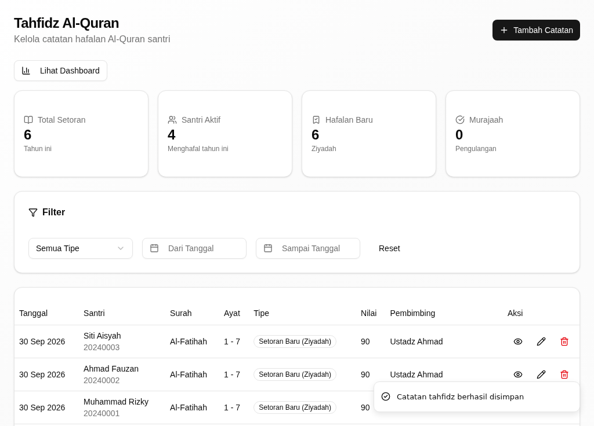
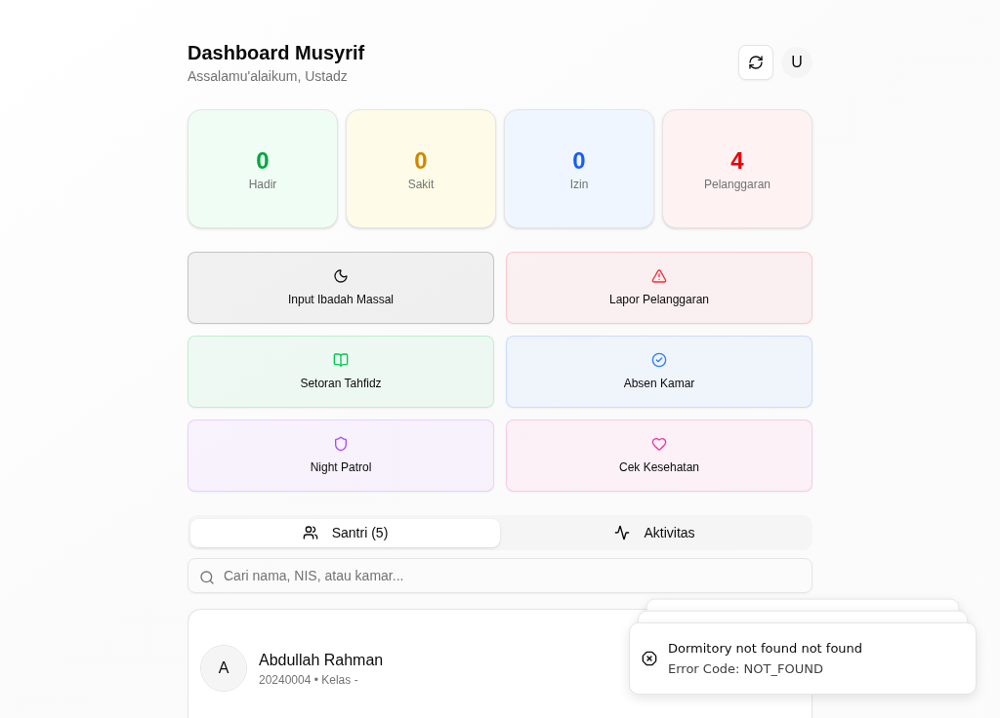
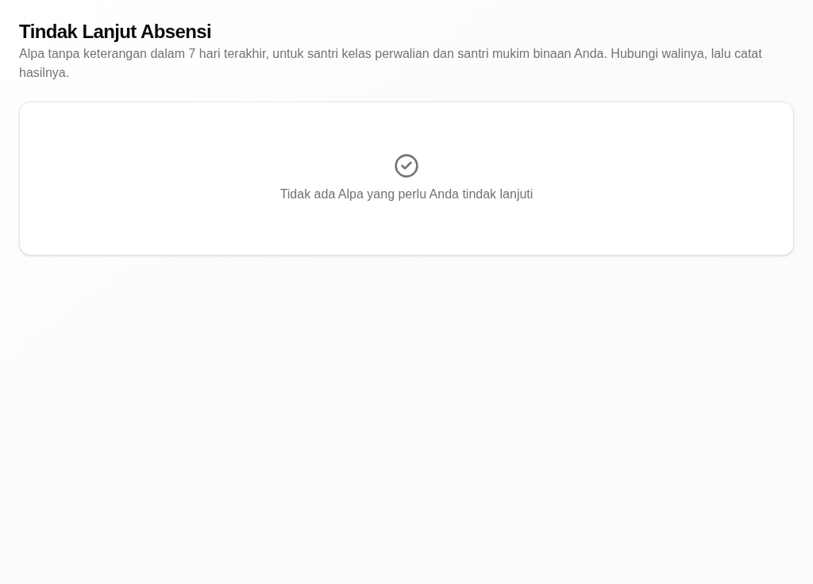
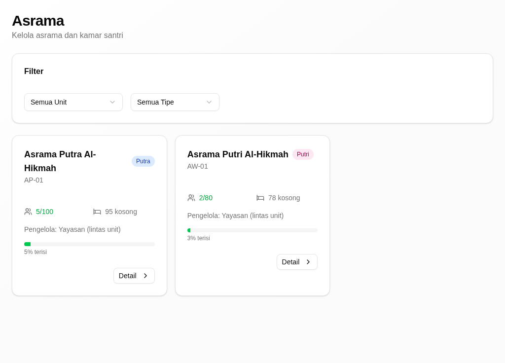
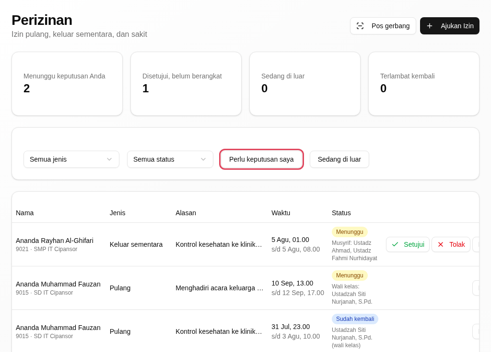
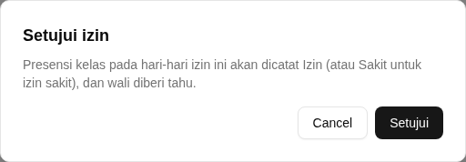
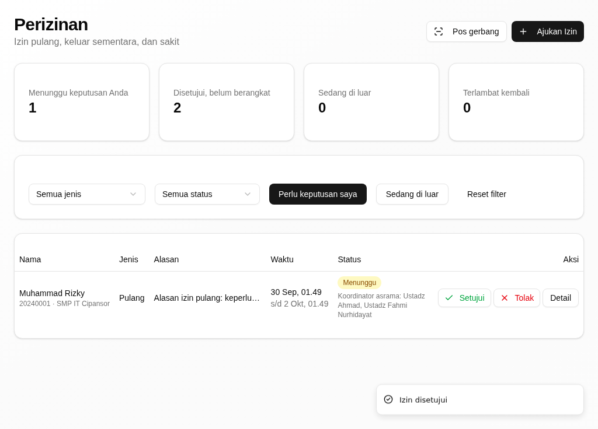

# Riwayat Revisi

| Versi | Tanggal | Basis aplikasi | Tingkat verifikasi | Perubahan |
|---|---|---|---|---|
| 0.1 | 30 September 2026 | aplikasi berjalan dari kode PR #512 (setelah `main` `2377f5fb`) | **T1 — terverifikasi di aplikasi berjalan** | Penyusunan awal; tiap kartu dijalankan dengan akun demo musyrif (`pesantren.musyrif@cipansor.or.id`) pada tumpukan lokal (PostgreSQL + API :3001 + web :3000) dan memuat tangkapan layar asli |

> **Tingkat verifikasi T1.** Semua kartu tugas di bawah sudah **dijalankan pada
> aplikasi berjalan** dengan akun demo musyrif, dan tiap kartu memuat tangkapan
> layar asli. Bila Anda menemukan layar yang berbeda dari gambar di sini,
> laporkan kepada admin unit.

# 1. Tentang Buklet Ini

Buklet ini untuk **musyrif** (pembimbing/pengasuh santri mukim) di pesantren.
Bagian umum (masuk, dasbor, konsep, glosarium) ada di *Panduan Pengguna — Bagian
Umum*.

Buklet ini menjelaskan versi aplikasi terbaru per 30 September 2026. Aplikasi
yang Anda pakai mungkin belum memuat semua perubahan itu; bila layar Anda
berbeda dari yang dijelaskan, tanyakan kepada admin unit. Di beberapa layar,
santri masih tertulis **Siswa** atau **Students**; buklet ini menulis nama tombol
dan judul persis seperti di layar.

## 1.1 Siapa Anda di aplikasi

Sebagai musyrif, dasbor awal Anda adalah halaman **Dashboard Musyrif** di
`/musyrif`. Menu Anda berkelompok: **Halaqoh & Tahfidz** (Tahfidz, Takhosus,
Kitab Kuning), **Pengasuhan** (Santri Binaan, Tindak Lanjut Absensi, Pola
Kehadiran, Asrama, Musyrif, Mutabaah Yaumiyah, Jurnal Ibadah, Muhasabah),
**Kedisiplinan** (Perizinan, Pelanggaran, Prestasi & Reward, Piket & Jaga),
**Kegiatan**, **Layanan**, **Laporan**, dan **Informasi**.

## 1.2 Yang bisa dan tidak bisa Anda lakukan

- Anda mengurus **santri binaan** Anda: hafalan, kehadiran, kedisiplinan,
  asrama, dan kesehatan.
- Anda **memutuskan izin santri mukim** — santri yang tinggal di asrama dan Anda
  bina. Izin santri harian (tidak mukim) diputuskan wali kelasnya.
- Anda **mencatat setoran tahfidz** santri binaan Anda.
- Kepala unit hanya turun tangan untuk izin lebih dari 7 hari, santri tanpa
  pembimbing, atau mengambil alih keputusan.
- Data santri hanya tampil sebatas santri binaan dan unit Anda.

## 1.3 Tugas dalam buklet ini

| Tugas | Seberapa sering | Menu |
|---|---|---|
| Mencatat setoran tahfidz | Harian | Halaqoh & Tahfidz → Tahfidz |
| Mengurus pengasuhan santri binaan | Harian | Pengasuhan → Santri Binaan, Tindak Lanjut Absensi, Asrama |
| Memutuskan izin santri mukim | Sesuai pengajuan | Kedisiplinan → Perizinan |

# 2. Tugas

## Mencatat setoran tahfidz

**Tujuan.** Mencatat setoran atau murajaah hafalan seorang santri binaan.

**Siapa.** Musyrif, untuk santri binaannya.

**Jalur menu.** Halaqoh & Tahfidz → Tahfidz (`/tahfidz`).

**Sebelum mulai.** Santri itu ada dalam binaan Anda.

**Langkah.**

1. Buka **Tahfidz**, lalu klik **Tambah Catatan**.
   *Formulir **Tambah Catatan Tahfidz** terbuka.*
2. Pada **Santri**, klik kotak pencarian santri, lalu pilih nama santri itu.
   *Nama dan NIS santri terisi.*
3. Pada **Tipe**, pilih jenisnya (mis. **Setoran Baru (Ziyadah)**).
4. Pada **Nilai**, pilih nilainya (mis. **Mumtaz (Sangat Baik)**).
5. Pada **Surah**, klik kotak **Pilih surah**, lalu pilih surahnya.
6. Isi **Ayat Awal** dan **Ayat Akhir** dengan angka ayat.
7. Klik **Simpan Catatan**.
   *Muncul pesan "Catatan tahfidz berhasil disimpan".*

{width=14cm}

*Gambar 1. Formulir Tambah Catatan Tahfidz: pilih santri, tanggal, tipe, nilai, surah, dan ayat.*

{width=14cm}

*Gambar 2. Setoran tersimpan; muncul pesan "Catatan tahfidz berhasil disimpan".*

**Hasilnya, dan giliran siapa berikutnya.** Setoran tercatat pada santri itu dan
tampil di halaman Tahfidz serta ringkasan hafalannya. Kekosongan setoran pada
hari tertentu dapat menjadi catatan tersendiri.

**Bila tidak berhasil.**

| Yang terlihat | Penyebab umum | Yang perlu dilakukan |
|---|---|---|
| "Santri wajib dipilih" | Santri belum dipilih | Ulangi langkah 2 |
| "Surah wajib dipilih" | Surah belum dipilih | Ulangi langkah 5 |
| "Ayat akhir harus sama atau lebih besar dari ayat awal" | Ayat akhir lebih kecil daripada ayat awal | Betulkan angkanya |
| Tombol **Simpan Catatan** tidak bereaksi | Ada isian wajib yang belum lengkap | Periksa **Tipe**, **Nilai**, **Surah**, dan ayat |

**Ketersediaan.** Ada pada versi aplikasi yang dijelaskan buklet ini (lihat bagian 1).

## Mengurus pengasuhan santri binaan

**Tujuan.** Menjaga keadaan santri binaan: kehadiran, kedisiplinan, dan
asramanya.

**Siapa.** Musyrif, untuk santri binaannya.

**Jalur menu.** Pengasuhan → Santri Binaan (`/students`). Halaman terkait:
Pengasuhan → Tindak Lanjut Absensi (`/attendance/follow-ups`) dan Pengasuhan →
Asrama (`/dormitories`).

**Langkah.**

1. Buka **Dashboard Musyrif** untuk melihat ringkasannya.
   *Ringkasan santri binaan, kehadiran, dan pekerjaan pengasuhan tampil.*
2. Buka **Santri Binaan** untuk melihat daftar dan keadaan tiap santri.
3. Buka **Tindak Lanjut Absensi** untuk menindaklanjuti santri yang **Alpa**
   (tidak hadir tanpa keterangan).
   *Daftar Alpa tanpa keterangan dalam 7 hari terakhir tampil.*
4. Buka **Asrama** untuk melihat kamar dan penghuninya.
   *Daftar kamar beserta penghuninya tampil.*

{width=14cm}

*Gambar 3. Dashboard Musyrif: ringkasan santri binaan dan kehadiran.*

{width=14cm}

*Gambar 4. Tindak Lanjut Absensi: Alpa tanpa keterangan santri binaan menunggu ditindaklanjuti.*

{width=14cm}

*Gambar 5. Asrama: kamar dan penghuni yang Anda urus.*

**Hasilnya, dan giliran siapa berikutnya.** Anda melihat keadaan santri binaan
dan menindaklanjuti Alpa; cara mencatat hasil tindak lanjut sama seperti kartu
"Menindaklanjuti Alpa" pada buklet Pendidik. Perubahan besar (pindah kamar,
sanksi) lewat admin unit.

**Bila tidak berhasil.**

| Yang terlihat | Penyebab umum | Yang perlu dilakukan |
|---|---|---|
| Daftar santri kosong | Anda belum ditetapkan membina santri mana pun | Hubungi admin unit |
| Santri tidak tampil di Tindak Lanjut | Tidak ada Alpa dalam 7 hari terakhir | Tidak ada yang perlu dilakukan |

**Ketersediaan.** Ada pada versi aplikasi yang dijelaskan buklet ini (lihat bagian 1).

## Memutuskan izin santri mukim

**Tujuan.** Menyetujui atau menolak permohonan izin santri mukim binaan Anda.

**Siapa.** Musyrif, untuk santri mukim binaannya. (Izin santri harian diputuskan
wali kelasnya.)

**Jalur menu.** Kedisiplinan → Perizinan (`/permits`).

**Sebelum mulai.** Ada permohonan izin yang menunggu keputusan Anda.

**Langkah.**

1. Buka **Perizinan**, lalu nyalakan penyaring **Perlu keputusan saya**.
   *Daftar izin santri binaan yang menunggu keputusan tampil.*
2. Periksa satu izin: **Jenis izin**, waktu **Berangkat** dan **Kembali**, dan
   **Alasan**.
3. Klik **Setujui izin** untuk menyetujui, atau **Tolak izin** untuk menolak.
   *Kotak konfirmasi terbuka.*
4. Isi catatan bila perlu, lalu klik **Setujui** (atau **Tolak**).
   *Muncul pesan "Izin disetujui" (atau "Izin ditolak").*

{width=14cm}

*Gambar 6. Bagi musyrif, izin santri binaannya menunggu di Perizinan.*

{width=14cm}

*Gambar 7. Kotak konfirmasi "Setujui izin" sebelum keputusan disimpan.*

{width=14cm}

*Gambar 8. Keputusan tersimpan; muncul pesan "Izin disetujui".*

**Hasilnya, dan giliran siapa berikutnya.** Izin yang disetujui menunggu pintu
gerbang mencatat keberangkatan dan kepulangan santri; izin yang ditolak kembali
ke pemohon beserta alasannya. Izin lebih dari 7 hari, atau santri tanpa
pembimbing, naik ke kepala unit.

**Bila tidak berhasil.**

| Yang terlihat | Penyebab umum | Yang perlu dilakukan |
|---|---|---|
| Daftar izin kosong | Tidak ada pengajuan yang menunggu, atau santri itu bukan binaan Anda | Periksa penyaring; tanyakan admin unit |
| Izin tidak bisa diputuskan | Izin itu sudah diputuskan atau diteruskan | Muat ulang halaman |

**Ketersediaan.** Ada pada versi aplikasi yang dijelaskan buklet ini (lihat bagian 1).

# 3. Bila Ada Masalah

- **Tidak bisa membuka halaman.** Laporkan ke admin unit; sebutkan jalur menu
  dan pesan yang muncul.
- **Santri binaan tidak tampil.** Hubungi admin unit untuk memastikan penugasan
  binaan.
- **Halaman Musyrif belum jalan penuh.** Beberapa bagian dashboard musyrif masih
  disempurnakan; pakai halaman menu yang dijelaskan di buklet ini.

Ke mana melapor: **admin unit pesantren** (bukan nama orang tertentu).
