# Riwayat Revisi

| Versi | Tanggal | Basis aplikasi | Tingkat verifikasi | Perubahan |
|---|---|---|---|---|
| 0.1 | 30 September 2026 | aplikasi berjalan dari kode commit `a4735001` | **T1 — terverifikasi di aplikasi berjalan** | Penyusunan awal; tiap kartu dijalankan dengan akun demo pengurus yayasan pada tumpukan lokal (PostgreSQL + API :3001 + web :3000) dan memuat tangkapan layar asli |

> **Tingkat verifikasi T1.** Semua kartu tugas di bawah sudah **dijalankan pada
> aplikasi berjalan** dengan akun demo pengurus yayasan, dan tiap kartu memuat
> tangkapan layar asli. Bila Anda menemukan layar yang berbeda dari gambar di
> sini, laporkan kepada admin unit.

# 1. Tentang Buklet Ini

Buklet ini untuk **pengurus yayasan** — pengurus, pengawas, dan pembina yang
meninjau seluruh unit. Bagian umum (masuk, dasbor, konsep, glosarium) ada di
*Panduan Pengguna — Bagian Umum*.

Buklet ini menjelaskan versi aplikasi terbaru per 30 September 2026. Aplikasi
yang Anda pakai mungkin belum memuat semua perubahan itu; bila layar Anda
berbeda dari yang dijelaskan, tanyakan kepada admin unit.

## 1.1 Siapa Anda di aplikasi

Sebagai pengurus yayasan, dasbor awal Anda adalah halaman **Dashboard** di
`/dashboard`. Menu Anda memuat kelompok **Ringkasan** (Dashboard, Analytics,
Reports), **Yayasan** (Yayasan beserta Units, Penjaminan Mutu beserta Aduan &
Aspirasi, Manajemen Risiko, Pengawasan Internal, Kepatuhan Syariah),
**Perencanaan & Kinerja** (Perencanaan Strategis, Manajemen Kinerja),
**Keuangan** (Tagihan & SPP beserta Verifikasi Pembayaran, Laporan Keuangan
beserta BOS/BOP, Donation/ZIS, Procurement), dan **Informasi** (E-Office
(Persuratan), Pengumuman, Data Alumni). Berbeda dari kepala unit, Anda melihat
**seluruh unit** sekaligus.

## 1.2 Yang bisa dan tidak bisa Anda lakukan

- Anda **meninjau mutu, risiko, pengawasan, dan kepatuhan syariah** seluruh
  unit.
- Anda **mengelola profil yayasan, unit pendidikan, dan rencana strategis**
  (RPJP → Renstra → RKA).
- Anda **mengesahkan** rencana unit dan **mengawasi keuangan** yayasan.
- Anda **tidak** mencatat tagihan harian santri — itu tugas bendahara unit.
- Anda **tidak** mengubah nilai akademik; itu tugas guru dan kepala unit.

## 1.3 Tugas dalam buklet ini

| Tugas | Seberapa sering | Menu |
|---|---|---|
| Menambah unit pendidikan | Sesuai kebutuhan | Yayasan → Units |
| Mengelola profil dan dokumen yayasan | Sesuai kebutuhan | Ringkasan → Yayasan |
| Meninjau penjaminan mutu SPMI | Tiap semester | Yayasan → Penjaminan Mutu |
| Mencatat dan memantau risiko | Bulanan | Yayasan → Manajemen Risiko |
| Mencatat temuan pengawasan | Sesuai temuan | Yayasan → Pengawasan Internal |
| Mencatat audit kepatuhan syariah | Tahunan | Yayasan → Kepatuhan Syariah |
| Menyusun dan mengesahkan rencana | Tahunan | Perencanaan & Kinerja |
| Mengesahkan pembayaran tingkat yayasan | Harian | Keuangan → Verifikasi Pembayaran |
| Memantau laporan keuangan | Bulanan | Keuangan → Laporan Keuangan |
| Memantau BOS/BOP | Bulanan | Keuangan → BOS/BOP |
| Mencatat donasi dan ZIS | Sesuai kebutuhan | Keuangan → Donation/ZIS |
| Memantau pengadaan barang | Sesuai kebutuhan | Keuangan → Procurement |
| Memantau alumni | Sesuai kebutuhan | Informasi → Data Alumni |
| Menangani aduan & aspirasi | Harian | Yayasan → Penjaminan Mutu → Aduan & Aspirasi |
| Menyetujui Perjanjian Kinerja | Tahunan | Perencanaan & Kinerja |

# 2. Tugas

## Menambah unit pendidikan

**Tujuan.** Mendaftarkan unit pendidikan baru (TK, SD, SMP, SMA) ke yayasan.

**Siapa.** Pengurus yayasan.

**Jalur menu.** Yayasan → Units (`/units`). Formulirnya di
`/units/new`.

**Sebelum mulai.** Nama, jenjang, dan alamat unit sudah ditetapkan.

**Langkah.**

1. Buka **Unit Pendidikan**, lalu klik **Tambah Unit**.
   *Formulir unit baru terbuka.*
2. Isi nama, jenjang, dan alamat unitnya.
3. Klik **Simpan Unit**.
   *Muncul pesan "Unit berhasil dibuat" dan unit tampil di daftar.*

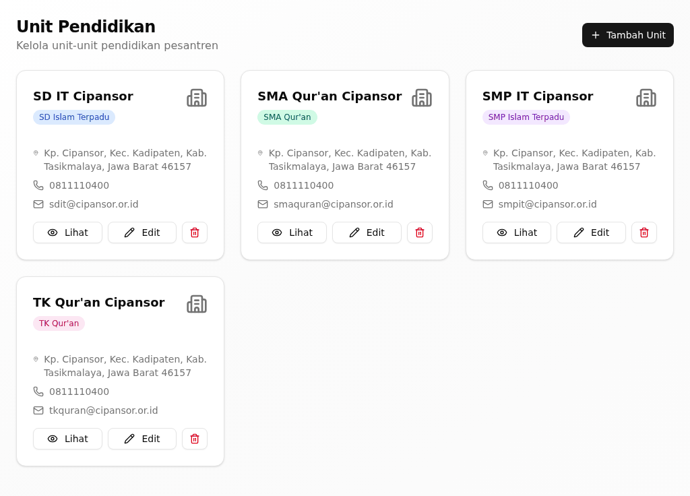{width=14cm}

*Gambar 1. Unit Pendidikan: daftar TK, SD, SMP, dan SMA beserta statusnya.*

**Hasilnya, dan giliran siapa berikutnya.** Unit baru tersedia untuk diisi
kelas, santri, dan pegawai oleh admin unit masing-masing.

**Bila tidak berhasil.**

| Yang terlihat | Penyebab umum | Yang perlu dilakukan |
|---|---|---|
| "Unit berhasil dibuat" tidak muncul | Ada isian wajib yang kosong | Lengkapi isiannya |
| Unit tidak muncul di daftar | Daftar belum dimuat ulang | Muat ulang halaman |

**Ketersediaan.** Ada pada versi aplikasi yang dijelaskan buklet ini (lihat bagian 1).

## Mengelola profil dan dokumen yayasan

**Tujuan.** Memperbarui profil yayasan dan menyimpan dokumen serta pengurusnya.

**Siapa.** Pengurus yayasan.

**Jalur menu.** Yayasan → Yayasan (`/foundation`).

**Sebelum mulai.** Data atau dokumen yayasan sudah disiapkan.

**Langkah.**

1. Buka **Yayasan**.
2. Untuk memperbarui profil, ubah datanya lalu simpan.
   *Muncul pesan "Data yayasan berhasil diperbarui".*
3. Klik **Tambah Dokumen** untuk menyimpan akta atau dokumen resmi lainnya.
4. Klik **Tambah Pengurus** untuk mencatat pengurus dan pengawas yayasan.

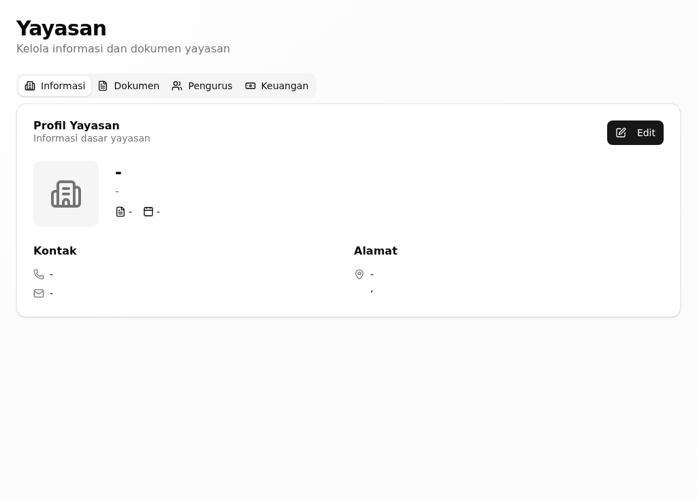{width=14cm}

*Gambar 2. Yayasan: profil, dokumen, dan organ yayasan.*

**Hasilnya, dan giliran siapa berikutnya.** Profil dan dokumen yayasan
diperbarui; menjadi rujukan unit dalam menyusun dokumen resminya.

**Bila tidak berhasil.**

| Yang terlihat | Penyebab umum | Yang perlu dilakukan |
|---|---|---|
| "Gagal memperbarui data yayasan" | Data tidak diterima | Periksa isian wajib, lalu ulangi |
| "Dokumen berhasil dihapus" muncul tanpa sengaja | Tombol hapus terklik | Unggah ulang dokumennya |

**Ketersediaan.** Ada pada versi aplikasi yang dijelaskan buklet ini (lihat bagian 1).

## Meninjau penjaminan mutu SPMI

**Tujuan.** Memantau kelengkapan standar mutu dan jadwal audit tiap unit.

**Siapa.** Pengurus yayasan atau pengawas mutu.

**Jalur menu.** Yayasan → Penjaminan Mutu (`/quality`). Lembar auditnya di
`/quality/audits`.

**Sebelum mulai.** Unit yang akan ditinjau sudah ditetapkan.

**Langkah.**

1. Buka **Penjaminan Mutu**, lalu pilih unitnya.
   *Kelengkapan standar mutu unit itu tampil.*
2. Buka jadwal auditnya, lalu klik **Buka Lembar Audit** pada audit yang
   berjalan.
3. Catat temuan auditnya pada lembar audit.
   *Temuan tersimpan pada lembar audit unit.*

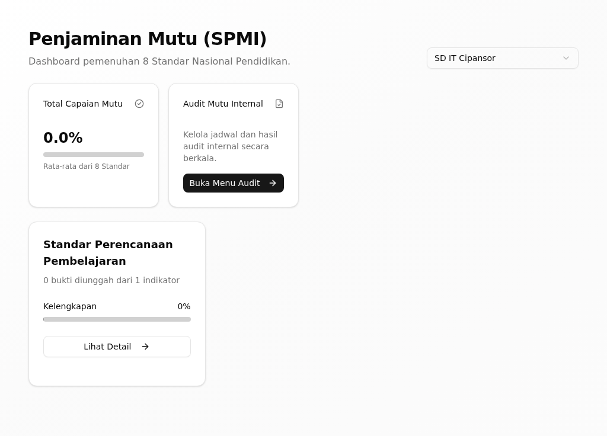{width=14cm}

*Gambar 3. Penjaminan Mutu SPMI: standar, audit mutu, dan temuan.*

**Hasilnya, dan giliran siapa berikutnya.** Temuan mutu tercatat; giliran
kepala unit menindaklanjutinya.

**Bila tidak berhasil.**

| Yang terlihat | Penyebab umum | Yang perlu dilakukan |
|---|---|---|
| "Belum ada unit" | Belum ada unit terdaftar | Tambahkan unit dulu di Unit Pendidikan |
| "Belum ada jadwal audit" | Audit belum dijadwalkan | Jadwalkan auditnya lebih dahulu |

**Ketersediaan.** Ada pada versi aplikasi yang dijelaskan buklet ini (lihat bagian 1).

## Mencatat dan memantau risiko

**Tujuan.** Mendaftarkan risiko yayasan dan unit beserta mitigasinya.

**Siapa.** Pengurus yayasan atau pengelola risiko.

**Jalur menu.** Yayasan → Manajemen Risiko (`/risk-management`).

**Sebelum mulai.** Risiko dan penilaian tingkatannya sudah diketahui.

**Langkah.**

1. Buka **Manajemen Risiko**.
   *Peta panas risiko dan ringkasannya tampil.*
2. Klik **Tambah Risiko**.
3. Isi uraian risikonya, tingkatannya, dan rencana mitigasinya, lalu simpan.
   *Risiko tampil pada daftar dan peta panasnya diperbarui.*

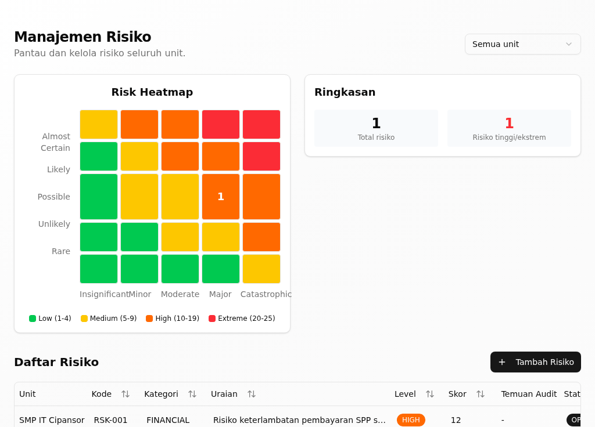{width=14cm}

*Gambar 4. Manajemen Risiko: peta panas risiko dan daftar mitigasinya.*

**Hasilnya, dan giliran siapa berikutnya.** Risiko tercatat dan terpantau pada
peta panas; giliran pemilik risiko menjalankan mitigasinya.

**Bila tidak berhasil.**

| Yang terlihat | Penyebab umum | Yang perlu dilakukan |
|---|---|---|
| Peta panas kosong | Belum ada risiko terdaftar | Klik **Tambah Risiko** |
| **Risiko tinggi/ekstrem** bertambah | Ada risiko baru bertingkat tinggi | Segera susun mitigasinya |

**Ketersediaan.** Ada pada versi aplikasi yang dijelaskan buklet ini (lihat bagian 1).

## Mencatat temuan pengawasan

**Tujuan.** Mencatat temuan audit internal dan tindak lanjutnya.

**Siapa.** Pengurus yayasan atau pengawas internal.

**Jalur menu.** Yayasan → Pengawasan Internal (`/pengawasan`).

**Sebelum mulai.** Temuan pengawasannya sudah diketahui.

**Langkah.**

1. Buka **Pengawasan Internal**.
2. Klik **Tambah Temuan**.
3. Isi uraian temuan dan tindakannya, lalu simpan.
   *Temuan tampil dengan statusnya; setelah selesai ditandai **Selesai**.*

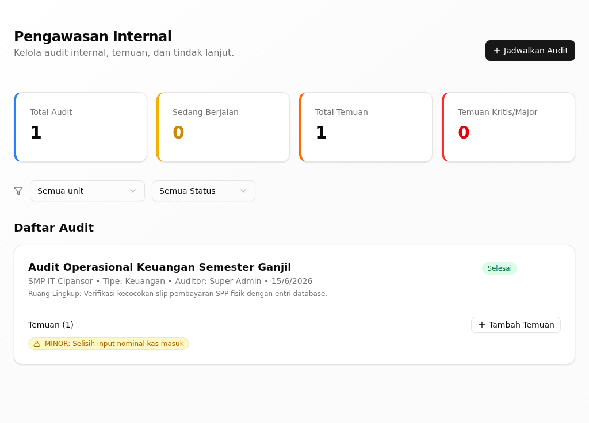{width=14cm}

*Gambar 5. Pengawasan Internal: temuan audit internal dan tindak lanjutnya.*

**Hasilnya, dan giliran siapa berikutnya.** Temuan tercatat dan dipantau
sampai **Selesai**; menjadi bahan laporan pengawasan yayasan.

**Bila tidak berhasil.**

| Yang terlihat | Penyebab umum | Yang perlu dilakukan |
|---|---|---|
| Tindakan tidak tersimpan | Uraian tindakan kurang dari 5 karakter | Tulis tindakannya lebih lengkap |

**Ketersediaan.** Ada pada versi aplikasi yang dijelaskan buklet ini (lihat bagian 1).

## Mencatat audit kepatuhan syariah

**Tujuan.** Menilai dan mengaudit kepatuhan syariah unit.

**Siapa.** Pengurus yayasan atau pengawas syariah.

**Jalur menu.** Yayasan → Kepatuhan Syariah (`/syariah`).

**Sebelum mulai.** Butir kepatuhan yang akan dinilai sudah ditetapkan.

**Langkah.**

1. Buka **Kepatuhan Syariah**.
2. Klik **Tambah Item Kepatuhan Syariah** untuk menyusun butir penilaiannya.
3. Klik **Catat Audit Syariah** untuk mencatat hasil auditnya.
   *Hasil audit tersimpan beserta skornya.*

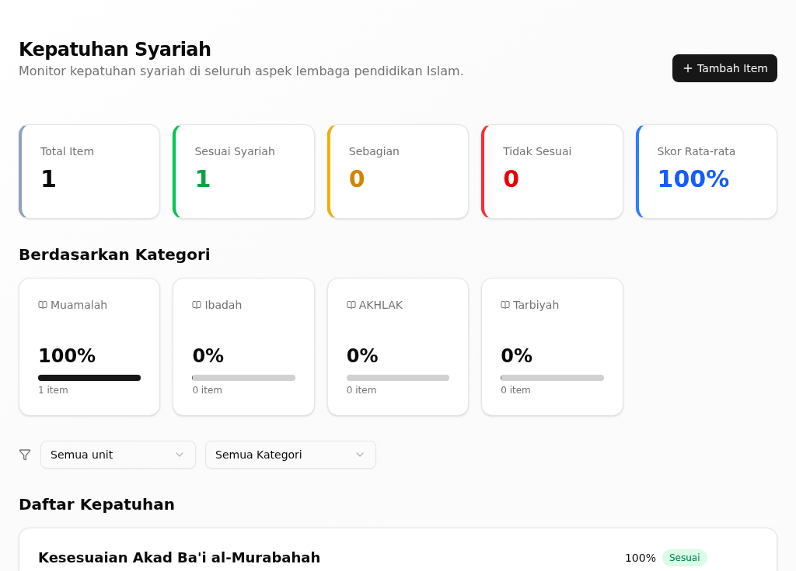{width=14cm}

*Gambar 6. Kepatuhan Syariah: penilaian dan audit kepatuhan syariah unit.*

**Hasilnya, dan giliran siapa berikutnya.** Hasil audit tercatat; giliran unit
memperbaiki butir yang belum patuh.

**Bila tidak berhasil.**

| Yang terlihat | Penyebab umum | Yang perlu dilakukan |
|---|---|---|
| Tidak ada butir penilaian | Butirnya belum disusun | Klik **Tambah Item Kepatuhan Syariah** |
| Hasil audit tidak tersimpan | Ada isian wajib yang kosong | Lengkapi isiannya |

**Ketersediaan.** Ada pada versi aplikasi yang dijelaskan buklet ini (lihat bagian 1).

## Menyusun dan mengesahkan rencana

**Tujuan.** Menyusun RPJP, Renstra, dan RKA unit, lalu mengesahkannya.

**Siapa.** Pengurus yayasan dan kepala unit.

**Jalur menu.** Perencanaan & Kinerja → Perencanaan Strategis (`/perencanaan`).

**Sebelum mulai.** Sasaran strategis yayasan sudah ditetapkan.

**Langkah.**

1. Buka **Perencanaan Strategis**.
   *Daftar Rencana beserta progress-nya tampil.*
2. Klik **Tambah Rencana**.
3. Isi **Judul Rencana**, **Jenis Rencana**, **Unit Kerja**, dan tanggalnya,
   lalu simpan.
4. Untuk rencana unit yang menunggu, klik **Sahkan RKA unit**.
   *Rencana unit berubah menjadi **Disetujui / Berjalan**.*

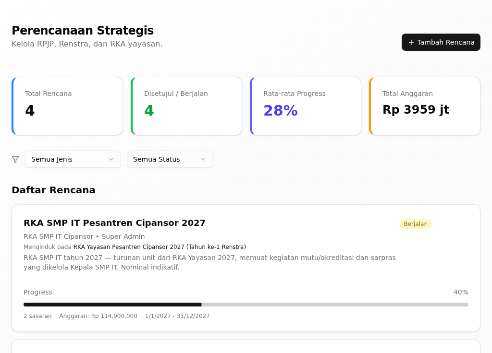{width=14cm}

*Gambar 7. Perencanaan Strategis: rantai RPJP → Renstra → RKA unit.*

**Hasilnya, dan giliran siapa berikutnya.** Rencana unit yang disahkan menjadi
dasar RKA dan anggarannya.

**Bila tidak berhasil.**

| Yang terlihat | Penyebab umum | Yang perlu dilakukan |
|---|---|---|
| "Belum ada rencana." | Belum ada rencana disusun | Klik **Tambah Rencana** |
| Tombol **Sahkan RKA unit** tidak tampil | Rencana unit belum diajukan | Minta kepala unit mengajukannya |

**Ketersediaan.** Ada pada versi aplikasi yang dijelaskan buklet ini (lihat bagian 1).

## Mengesahkan pembayaran tingkat yayasan

**Tujuan.** Memberi pengesahan akhir atas bukti bayar yang sudah diverifikasi
tata usaha.

**Siapa.** Pengurus yayasan atau pejabat keuangan yayasan.

**Jalur menu.** Keuangan → Verifikasi Pembayaran (`/finance/verification`).

**Sebelum mulai.** Ada bukti bayar yang sudah diverifikasi tata usaha.

**Langkah.**

1. Buka **Verifikasi Pembayaran**.
   *Bukti bayar yang sudah diverifikasi tata usaha tampil.*
2. Klik **Lihat Bukti** untuk memeriksanya.
3. Klik **Sahkan**.
   *Muncul pesan "Pembayaran disahkan dan tercatat".*

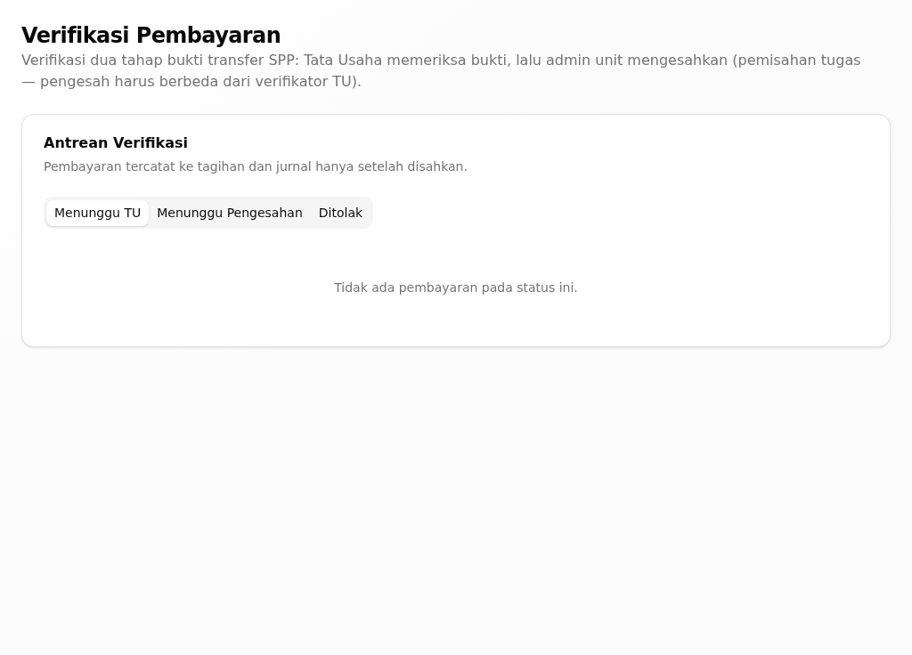{width=14cm}

*Gambar 8. Verifikasi Pembayaran: persetujuan bukti bayar tingkat yayasan.*

**Hasilnya, dan giliran siapa berikutnya.** Pembayaran tercatat lunas dan masuk
ke laporan keuangan unit.

**Bila tidak berhasil.**

| Yang terlihat | Penyebab umum | Yang perlu dilakukan |
|---|---|---|
| Tidak ada bukti yang bisa disahkan | Belum diverifikasi tata usaha | Tunggu verifikasi tata usaha |
| "Gagal memproses" | Koneksi bermasalah | Muat ulang halaman, lalu ulangi |

**Ketersediaan.** Ada pada versi aplikasi yang dijelaskan buklet ini (lihat bagian 1).

## Memantau laporan keuangan

**Tujuan.** Melihat buku besar dan laporan keuangan yayasan.

**Siapa.** Pengurus yayasan atau pejabat keuangan yayasan.

**Jalur menu.** Keuangan → Laporan Keuangan (`/finance/accounting`).

**Sebelum mulai.** Unit sudah mencatat jurnalnya.

**Langkah.**

1. Buka **Laporan Keuangan**.
2. Klik tab **Jurnal Umum** untuk melihat transaksi, atau tab laporan untuk
   melihat **Neraca Saldo (Trial Balance)** dan laba rugi.
   *Angka laporan mengikuti jurnal unit.*

{width=14cm}

*Gambar 9. Laporan Keuangan: buku besar dan laporan keuangan yayasan.*

**Hasilnya, dan giliran siapa berikutnya.** Anda melihat posisi keuangan
yayasan; menjadi bahan keputusan anggaran.

**Bila tidak berhasil.**

| Yang terlihat | Penyebab umum | Yang perlu dilakukan |
|---|---|---|
| "Belum ada data dalam periode ini" | Belum ada jurnal pada periode itu | Ubah periode laporannya |
| "Belum ada entri jurnal" | Unit belum mencatat jurnal | Ingatkan bendahara unit |

**Ketersediaan.** Ada pada versi aplikasi yang dijelaskan buklet ini (lihat bagian 1).

## Memantau BOS/BOP

**Tujuan.** Memantau pengelolaan dana bantuan operasional sekolah.

**Siapa.** Pengurus yayasan atau pejabat keuangan yayasan.

**Jalur menu.** Keuangan → BOS/BOP (`/finance/bos`).

**Sebelum mulai.** Dana BOS unit sudah ditetapkan.

**Langkah.**

1. Buka **BOS/BOP**.
   *Kepatuhan penggunaan anggaran BOS tampil.*
2. Klik **Catat Pengeluaran** untuk mencatat pengeluaran dana BOS.
3. Isi **Komponen**, **Jumlah (Rp)**, dan **No. Kwitansi**, lalu simpan.
4. Klik **Export** untuk mengunduh laporannya.
   *Muncul pesan "Laporan berhasil diunduh".*

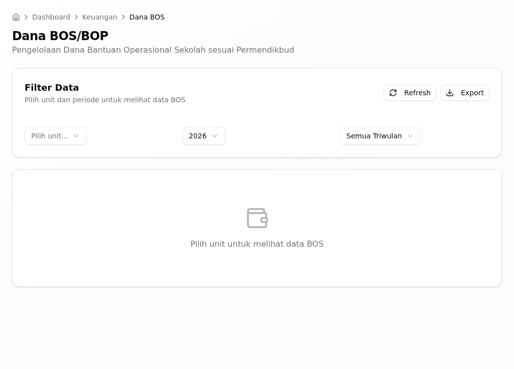{width=14cm}

*Gambar 10. BOS/BOP: pengelolaan dana bantuan operasional sekolah.*

**Hasilnya, dan giliran siapa berikutnya.** Pengeluaran BOS tercatat dan
kepatuhannya terpantau; menjadi bahan laporan ke dinas.

**Bila tidak berhasil.**

| Yang terlihat | Penyebab umum | Yang perlu dilakukan |
|---|---|---|
| "Lengkapi semua field yang diperlukan" | Ada isian wajib yang kosong | Lengkapi komponen, jumlah, dan kwitansinya |
| Status **Melebihi** | Pengeluaran melampaui alokasi komponen | Periksa **Alokasi Maks** komponennya |

**Ketersediaan.** Ada pada versi aplikasi yang dijelaskan buklet ini (lihat bagian 1).

## Mencatat donasi dan ZIS

**Tujuan.** Mencatat donasi dan infak yang masuk ke yayasan.

**Siapa.** Pengurus yayasan atau petugas ZIS.

**Jalur menu.** Keuangan → Donation/ZIS (`/donation`).

**Sebelum mulai.** Campaign atau donasi yang akan dicatat sudah diketahui.

**Langkah.**

1. Buka **Donasi & Infak**.
   *Daftar campaign beserta donasinya tampil.*
2. Klik **Buat Campaign** untuk membuat campaign baru, lalu isi **Target** dan
   masa berlakunya.
3. Klik **Catat Donasi** untuk mencatat donasi yang masuk.
   *Donasi tampil pada daftar dan progress campaign-nya diperbarui.*

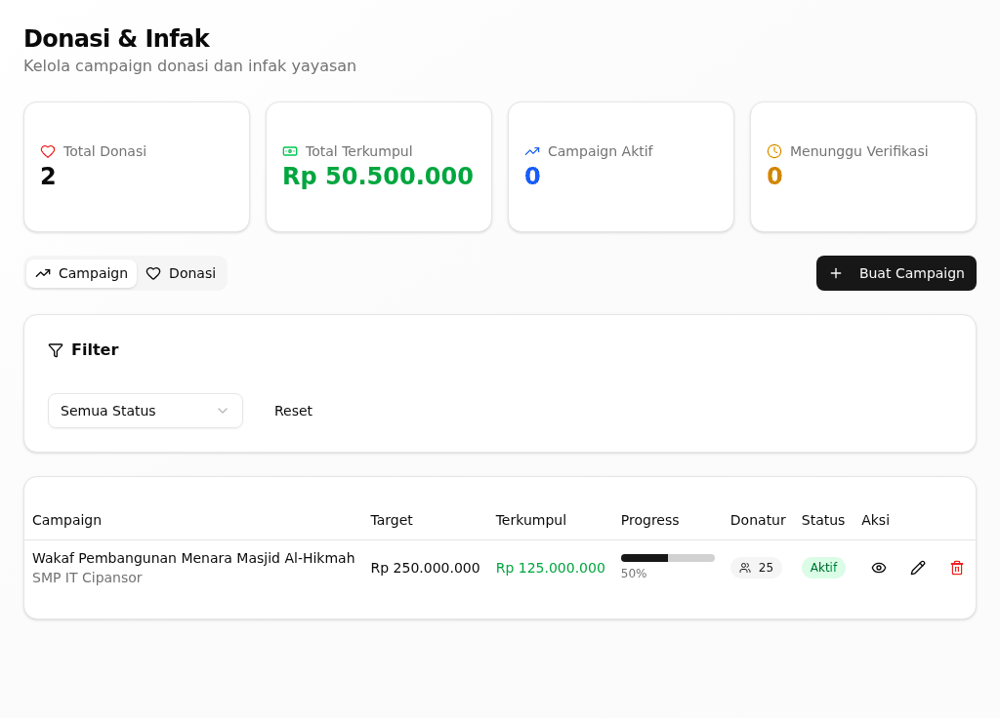{width=14cm}

*Gambar 11. Donasi & Infak: catatan ZIS dan donasi yang masuk.*

**Hasilnya, dan giliran siapa berikutnya.** Donasi tercatat dan masuk ke
laporan keuangan yayasan.

**Bila tidak berhasil.**

| Yang terlihat | Penyebab umum | Yang perlu dilakukan |
|---|---|---|
| "Tidak ada donasi" | Belum ada donasi pada campaign itu | Catat donasinya |
| "Donasi berhasil dihapus" muncul tanpa sengaja | Tombol hapus terklik | Catat ulang donasinya |

**Ketersediaan.** Ada pada versi aplikasi yang dijelaskan buklet ini (lihat bagian 1).

## Memantau pengadaan barang

**Tujuan.** Melihat permintaan dan proses pengadaan barang unit.

**Siapa.** Pengurus yayasan.

**Jalur menu.** Keuangan → Procurement (`/procurement`).

**Sebelum mulai.** Unit sudah mengajukan permintaan pengadaan.

**Langkah.**

1. Buka **Pengadaan Barang**.
   *Daftar pengajuan beserta statusnya tampil.*
2. Saring dengan **Semua Unit** atau **Semua Status** sesuai kebutuhan.
3. Buka satu pengajuan untuk melihat rincian dan **Total Estimasi**-nya.

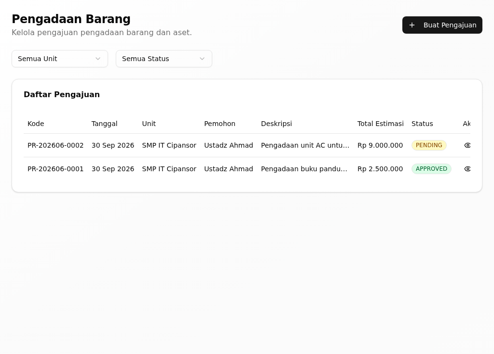{width=14cm}

*Gambar 12. Pengadaan Barang: permintaan dan proses pengadaan unit.*

**Hasilnya, dan giliran siapa berikutnya.** Anda melihat posisi pengadaan
seluruh unit; menjadi bahan keputusan anggaran.

**Bila tidak berhasil.**

| Yang terlihat | Penyebab umum | Yang perlu dilakukan |
|---|---|---|
| "Tidak ada data" | Belum ada pengajuan | Tunggu unit mengajukan |
| Unit tidak muncul | Saringan unit keliru | Pilih **Semua Unit** |

**Ketersediaan.** Ada pada versi aplikasi yang dijelaskan buklet ini (lihat bagian 1).

## Memantau alumni

**Tujuan.** Melihat jejak lulusan tiap unit dan acara alumninya.

**Siapa.** Pengurus yayasan.

**Jalur menu.** Informasi → Data Alumni (`/alumni`).

**Sebelum mulai.** Data alumni sudah terkumpul.

**Langkah.**

1. Buka **Data Alumni**.
   *Daftar alumni dan acara alumninya tampil.*
2. Klik **Buat Acara** untuk membuat acara reuni atau kegiatan alumni.
3. Klik **Detail** pada satu alumni untuk melihat jejaknya.

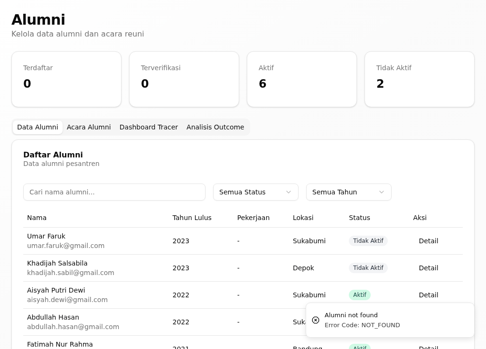{width=14cm}

*Gambar 13. Data Alumni: jejak lulusan tiap unit.*

**Hasilnya, dan giliran siapa berikutnya.** Data alumni terpantau; menjadi
bahan penelusuran mutu lulusan.

**Bila tidak berhasil.**

| Yang terlihat | Penyebab umum | Yang perlu dilakukan |
|---|---|---|
| "Belum ada data korelasi yang cukup" | Data alumni masih sedikit | Lengkapi data alumni |
| "Belum ada acara alumni" | Belum ada acara dibuat | Klik **Buat Acara** |

**Ketersediaan.** Ada pada versi aplikasi yang dijelaskan buklet ini (lihat bagian 1).

## Menangani aduan & aspirasi

**Tujuan.** Melihat dan menindaklanjuti aduan yang masuk dari unit.

**Siapa.** Pengurus yayasan.

**Jalur menu.** Yayasan → Penjaminan Mutu → Aduan & Aspirasi
(`/quality/complaints`).

**Sebelum mulai.** Ada aduan yang masuk.

**Langkah.**

1. Buka **Aduan & Aspirasi**.
   *Daftar aduan beserta statusnya tampil.*
2. Saring dengan **Semua Status** bila perlu, lalu buka satu aduan.
3. Tindak lanjuti aduan itu, lalu tandai **Selesai** bila sudah tuntas.

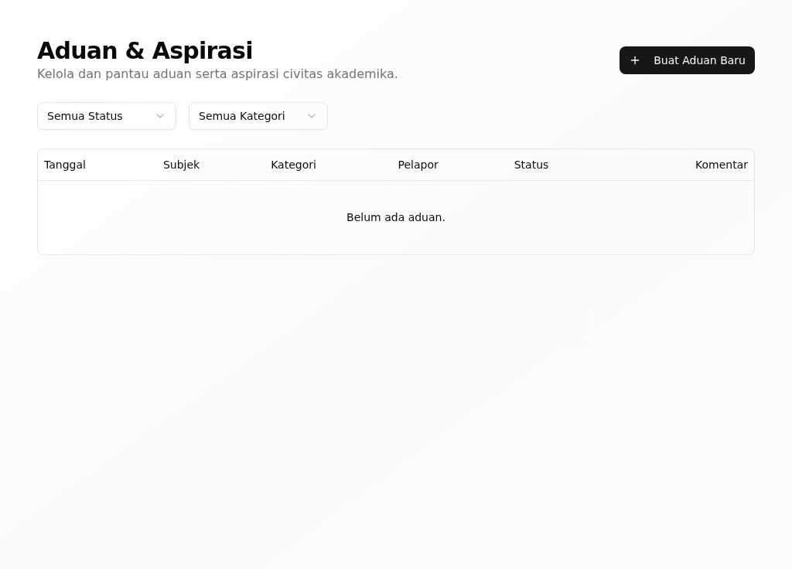{width=14cm}

*Gambar 14. Aduan & Aspirasi: keluhan yang masuk beserta status penanganannya.*

**Hasilnya, dan giliran siapa berikutnya.** Aduan tertangani dan statusnya
tercatat; menjadi bahan perbaikan layanan.

**Bila tidak berhasil.**

| Yang terlihat | Penyebab umum | Yang perlu dilakukan |
|---|---|---|
| Aduan tidak tampil | Saringan status keliru | Pilih **Semua Status** |
| Aduan tetap terbuka | Belum ditandai selesai | Tandai **Selesai** |

**Ketersediaan.** Ada pada versi aplikasi yang dijelaskan buklet ini (lihat bagian 1).

## Menyetujui Perjanjian Kinerja

**Tujuan.** Menyetujui Perjanjian Kinerja pegawai yayasan.

**Siapa.** Pengurus yayasan sebagai atasan penilai.

**Jalur menu.** Perencanaan & Kinerja → Manajemen Kinerja → Perjanjian Kinerja
(`/kinerja/pk`).

**Sebelum mulai.** Pegawai sudah mengajukan PK-nya.

**Langkah.**

1. Buka **Perjanjian Kinerja**.
2. Buka PK yang menunggu keputusan Anda.
3. Klik **Setujui** atau **Kembalikan** untuk revisi.
   *Muncul pesan "Perjanjian Kinerja berhasil disetujui" atau "Perjanjian
   Kinerja dikembalikan untuk revisi".*

{width=14cm}

*Gambar 15. Perjanjian Kinerja: kesepakatan target kerja pegawai dan atasan penilai.*

**Hasilnya, dan giliran siapa berikutnya.** PK yang disetujui menjadi dasar
evaluasi kinerja periodik pegawai itu.

**Bila tidak berhasil.**

| Yang terlihat | Penyebab umum | Yang perlu dilakukan |
|---|---|---|
| Tidak ada PK yang menunggu | Pegawai belum mengajukan | Ingatkan pegawai mengajukan |
| PK tidak bisa disetujui | Target belum lengkap | Kembalikan untuk revisi |

**Ketersediaan.** Ada pada versi aplikasi yang dijelaskan buklet ini (lihat bagian 1).

# 3. Bila Ada Masalah

- **Menu yang dijelaskan tidak tampil.** Menu ditentukan peran Anda; tanyakan
  kepada admin sistem.
- **Data unit tampak kosong.** Pilih unitnya pada saringan unit di halaman itu.
- **Layar berbeda dari gambar di buklet.** Aplikasi yang Anda pakai mungkin
  belum memuat semua perubahan; laporkan kepada admin sistem.
