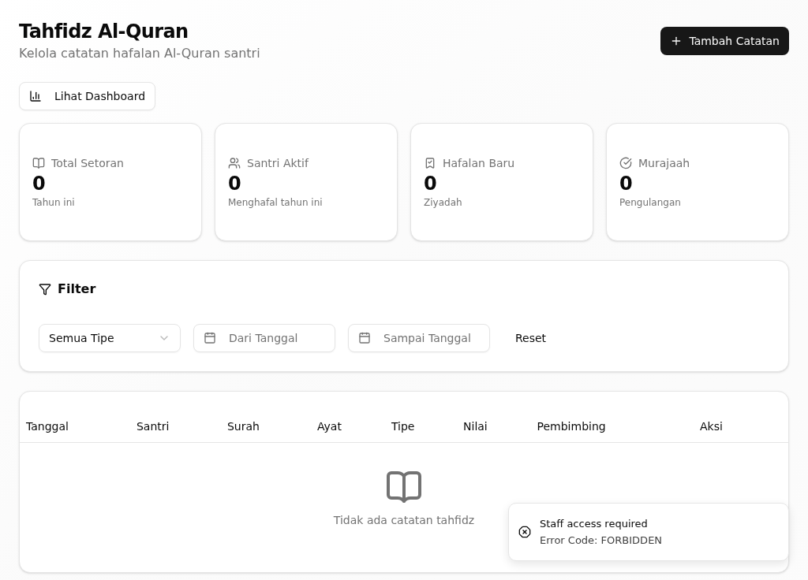
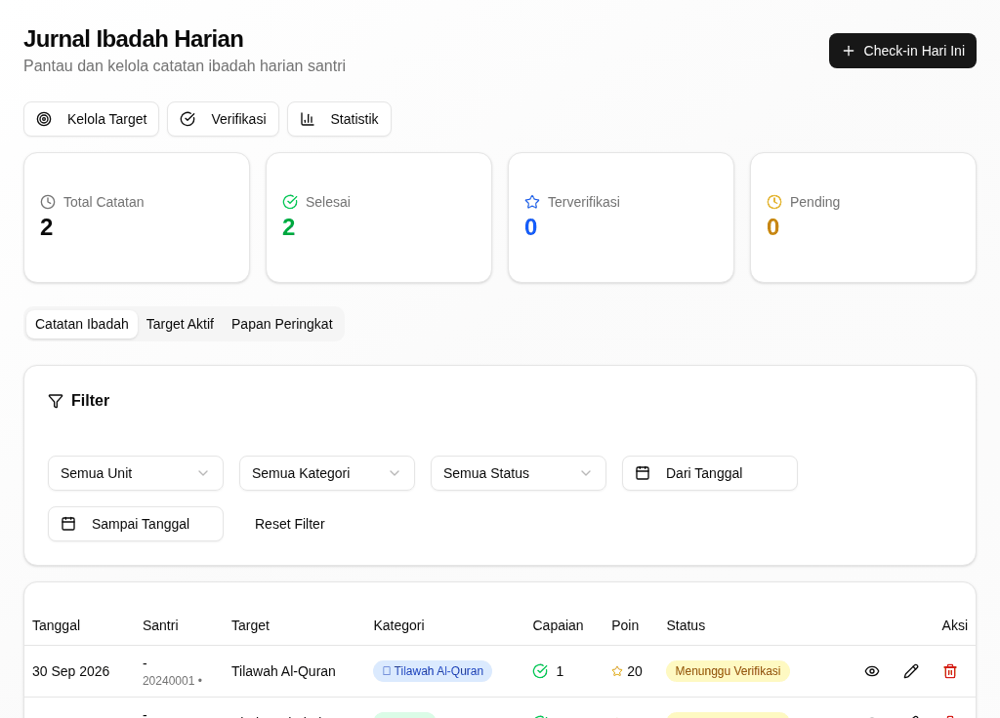
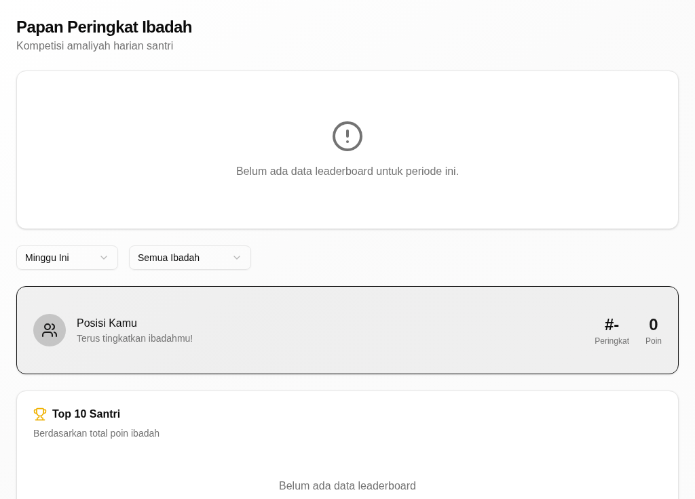
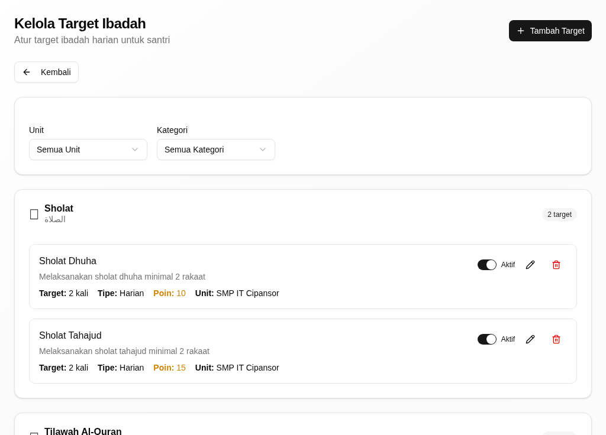
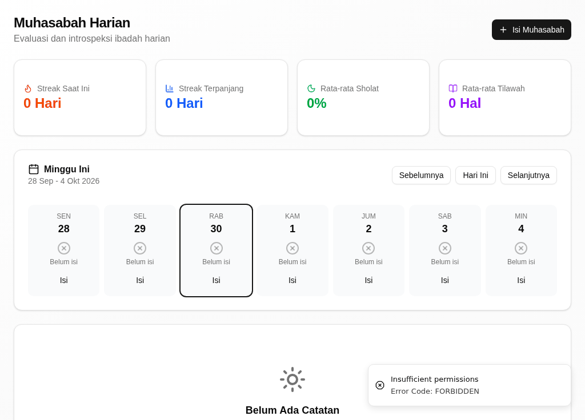
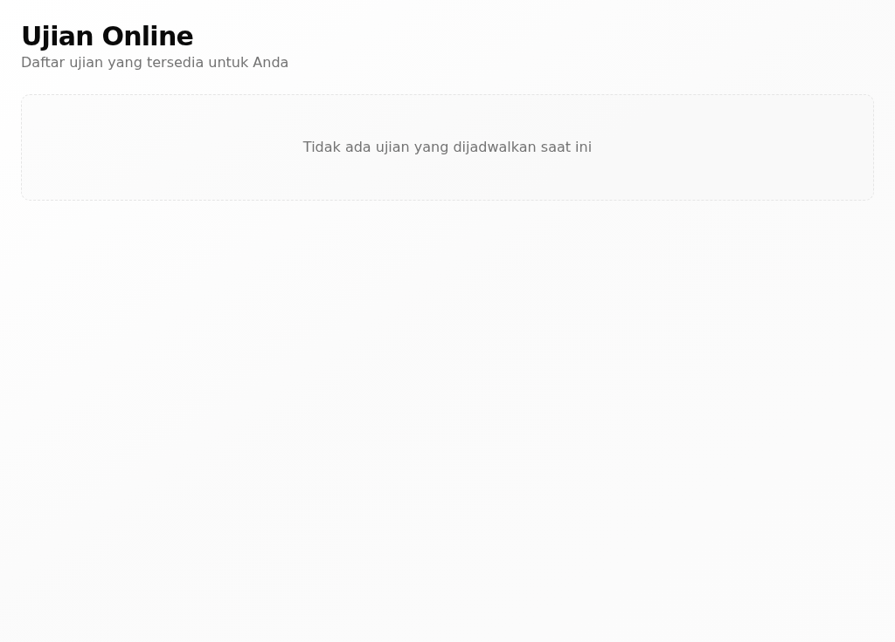
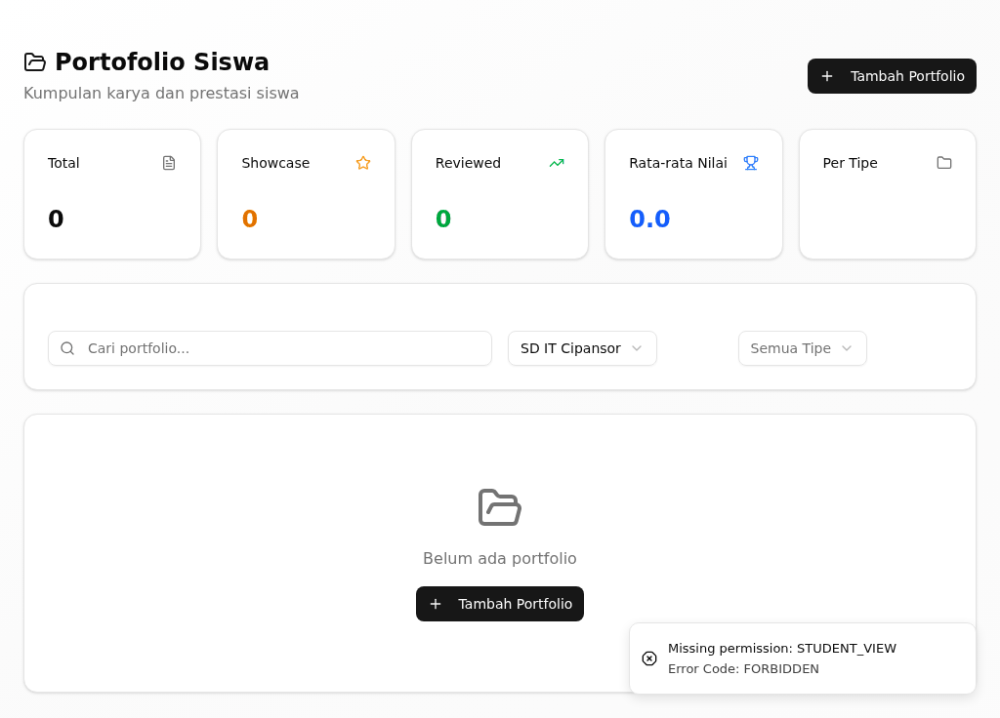
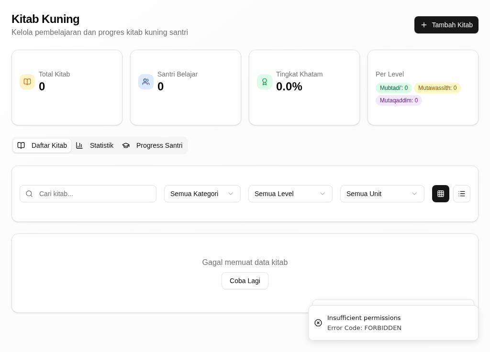
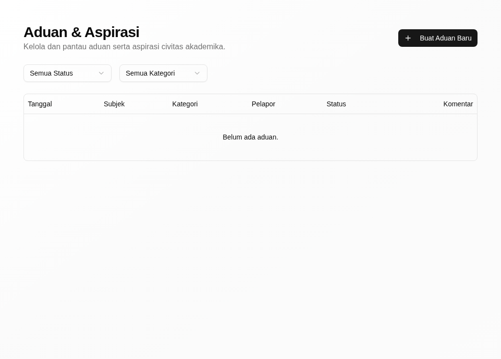

# Riwayat Revisi

| Versi | Tanggal | Basis aplikasi | Tingkat verifikasi | Perubahan |
|---|---|---|---|---|
| 0.1 | 30 September 2026 | aplikasi berjalan dari kode commit `a4735001` | **T1 — terverifikasi di aplikasi berjalan** | Penyusunan awal; tiap kartu dijalankan dengan akun demo santri pada tumpukan lokal (PostgreSQL + API :3001 + web :3000) dan memuat tangkapan layar asli |
| 0.2 | 30 September 2026 | aplikasi berjalan dari kode commit `a4735001` | **T1 — terverifikasi di aplikasi berjalan** | Gambar Papan Peringkat diambil ulang dari halaman `/ibadah/leaderboard` (tangkapan pertama keliru memakai layar Jurnal Ibadah); kartu "Menetapkan target ibadah" memakai tangkapan halaman **Kelola Target Ibadah** yang sebenarnya, bukan Jurnal Ibadah |

> **Tingkat verifikasi T1.** Semua kartu tugas di bawah sudah **dijalankan pada
> aplikasi berjalan** dengan akun demo santri, dan tiap kartu memuat tangkapan
> layar asli. Bila Anda menemukan layar yang berbeda dari gambar di sini,
> tanyakan kepada wali kelas atau musyrif.

# 1. Tentang Buklet Ini

Buklet ini untuk **santri** — pelajar yang memakai portal untuk menelusuri
hafalan, ibadah, ujian, dan kegiatan harian. Bagian umum (masuk, dasbor, konsep,
glosarium) ada di *Panduan Pengguna — Bagian Umum*.

Buklet ini menjelaskan versi aplikasi terbaru per 30 September 2026. Aplikasi
yang Anda pakai mungkin belum memuat semua perubahan itu; bila layar Anda
berbeda dari yang dijelaskan, tanyakan kepada wali kelas atau musyrif.

## 1.1 Siapa Anda di aplikasi

Sebagai santri, dasbor awal Anda adalah halaman **Dashboard** di `/student`.
Menu Anda memuat kelompok **Ringkasan** (Dashboard), **Hafalan** (Hafalan
Saya), **Akademik** (Ujian Online, Portfolio Saya), **Pesantren** (Jurnal
Ibadah, Prestasi Ibadah, Muhadhoroh, Muhadatsah, Kitab Kuning, Muhasabah
Harian), dan **Kegiatan** (Jadwal, Pengumuman, Aduan & Aspirasi). Anda melihat
**data diri Anda sendiri**.

## 1.2 Yang bisa dan tidak bisa Anda lakukan

- Anda **melihat** hafalan, jadwal, dan pengumuman.
- Anda **mengisi** jurnal ibadah, muhasabah harian, dan portfolio Anda.
- Anda **mengerjakan** ujian online yang dijadwalkan.
- Anda **menyampaikan** aduan atau aspirasi.
- Anda **tidak** mengubah nilai akademik; itu tugas guru.
- Anda **tidak** mencatat setoran hafalan; itu tugas guru tahfidz atau musyrif.

## 1.3 Tugas dalam buklet ini

| Tugas | Seberapa sering | Menu |
|---|---|---|
| Melihat hafalan | Harian | Hafalan → Hafalan Saya |
| Mengisi jurnal ibadah | Harian | Pesantren → Jurnal Ibadah |
| Menetapkan target ibadah | Mingguan | Pesantren → Jurnal Ibadah → Kelola Target |
| Melihat papan peringkat ibadah | Mingguan | Pesantren → Jurnal Ibadah → Papan Peringkat |
| Mengisi muhasabah harian | Harian | Pesantren → Muhasabah Harian |
| Mengerjakan ujian online | Sesuai jadwal | Akademik → Ujian Online |
| Mengisi portfolio | Sesuai kebutuhan | Akademik → Portfolio Saya |
| Menambah kitab kuning | Sesuai kebutuhan | Pesantren → Kitab Kuning |
| Menyampaikan aduan & aspirasi | Sesuai kebutuhan | Kegiatan → Aduan & Aspirasi |

# 2. Tugas

## Melihat hafalan

**Tujuan.** Melihat setoran dan capaian hafalan Al-Quran Anda.

**Siapa.** Santri.

**Jalur menu.** Hafalan → Hafalan Saya (`/tahfidz`).

**Sebelum mulai.** Anda sudah masuk dengan akun santri Anda.

**Langkah.**

1. Buka **Hafalan Saya**.
   *Setoran terakhir dan total setoran Anda tampil.*
2. Klik **Lihat Dashboard** untuk melihat grafik capaiannya.
   *Grafik capaian hafalan terbuka.*

{width=14cm}

*Gambar 1. Hafalan Saya: setoran dan capaian hafalan Al-Quran.*

**Hasilnya, dan giliran siapa berikutnya.** Anda melihat posisi hafalan Anda.
Giliran guru tahfidz atau musyrif mencatat setoran berikutnya.

**Bila tidak berhasil.**

| Yang terlihat | Penyebab umum | Yang perlu dilakukan |
|---|---|---|
| Belum ada setoran | Setoran belum dicatat guru | Minta guru mencatatnya |
| "Catatan tahfidz berhasil dihapus" muncul | Tombol hapus terklik | Laporkan kepada musyrif |

**Ketersediaan.** Ada pada versi aplikasi yang dijelaskan buklet ini (lihat bagian 1).

## Mengisi jurnal ibadah

**Tujuan.** Mencatat sholat, tilawah, dan dzikir harian Anda.

**Siapa.** Santri.

**Jalur menu.** Pesantren → Jurnal Ibadah (`/ibadah`).

**Sebelum mulai.** Anda sudah menjalankan ibadahnya hari ini.

**Langkah.**

1. Buka **Jurnal Ibadah**.
   *Catatan ibadah hari ini dan target Anda tampil.*
2. Catat ibadah yang sudah Anda jalankan.
   *Catatan tersimpan pada jurnal harian Anda.*
3. Buka **Papan Peringkat** untuk melihat posisi ketekunan Anda.
   *Peringkat beserta **Posisi Kamu** tampil.*

{width=14cm}

*Gambar 2. Jurnal Ibadah: catatan sholat, tilawah, dan target ibadah.*

{width=14cm}

*Gambar 3. Papan Peringkat: peringkat ketekunan ibadah antar santri.*

**Hasilnya, dan giliran siapa berikutnya.** Jurnal dan poin ibadah Anda
diperbarui. Giliran wali kelas atau musyrif memverifikasinya.

**Bila tidak berhasil.**

| Yang terlihat | Penyebab umum | Yang perlu dilakukan |
|---|---|---|
| "Gagal menghapus catatan" | Koneksi bermasalah | Muat ulang halaman, lalu ulangi |
| Peringkat tidak berubah | Jurnal hari ini belum tercatat | Catat ibadahnya lebih dahulu |

**Ketersediaan.** Ada pada versi aplikasi yang dijelaskan buklet ini (lihat bagian 1).

## Melihat target ibadah Anda

**Tujuan.** Melihat target ibadah harian yang berlaku di unit Anda, sebagai
ukuran jurnal ibadah.

**Siapa.** Santri. Target ditetapkan pengelola unit (musyrif, wali kelas, atau
kepala unit), bukan oleh santri sendiri — halaman **Kelola Target Ibadah**
(`/ibadah/targets`) menetapkan target untuk seluruh unit, termasuk menyemai
target default dan menghapusnya, sehingga tombol tambah, ubah, dan hapus di
halaman itu hanya untuk peran pengelola. Santri membaca target dan mencatat
ibadahnya di **Jurnal Ibadah**.

**Jalur menu.** Pesantren → Jurnal Ibadah (`/ibadah`).

**Sebelum mulai.** Anda sudah menjalankan ibadahnya hari ini.

**Langkah.**

1. Buka **Jurnal Ibadah**.
2. Pilih tab **Target Aktif**.
   *Daftar target ibadah unit Anda tampil beserta jenis dan besarannya.*

{width=14cm}

*Gambar 4. Target Ibadah: daftar target unit yang menjadi ukuran jurnal harian.*

**Hasilnya, dan giliran siapa berikutnya.** Target menjadi ukuran jurnal ibadah
harian Anda. Bila target belum ada atau perlu diubah, sampaikan kepada musyrif
atau wali kelas — mereka yang menetapkannya.

**Bila tidak berhasil.**

| Yang terlihat | Penyebab umum | Yang perlu dilakukan |
|---|---|---|
| **Belum ada target ibadah** | Unit belum menetapkan target | Minta musyrif menetapkan target unit |
| "Gagal menghapus target" | Koneksi bermasalah | Muat ulang halaman |

**Ketersediaan.** Ada pada versi aplikasi yang dijelaskan buklet ini (lihat bagian 1).

## Mengisi muhasabah harian

**Tujuan.** Menuliskan refleksi diri Anda setiap hari.

**Siapa.** Santri.

**Jalur menu.** Pesantren → Muhasabah Harian (`/muhasabah`). Formulirnya di
`/muhasabah/new`.

**Sebelum mulai.** Anda sudah menjalani hari ini dan siap menulis refleksinya.

**Langkah.**

1. Buka **Muhasabah Harian**.
2. Klik **Isi Muhasabah Hari Ini**.
   *Formulir muhasabah terbuka.*
3. Isi refleksi ibadah dan tilawah hari ini, lalu simpan.
   *Muncul pesan "Muhasabah berhasil disimpan".*

{width=14cm}

*Gambar 5. Muhasabah Harian: refleksi diri santri setiap hari.*

**Hasilnya, dan giliran siapa berikutnya.** Muhasabah tersimpan pada riwayat
Anda dan dapat dibaca pembimbing.

**Bila tidak berhasil.**

| Yang terlihat | Penyebab umum | Yang perlu dilakukan |
|---|---|---|
| "Muhasabah berhasil disimpan" tidak muncul | Ada isian yang belum lengkap | Lengkapi refleksinya |
| Sudah pernah mengisi hari ini | Satu muhasabah per hari | Buka **Detail** untuk melihatnya |

**Ketersediaan.** Ada pada versi aplikasi yang dijelaskan buklet ini (lihat bagian 1).

## Mengerjakan ujian online

**Tujuan.** Mengerjakan ujian yang sudah dijadwalkan guru.

**Siapa.** Santri.

**Jalur menu.** Akademik → Ujian Online (`/student/exams`).

**Sebelum mulai.** Guru sudah menjadwalkan ujiannya dan waktunya sudah tiba.

**Langkah.**

1. Buka **Ujian Online**.
   *Daftar ujian yang tersedia tampil.*
2. Klik **Mulai Ujian** pada ujian yang akan dikerjakan.
   *Soal ujian terbuka.*
3. Jawab seluruh soalnya, lalu kumpulkan.
   *Jawaban Anda tersimpan dan dinilai.*

{width=14cm}

*Gambar 6. Ujian Online: daftar ujian yang tersedia untuk dikerjakan.*

**Hasilnya, dan giliran siapa berikutnya.** Jawaban terkumpul; giliran guru
menilai dan mengumumkan hasilnya.

**Bila tidak berhasil.**

| Yang terlihat | Penyebab umum | Yang perlu dilakukan |
|---|---|---|
| Ujian tidak tampil | Ujian belum dijadwalkan atau waktunya belum tiba | Tunggu jadwalnya |
| Halaman tertutup saat mengerjakan | Koneksi terputus | Masuk kembali, lanjutkan ujiannya |

**Ketersediaan.** Ada pada versi aplikasi yang dijelaskan buklet ini (lihat bagian 1).

## Mengisi portfolio

**Tujuan.** Mengumpulkan karya dan prestasi Anda.

**Siapa.** Santri.

**Jalur menu.** Akademik → Portfolio Saya (`/portfolio`).

**Sebelum mulai.** Karya atau prestasi yang akan dicatat sudah disiapkan.

**Langkah.**

1. Buka **Portfolio Saya**.
2. Klik **Tambah Portfolio**.
   *Formulir **Tambah Portfolio Baru** terbuka.*
3. Isi judul dan keterangan karyanya, lalu klik **Simpan**.
   *Muncul pesan "Portfolio berhasil dibuat".*

{width=14cm}

*Gambar 7. Portfolio Saya: kumpulan karya dan prestasi santri.*

**Hasilnya, dan giliran siapa berikutnya.** Karya Anda tercatat pada portfolio;
menjadi bahan penilaian sikap dan prestasi.

**Bila tidak berhasil.**

| Yang terlihat | Penyebab umum | Yang perlu dilakukan |
|---|---|---|
| "Gagal membuat portfolio" | Ada isian yang belum lengkap | Lengkapi judul dan keterangannya |
| "Gagal menghapus portfolio" | Koneksi bermasalah | Muat ulang halaman |

**Ketersediaan.** Ada pada versi aplikasi yang dijelaskan buklet ini (lihat bagian 1).

## Menambah kitab kuning

**Tujuan.** Mencatat kitab yang Anda kaji beserta capaiannya.

**Siapa.** Santri.

**Jalur menu.** Pesantren → Kitab Kuning (`/kitab-progress`). Formulirnya di
`/kitab-progress/new`.

**Sebelum mulai.** Nama kitab dan kajiannya sudah diketahui.

**Langkah.**

1. Buka **Kitab Kuning**, lalu klik **Tambah Kitab**.
   *Formulir kitab baru terbuka.*
2. Isi nama kitab dan keterangannya.
3. Klik **Simpan Kitab**.
   *Kitab tampil pada daftar kajian Anda.*

{width=14cm}

*Gambar 8. Kitab Kuning: capaian kajian kitab per santri.*

**Hasilnya, dan giliran siapa berikutnya.** Kitab tercatat dan bisa dilacak
kemajuannya lewat **Buka Halaman Tracking**.

**Bila tidak berhasil.**

| Yang terlihat | Penyebab umum | Yang perlu dilakukan |
|---|---|---|
| "Gagal menghapus kitab" | Koneksi bermasalah | Muat ulang halaman |
| Kitab tidak tampil | Ada isian yang belum lengkap | Ulangi langkah 2 |

**Ketersediaan.** Ada pada versi aplikasi yang dijelaskan buklet ini (lihat bagian 1).

## Menyampaikan aduan & aspirasi

**Tujuan.** Menyampaikan keluhan atau saran kepada unit.

**Siapa.** Santri.

**Jalur menu.** Kegiatan → Aduan & Aspirasi (`/quality/complaints`). Formulirnya
di `/quality/complaints/create`.

**Sebelum mulai.** Aduan atau saran yang akan disampaikan sudah disiapkan.

**Langkah.**

1. Buka **Aduan & Aspirasi**, lalu klik **Buat Aduan Baru**.
2. Isi judul dan uraian aduannya.
3. Bila tidak ingin dikenali, centang **Kirim Secara Anonim**.
4. Klik **Kirim Aduan**.
   *Aduan Anda masuk dan tercatat dengan statusnya.*

{width=14cm}

*Gambar 9. Aduan & Aspirasi: menyampaikan keluhan atau saran ke unit.*

**Hasilnya, dan giliran siapa berikutnya.** Aduan Anda diterima dan ditangani
petugas unit; statusnya bisa Anda pantau di halaman yang sama.

**Bila tidak berhasil.**

| Yang terlihat | Penyebab umum | Yang perlu dilakukan |
|---|---|---|
| "Kirim Aduan" tidak bereaksi | Judul atau uraian belum diisi | Lengkapi aduannya |
| Aduan tidak tampil | Saringan status keliru | Pilih **Semua Status** |

**Ketersediaan.** Ada pada versi aplikasi yang dijelaskan buklet ini (lihat bagian 1).

# 3. Bila Ada Masalah

- **Lupa kata sandi atau tidak bisa masuk.** Hubungi wali kelas atau admin
  unit; mereka membantu memulihkan akun Anda.
- **Data Anda tidak tampil.** Pastikan Anda masuk dengan akun Anda sendiri,
  bukan akun teman.
- **Layar berbeda dari gambar di buklet.** Aplikasi yang Anda pakai mungkin
  belum memuat semua perubahan; tanyakan kepada wali kelas atau musyrif.
