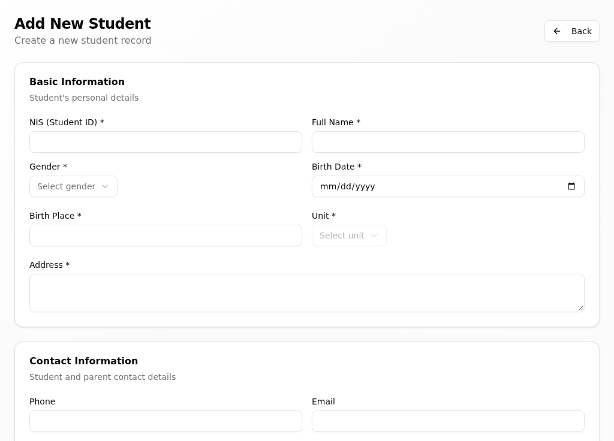
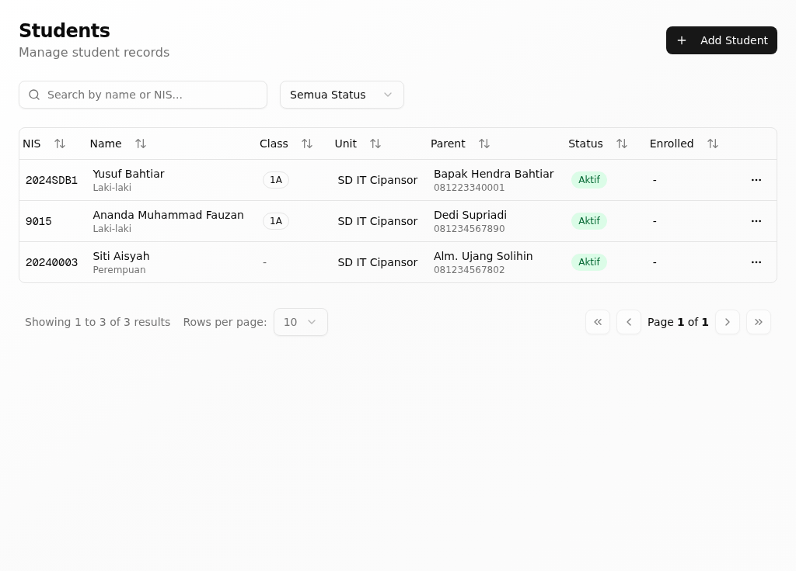
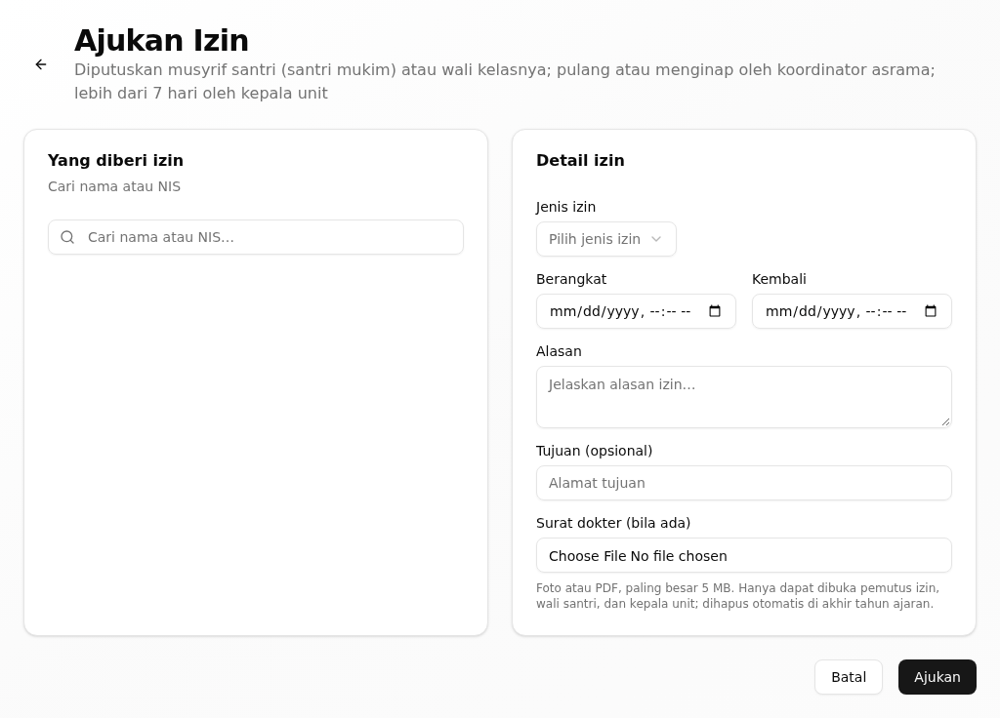
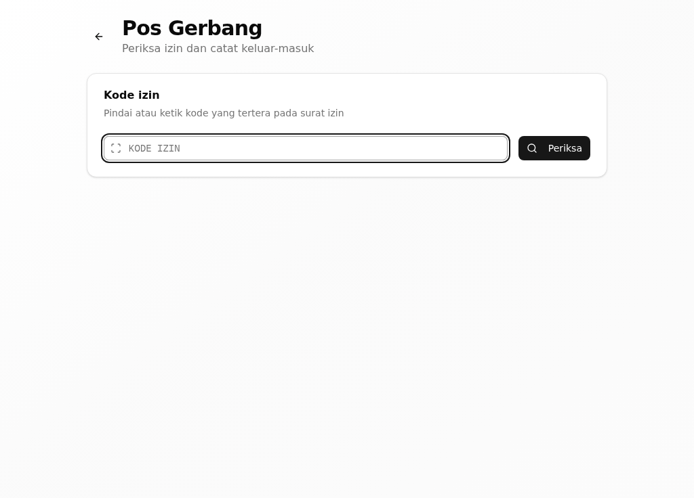
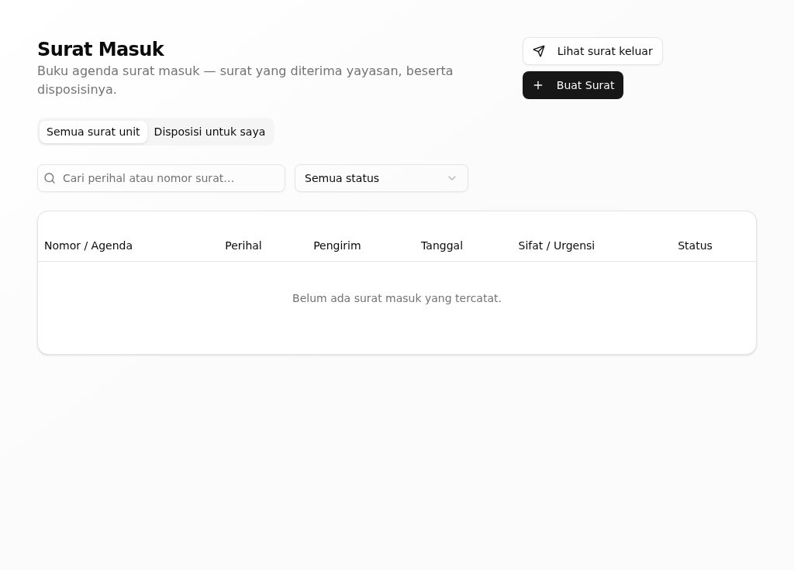
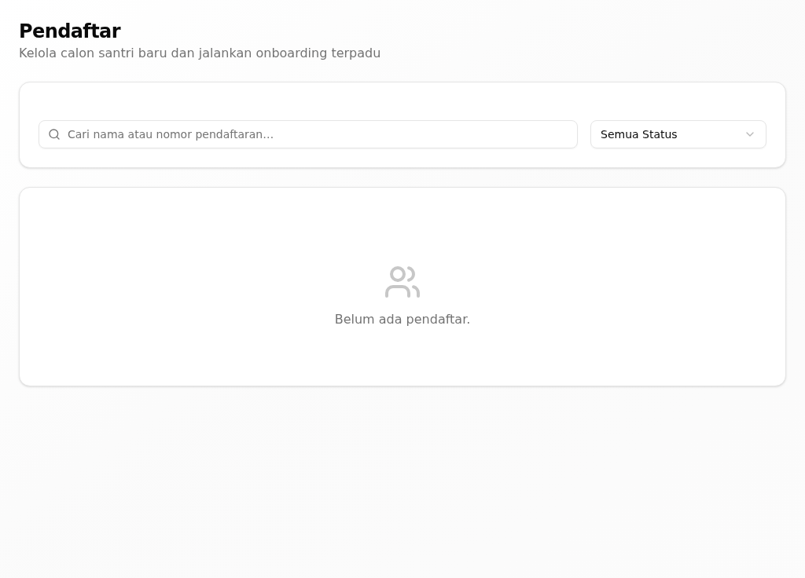
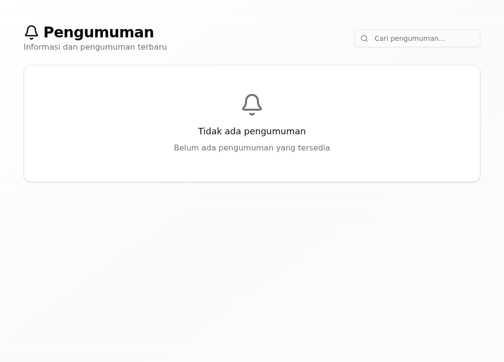
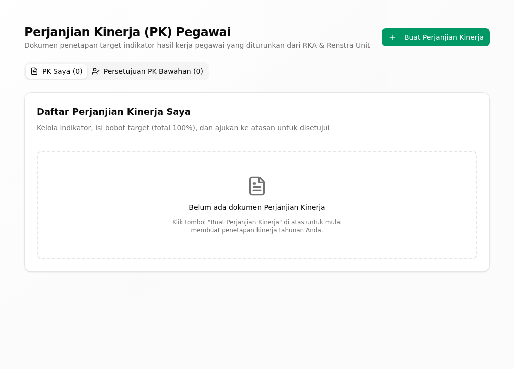

# Riwayat Revisi

| Versi | Tanggal | Basis aplikasi | Tingkat verifikasi | Perubahan |
|---|---|---|---|---|
| 0.1 | 30 September 2026 | aplikasi berjalan dari kode commit `a4735001` | **T1 — terverifikasi di aplikasi berjalan** | Penyusunan awal; tiap kartu dijalankan dengan akun demo tata usaha pada tumpukan lokal (PostgreSQL + API :3001 + web :3000) dan memuat tangkapan layar asli |

> **Tingkat verifikasi T1.** Semua kartu tugas di bawah sudah **dijalankan pada
> aplikasi berjalan** dengan akun demo tata usaha, dan tiap kartu memuat
> tangkapan layar asli. Bila Anda menemukan layar yang berbeda dari gambar di
> sini, laporkan kepada admin unit.

# 1. Tentang Buklet Ini

Buklet ini untuk **staf tata usaha** unit (`*_TATA_USAHA`) — pegawai yang
melayani administrasi santri, surat, dan penerimaan. Bagian umum (masuk, dasbor,
konsep, glosarium) ada di *Panduan Pengguna — Bagian Umum*.

Buklet ini menjelaskan versi aplikasi terbaru per 30 September 2026. Aplikasi
yang Anda pakai mungkin belum memuat semua perubahan itu; bila layar Anda
berbeda dari yang dijelaskan, tanyakan kepada admin unit. Di beberapa layar,
santri masih tertulis **Siswa** atau **Students**, dan sebagian tombol masih
berbahasa Inggris; buklet ini menulis nama tombol dan judul persis seperti di
layar.

## 1.1 Siapa Anda di aplikasi

Sebagai staf tata usaha, dasbor awal Anda adalah halaman **Dashboard** di
`/staff`. Menu Anda berkelompok: **Ringkasan**, **Kinerja**, **Layanan Siswa**
(**Data Siswa**, **Kesehatan**, **Perizinan**, **Pelanggaran**, **Penghargaan**, **Kampus Hijau**), dan
**Administrasi** (Penerimaan, E-Office, Keuangan, Pengumuman, Aduan &
Aspirasi). Anda melayani **satu unit** — data yang tampil terbatas pada unit
Anda.

## 1.2 Yang bisa dan tidak bisa Anda lakukan

- Anda **mendaftarkan santri baru**, melihat data santri, dan mencatat layanan
  harian (kesehatan, izin, pelanggaran, penghargaan).
- Anda **menyusun surat** dan mencatat surat masuk unit.
- Anda **memeriksa berkas pendaftar** penerimaan santri baru.
- Anda **tidak** menetapkan tagihan atau mengesahkan pembayaran — itu tugas
  bendahara unit.
- Anda **tidak** mengubah nilai akademik; itu tugas guru.

## 1.3 Tugas dalam buklet ini

| Tugas | Seberapa sering | Menu |
|---|---|---|
| Mendaftarkan santri baru | Sesuai pendaftaran | Layanan Siswa → Data Siswa |
| Mengajukan izin santri | Harian | Layanan Siswa → Perizinan |
| Memeriksa izin di pos gerbang | Harian | Layanan Siswa → Perizinan |
| Mengelola surat masuk dan keluar | Harian | Administrasi → E-Office |
| Menindaklanjuti pendaftar penerimaan | Sesuai musim | Administrasi → Penerimaan |
| Membuat pengumuman unit | Sesuai kebutuhan | Administrasi → Pengumuman |
| Menyusun Perjanjian Kinerja | Tahunan | Kinerja → Manajemen Kinerja |

# 2. Tugas

## Mendaftarkan santri baru

**Tujuan.** Memasukkan data santri baru beserta data orang tua ke unit Anda.

**Siapa.** Staf tata usaha, untuk unit sendiri.

**Jalur menu.** Layanan Siswa → Data Siswa (`/students`). Formulirnya di
`/students/new`.

**Sebelum mulai.** Unit Anda sudah ditetapkan, dan data santri itu sudah
diterima dari keluarga.

**Langkah.**

1. Buka **Data Siswa**, lalu klik **Add Student**.
   *Formulir **Add New Student** terbuka.*
2. Pada bagian **Basic Information**, isi **Full Name**, **NIS (Student ID)**,
   **Unit**, **Gender**, **Birth Place**, dan **Birth Date**.
   *Isian bertanda bintang wajib diisi.*
3. Pada bagian **Contact Information**, isi **Parent Name**, **Parent Phone**,
   dan **Address** bila perlu.
4. Pada bagian **Enrollment**, isi **Enrollment Date**.
5. Klik **Create Student**.
   *Muncul pesan "Student created successfully" dan santri tampil di daftar.*

{width=14cm}

*Gambar 1. Formulir Add New Student: identitas santri, kontak orang tua, dan tanggal pendaftaran.*

{width=14cm}

*Gambar 2. Daftar santri unit setelah santri baru tersimpan.*

**Hasilnya, dan giliran siapa berikutnya.** Santri tercatat di unit Anda dan
tampil di daftar **Data Siswa**. Giliran bendahara unit menetapkan tagihan
santri itu.

**Bila tidak berhasil.**

| Yang terlihat | Penyebab umum | Yang perlu dilakukan |
|---|---|---|
| "Failed to create student" | Ada isian wajib yang kosong atau NIS sudah dipakai | Periksa isian bertanda bintang dan NIS |
| Tombol **Create Student** tidak bereaksi | Data masih dikirim | Tunggu sebentar, lalu coba lagi |
| Isian **Unit** tidak bisa diubah | Unit mengikuti akun Anda | Hubungi admin unit bila unitnya keliru |

**Ketersediaan.** Ada pada versi aplikasi yang dijelaskan buklet ini (lihat bagian 1).

## Mengajukan izin santri

**Tujuan.** Mencatat permohonan izin seorang santri (pulang, keluar sementara,
atau sakit).

**Siapa.** Staf tata usaha, untuk santri di unit sendiri.

**Jalur menu.** Layanan Siswa → Perizinan (`/permits`). Formulirnya di
`/permits/new`.

**Sebelum mulai.** Santri sudah terdaftar di unit Anda.

**Langkah.**

1. Buka **Perizinan**, lalu klik **Ajukan Izin**.
   *Formulir **Ajukan Izin** terbuka.*
2. Pada **Yang diberi izin**, klik kotak **Cari nama atau NIS**, lalu pilih
   santrinya.
3. Pada **Jenis izin**, pilih jenisnya.
4. Isi **Alasan**, **Tujuan (opsional)**, dan **Berangkat**.
5. Klik **Ajukan**.
   *Muncul pesan "Izin diajukan" dan halaman izin santri terbuka.*

{width=14cm}

*Gambar 3. Formulir Ajukan Izin: santri, jenis izin, alasan, tujuan, dan waktu berangkat.*

**Hasilnya, dan giliran siapa berikutnya.** Izin menunggu keputusan wali kelas
(santri harian) atau musyrif (santri mukim). Setelah disetujui, pos gerbang
mencatat keberangkatan dan kepulangan.

**Bila tidak berhasil.**

| Yang terlihat | Penyebab umum | Yang perlu dilakukan |
|---|---|---|
| Tombol **Ajukan** tidak bereaksi | Santri, jenis izin, atau alasan belum lengkap | Lengkapi langkah 2–4 |
| Pesan galat dari peladen | Data tidak diterima | Baca pesannya, betulkan, lalu ulangi |

**Ketersediaan.** Ada pada versi aplikasi yang dijelaskan buklet ini (lihat bagian 1).

## Memeriksa izin di pos gerbang

**Tujuan.** Memeriksa kode izin santri lalu mencatat keberangkatan atau
kepulangannya.

**Siapa.** Staf tata usaha atau petugas pos gerbang.

**Jalur menu.** Layanan Siswa → Perizinan (`/permits`). Tombol **Pos gerbang**
ada di halaman itu.

**Sebelum mulai.** Izin santri sudah disetujui penanggung jawabnya.

**Langkah.**

1. Pada **Kode izin**, ketik kode dari surat izin santri.
2. Klik **Periksa**.
   *Detail izin dan foto santri tampil.*
3. Klik **Catat keluar**.
   *Muncul pesan "Keberangkatan dicatat".*
4. Saat santri kembali, klik **Catat kembali**.
   *Muncul pesan "Kepulangan dicatat".*

{width=14cm}

*Gambar 4. Pos Gerbang: isian kode izin, tombol Periksa, dan pencatatan keluar-masuk.*

**Hasilnya, dan giliran siapa berikutnya.** Keberangkatan dan kepulangan
tercatat pada izin santri. Bila santri tidak kembali sebelum **Paling lambat
kembali**, izin menjadi terlambat dan tampil di daftar pemantauan.

**Bila tidak berhasil.**

| Yang terlihat | Penyebab umum | Yang perlu dilakukan |
|---|---|---|
| Detail izin tidak muncul | Kode salah ketik atau izin belum disetujui | Periksa kode, ulangi langkah 1–2 |
| Tombol **Catat keluar** tidak aktif | Izin belum disetujui atau sudah kedaluwarsa | Periksa status izin, hubungi penanggung jawab |

**Ketersediaan.** Ada pada versi aplikasi yang dijelaskan buklet ini (lihat bagian 1).

## Mengelola surat masuk dan keluar

**Tujuan.** Mencatat surat yang diterima unit dan menyusun surat keluar.

**Siapa.** Staf tata usaha unit.

**Jalur menu.** Administrasi → E-Office (`/e-office`). Buku agenda di
`/e-office/inbox`, formulir surat di `/e-office/create`.

**Sebelum mulai.** Anda tahu arah surat (masuk atau keluar) dan unit
penerbitnya.

**Langkah.**

1. Buka **E-Office**, lalu klik **Catat Surat Masuk** atau **Buat Surat Baru**.
2. Untuk surat keluar, isi **Perihal**, **Urgensi**, **Sifat**, **Jenis
   Naskah**, dan **Arah Surat**.
3. Isi **Instansi Penerima**, **Nama Penerima**, dan **Pemeriksa / Peninjau
   Pertama**.
4. Unggah naskahnya, lalu klik **Ajukan Review**.
   *Surat masuk ke antrean pemeriksa.*
5. Buka **Surat Masuk** untuk melihat agenda surat yang diterima unit.

{width=14cm}

*Gambar 5. Formulir Buat Surat Baru: arah, perihal, penerima, dan pemeriksa pertama.*

{width=14cm}

*Gambar 6. Buku agenda Surat Masuk unit beserta disposisinya.*

**Hasilnya, dan giliran siapa berikutnya.** Surat keluar menunggu pemeriksa
pertama; surat masuk tampil di buku agenda untuk didisposisikan pimpinan.

**Bila tidak berhasil.**

| Yang terlihat | Penyebab umum | Yang perlu dilakukan |
|---|---|---|
| "Pemeriksa pertama wajib dipilih saat mengajukan review." | Pemeriksa belum dipilih | Ulangi langkah 3 |
| "Unit ID wajib dipilih" | Unit penerbit belum ditetapkan | Pilih unit penerbit surat |
| "Gagal memproses surat" | Data belum lengkap | Periksa isian wajib, lalu ulangi |

**Ketersediaan.** Ada pada versi aplikasi yang dijelaskan buklet ini (lihat bagian 1).

## Menindaklanjuti pendaftar penerimaan

**Tujuan.** Memeriksa berkas calon santri dan mencatat keputusan seleksinya.

**Siapa.** Staf tata usaha unit.

**Jalur menu.** Administrasi → Penerimaan (`/spmb`). Tombol **Kelola Pendaftaran**
ada di halaman itu; daftarnya di `/spmb/registrations`.

**Sebelum mulai.** Ada pendaftar baru dari halaman publik unit Anda.

**Langkah.**

1. Buka **Penerimaan**, lalu klik **Kelola Pendaftaran**.
   *Daftar pendaftar beserta statusnya tampil.*
2. Klik nama seorang pendaftar.
   *Halaman **Data Calon Santri** beserta berkas persyaratannya terbuka.*
3. Periksa berkasnya, lalu catat nilai seleksi bila sudah ada.
4. Pada **Keputusan Kelulusan Seleksi**, klik **Terima** untuk menerima atau
   **Tolak** untuk menolak.
   *Status pendaftar berubah dan tercatat.*

{width=14cm}

*Gambar 7. Daftar Pendaftar: calon santri beserta nomor, status, dan tanggal daftar.*

**Hasilnya, dan giliran siapa berikutnya.** Pendaftar yang diterima masuk ke
tahap daftar ulang dan pendataan santri baru.

**Bila tidak berhasil.**

| Yang terlihat | Penyebab umum | Yang perlu dilakukan |
|---|---|---|
| "Data pendaftar tidak ditemukan." | Pendaftar sudah dihapus atau tautannya basi | Kembali ke daftar pendaftar |
| "Unit tidak diketahui untuk pendaftar ini." | Unit pendaftar tidak dikenali akun Anda | Laporkan ke admin unit |

**Ketersediaan.** Ada pada versi aplikasi yang dijelaskan buklet ini (lihat bagian 1).

## Membuat pengumuman unit

**Tujuan.** Menyiarkan kabar unit kepada pengguna aplikasi.

**Siapa.** Staf tata usaha unit.

**Jalur menu.** Administrasi → Pengumuman (`/announcements`).

**Sebelum mulai.** Isi pengumuman sudah disiapkan.

**Langkah.**

1. Buka **Pengumuman**, lalu klik **Buat Baru**.
   *Formulir **Buat Pengumuman Baru** terbuka.*
2. Isi **Judul*** dan **Konten***.
3. Klik **Simpan**.
   *Muncul pesan "Pengumuman berhasil dibuat".*

{width=14cm}

*Gambar 8. Halaman Pengumuman unit dan formulir Buat Pengumuman Baru.*

**Hasilnya, dan giliran siapa berikutnya.** Pengumuman tampil di halaman
Pengumuman pengguna yang berhak membacanya.

**Bila tidak berhasil.**

| Yang terlihat | Penyebab umum | Yang perlu dilakukan |
|---|---|---|
| "Judul dan konten wajib diisi" | Ada isian wajib yang kosong | Isi **Judul*** dan **Konten*** |

**Ketersediaan.** Ada pada versi aplikasi yang dijelaskan buklet ini (lihat bagian 1).

## Menyusun Perjanjian Kinerja

**Tujuan.** Menyepakati target kerja Anda dengan atasan penilai.

**Siapa.** Staf tata usaha unit.

**Jalur menu.** Kinerja → Manajemen Kinerja → Perjanjian Kinerja (`/kinerja/pk`).

**Sebelum mulai.** Atasan penilai Anda sudah ditetapkan.

**Langkah.**

1. Buka **Perjanjian Kinerja**, lalu klik **Buat Perjanjian Kinerja**.
   *Formulir PK terbuka.*
2. Isi indikator dan target kerjanya.
3. Ajukan kepada atasan penilai untuk disetujui.
   *Muncul pesan "Perjanjian Kinerja berhasil diajukan".*

{width=14cm}

*Gambar 9. Halaman Perjanjian Kinerja pegawai beserta daftar PK-nya.*

**Hasilnya, dan giliran siapa berikutnya.** PK menunggu persetujuan atasan
penilai. Setelah disetujui, PK menjadi dasar evaluasi kinerja periodik.

**Bila tidak berhasil.**

| Yang terlihat | Penyebab umum | Yang perlu dilakukan |
|---|---|---|
| PK tidak bisa diajukan | Indikator atau target belum lengkap | Lengkapi indikatornya |
| "Perjanjian Kinerja berhasil dibuat" tetapi belum diajukan | PK tersimpan sebagai draf | Ajukan kepada atasan penilai |

**Ketersediaan.** Ada pada versi aplikasi yang dijelaskan buklet ini (lihat bagian 1).

# 3. Bila Ada Masalah

- **Tidak menemukan menu yang dijelaskan di sini.** Menu Anda ditentukan oleh
  peran dan unit Anda. Tanyakan kepada admin unit bila ada menu yang seharusnya
  ada tetapi tidak tampil.
- **Data santri atau unit tampak kosong.** Data hanya tampil untuk unit Anda;
  pastikan Anda membuka unit yang benar.
- **Layar berbeda dari gambar di buklet.** Aplikasi yang Anda pakai mungkin
  belum memuat semua perubahan; laporkan kepada admin unit.
