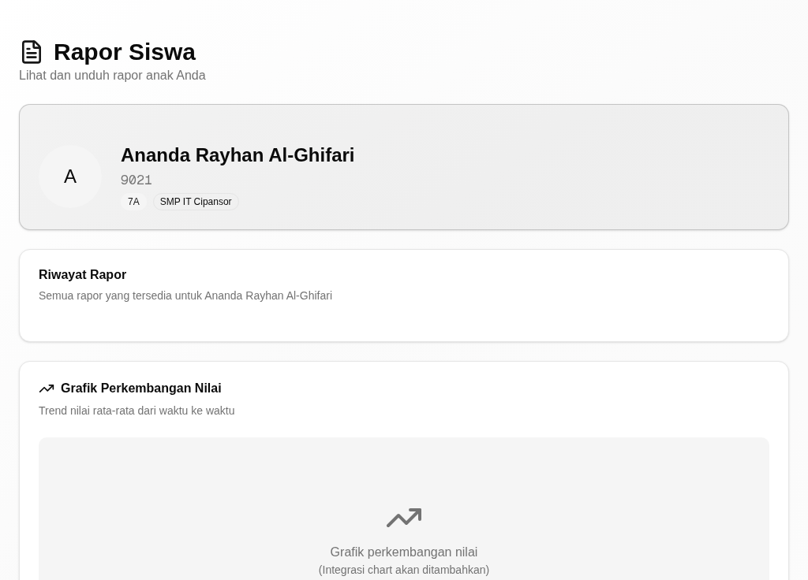
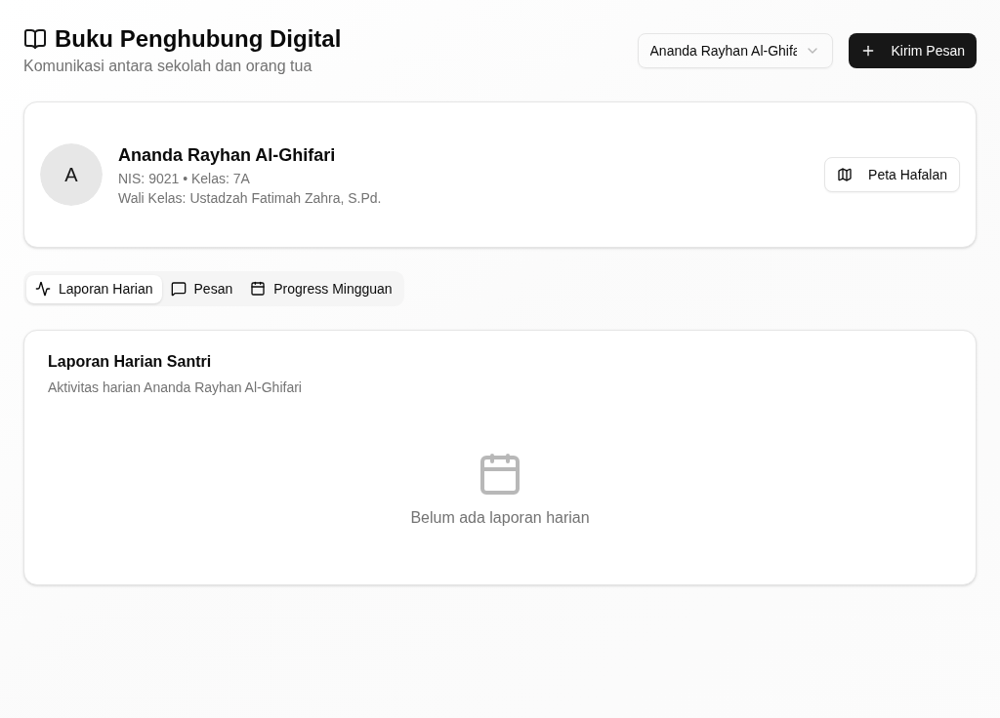
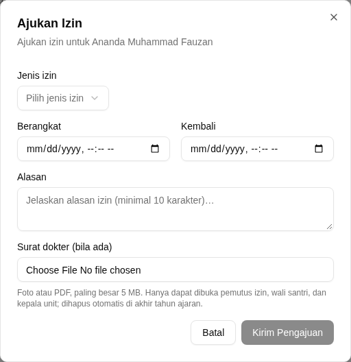
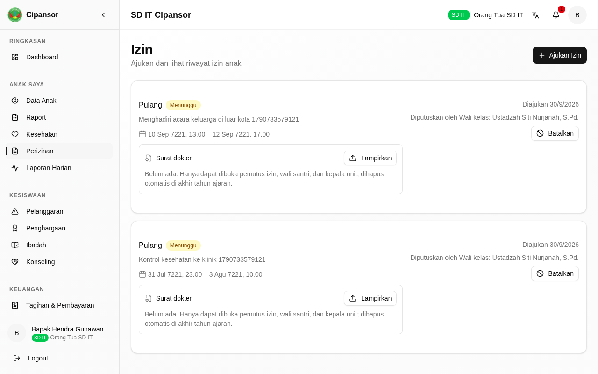
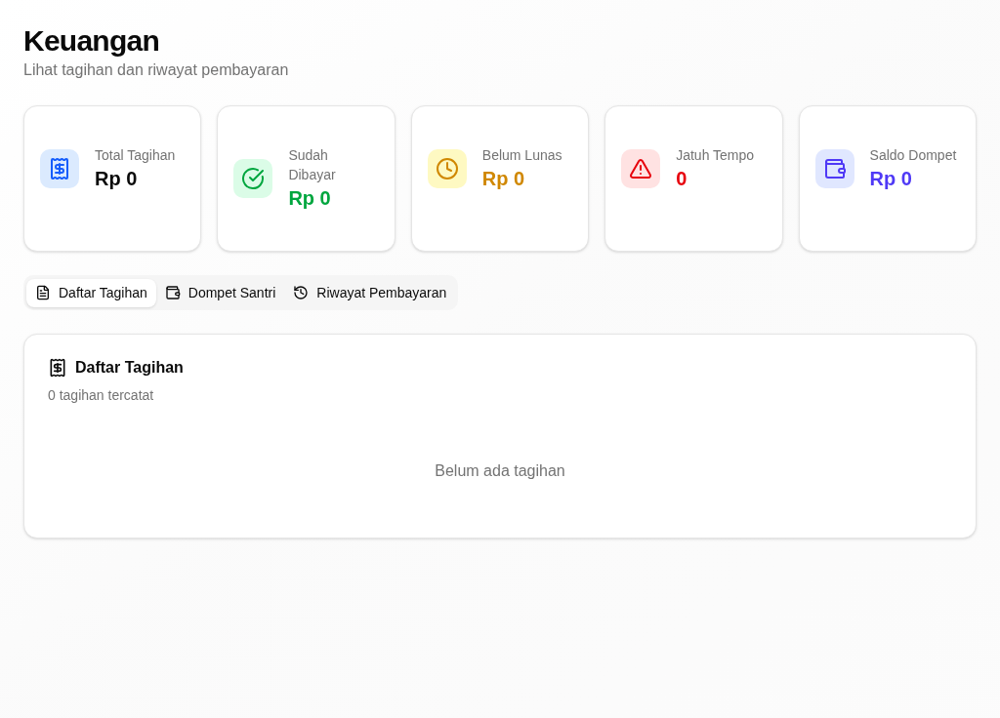

# Riwayat Revisi

| Versi | Tanggal | Basis aplikasi | Tingkat verifikasi | Perubahan |
|---|---|---|---|---|
| 0.1 | 30 September 2026 | aplikasi berjalan dari kode PR #512 (setelah `main` `2377f5fb`) | **T1 — terverifikasi di aplikasi berjalan** | Penyusunan awal; tiap kartu dijalankan dengan akun demo wali santri (`smpit.ortu@`, `sdit.ortu@`) pada tumpukan lokal (PostgreSQL + API :3001 + web :3000) dan memuat tangkapan layar asli |

> **Tingkat verifikasi T1.** Semua kartu tugas di bawah sudah **dijalankan pada
> aplikasi berjalan** dengan akun demo wali santri, dan tiap kartu memuat
> tangkapan layar asli. Bila Anda menemukan layar yang berbeda dari gambar di
> sini, laporkan kepada admin unit.

# 1. Tentang Buklet Ini

Buklet ini untuk **wali santri** (`*_ORANG_TUA`) — orang tua atau penanggung
jawab santri. Bagian umum (masuk, dasbor, konsep, glosarium) ada di *Panduan
Pengguna — Bagian Umum*.

Buklet ini menjelaskan versi aplikasi terbaru per 30 September 2026. Aplikasi
yang Anda pakai mungkin belum memuat semua perubahan itu; bila layar Anda
berbeda dari yang dijelaskan, tanyakan kepada admin unit. Di beberapa layar,
santri masih tertulis **Siswa**; buklet ini menulis nama tombol dan judul persis
seperti di layar.

## 1.1 Siapa Anda di aplikasi

Sebagai wali santri, dasbor awal Anda adalah halaman **Dashboard** di `/parent`.
Menu Anda berkelompok: **Anak Saya** (Data Anak, Raport, Kesehatan, Perizinan,
Laporan Harian), **Kesiswaan**, **Keuangan**, **Komunikasi**, dan **Informasi**.
Anda hanya melihat data **anak Anda sendiri**.

## 1.2 Yang bisa dan tidak bisa Anda lakukan

- Anda melihat data anak Anda: identitas, hafalan, rapor, kesehatan, laporan
  harian, izin, dan tagihan.
- Anda **mengajukan izin** untuk anak Anda; yang memutuskan adalah wali kelasnya
  (santri harian) atau musyrifnya (santri mukim), bukan Anda.
- Anda **tidak** dapat mengubah nilai, absensi, atau data akademik anak.
- Data anak lain tidak pernah tampil pada akun Anda.

## 1.3 Tugas dalam buklet ini

| Tugas | Seberapa sering | Menu |
|---|---|---|
| Melihat perkembangan anak | Sesuai kebutuhan | Anak Saya → Data Anak, Raport, Kesehatan, Laporan Harian |
| Mengajukan izin anak | Sesuai kebutuhan | Anak Saya → Perizinan |
| Memantau tagihan dan pembayaran | Bulanan | Keuangan → Tagihan & Pembayaran |

# 2. Tugas

## Melihat perkembangan anak

**Tujuan.** Memantau keadaan anak: identitas, hafalan, rapor, kesehatan, dan
laporan harian dari guru.

**Siapa.** Wali santri, untuk anaknya sendiri.

**Jalur menu.** Anak Saya → Data Anak (`/parent/children`). Halaman terkait:
Raport (`/parent/report-cards`), Kesehatan (`/parent/health`), Laporan Harian
(`/parent/daily-report`), dan Buku Penghubung (`/parent/buku-penghubung`).

**Sebelum mulai.** Anak Anda sudah terdaftar dan dikaitkan ke akun Anda oleh
admin unit.

**Langkah.**

1. Buka **Data Anak**.
   *Identitas anak, hafalan terakhir, dan keadaannya tampil.*
2. Buka **Raport**.
   *Riwayat rapor anak per semester tampil.*
3. Buka **Kesehatan**.
   *Catatan kesehatan anak dari UKS tampil.*
4. Buka **Laporan Harian** atau **Buku Penghubung**.
   *Laporan harian yang ditulis guru tampil.*

{width=14cm}

*Gambar 1. Data Anak: identitas, hafalan terakhir, dan keadaan anak.*

{width=14cm}

*Gambar 2. Riwayat Rapor anak per semester.*

{width=14cm}

*Gambar 3. Buku Penghubung Digital memuat laporan harian dari guru.*

**Hasilnya, dan giliran siapa berikutnya.** Anda membaca; tidak ada data yang
berubah. Bila ada yang perlu ditanyakan, hubungi wali kelas anak Anda.

**Bila tidak berhasil.**

| Yang terlihat | Penyebab umum | Yang perlu dilakukan |
|---|---|---|
| "Anda tidak memiliki akses ke data anak ini" | Anak itu bukan anak Anda, atau tautannya belum dibuat | Hubungi admin unit |
| Halaman kosong | Belum ada data pada periode itu | Muat ulang halaman; bila tetap, tanyakan admin unit |

**Ketersediaan.** Ada pada versi aplikasi yang dijelaskan buklet ini (lihat bagian 1).

## Mengajukan izin anak

**Tujuan.** Mengajukan permohonan izin untuk anak Anda.

**Siapa.** Wali santri. Yang memutuskan: wali kelas anak (santri harian) atau
musyrif anak (santri mukim).

**Jalur menu.** Anak Saya → Perizinan (`/parent/permits`).

**Sebelum mulai.** Anak Anda sudah dikaitkan ke akun Anda.

**Langkah.**

1. Buka **Perizinan**, lalu klik **Ajukan Izin**.
   *Kotak "Ajukan Izin" terbuka.*
2. Pada **Jenis izin**, pilih satu (mis. **Pulang**).
3. Isi **Berangkat** dan **Kembali** dengan tanggal dan jam.
4. Isi **Alasan**.
5. Klik **Kirim Pengajuan**.
   *Muncul pesan "Pengajuan izin terkirim"; izin tampil dengan status **Menunggu** dan keterangan **Diputuskan oleh**.*

{width=14cm}

*Gambar 4. Kotak Ajukan Izin: jenis izin, waktu berangkat dan kembali, serta alasan.*

{width=14cm}

*Gambar 5. Izin tampil dengan status Menunggu dan siapa yang akan memutuskannya.*

**Hasilnya, dan giliran siapa berikutnya.** Izin berstatus **Menunggu**. Giliran
wali kelas atau musyrif anak Anda memutuskannya. Bila disetujui, anak Anda
menunggu pintu gerbang mencatat keberangkatan dan kepulangan.

**Bila tidak berhasil.**

| Yang terlihat | Penyebab umum | Yang perlu dilakukan |
|---|---|---|
| "Waktu kembali harus sesudah waktu berangkat" | Tanggal **Kembali** lebih awal daripada **Berangkat** | Betulkan tanggalnya |
| "Alasan minimal 10 karakter" | Alasan terlalu pendek | Tulis alasan yang lebih lengkap |

**Ketersediaan.** Ada pada versi aplikasi yang dijelaskan buklet ini (lihat bagian 1).

## Memantau tagihan dan pembayaran

**Tujuan.** Melihat tagihan anak dan status pembayarannya.

**Siapa.** Wali santri, untuk anaknya sendiri.

**Jalur menu.** Keuangan → Tagihan & Pembayaran (`/parent/finance`).

**Langkah.**

1. Buka **Tagihan & Pembayaran**.
   *Daftar tagihan anak beserta statusnya tampil.*
2. Periksa status tiap tagihan.
   *Tagihan yang sudah dibayar dan diverifikasi berstatus lunas; yang belum tampil sebagai tunggakan.*

{width=14cm}

*Gambar 6. Tagihan & Pembayaran: tagihan anak beserta statusnya.*

**Hasilnya, dan giliran siapa berikutnya.** Anda membaca status tagihan. Untuk
pembayaran dan verifikasinya, hubungi bendahara atau admin unit.

**Bila tidak berhasil.**

| Yang terlihat | Penyebab umum | Yang perlu dilakukan |
|---|---|---|
| Tagihan tidak sesuai | Data pembayaran belum diverifikasi bendahara | Hubungi bendahara unit |

**Ketersediaan.** Ada pada versi aplikasi yang dijelaskan buklet ini (lihat bagian 1).

# 3. Bila Ada Masalah

- **Tidak bisa membuka halaman.** Laporkan ke admin unit; sebutkan jalur menu
  dan pesan yang muncul.
- **Anak tidak tampil.** Hubungi admin unit untuk memastikan tautan akun ke
  santri.
- **Halaman Pesan belum jalan.** Untuk sementara, hubungi wali kelas lewat
  telepon atau WhatsApp.

Ke mana melapor: **admin unit** anak Anda (bukan nama orang tertentu).
