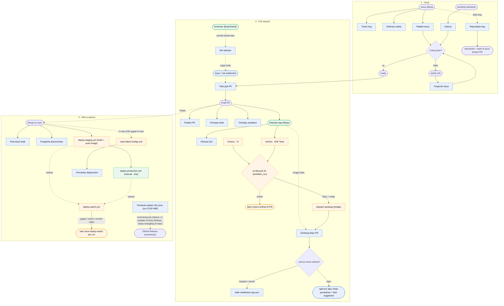
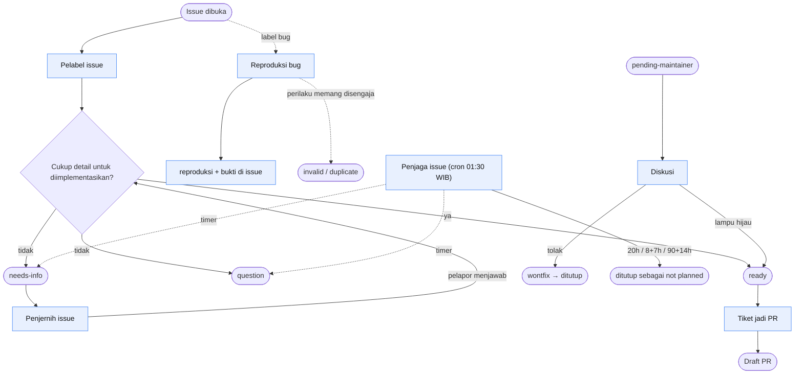
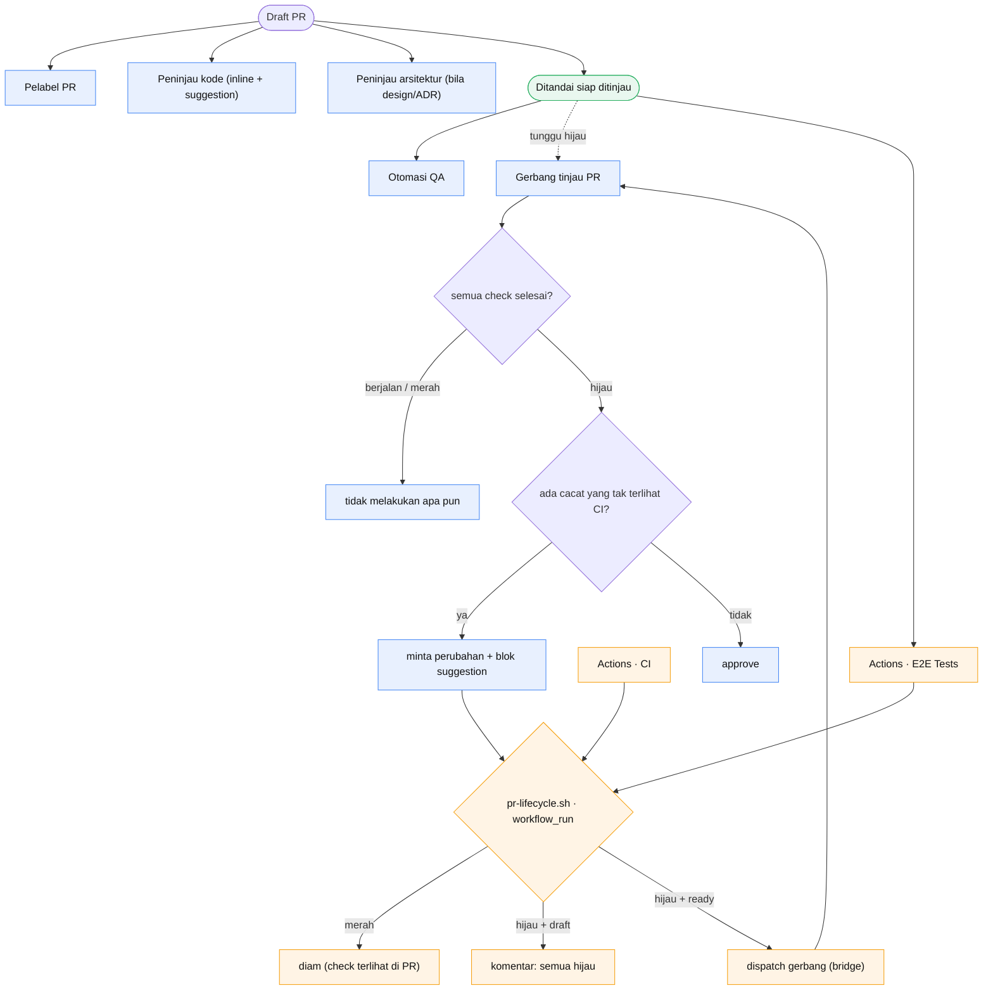
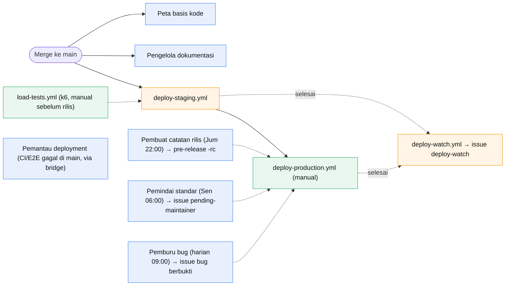
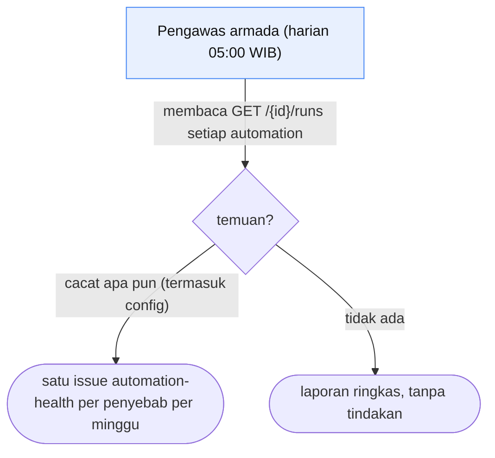

# Alur automation SDLC

Pipeline yang membawa perubahan dari issue yang dilaporkan sampai produksi,
terbagi ke dua jalur yang masing-masing mengerjakan bagian yang paling cocok
untuknya:

- **Automation cloud** (`app.all-hands.dev`) — agen LLM yang membaca konteks dan
  menilai: triase, pelabelan, tinjauan, menulis perbaikan. Ia tidak pernah
  merge, dan menyerahkan keputusan draft/ready kepada manusia atau gerbang
  tinjau.
- **GitHub Actions** — konsekuensi tetap yang harus menyala andal dan tidak
  boleh memakan token: jembatan hasil CI yang men-dispatch gerbang, penyapu
  duplikat, pemeriksaan ketidaksesuaian label, dan deploy. Aturannya ada di
  `.github/scripts/` supaya bisa dijalankan manual.

Jadwal cron cloud dalam **Asia/Jakarta (WIB)**; jadwal GHA dalam **UTC**.
Setiap pemicu komentar membawa guard footer
`!icontains(comment.body, 'This comment was created by an AI agent')`, karena
automation memposting lewat akun yang sama dengan pelapor dan tanpa itu akan
memicu dirinya sendiri (insiden #680). `Bot sebutan` tidak memakai guard itu;
ia memakai `destination: continue_conversation`, sehingga setiap sebutan tentang
satu PR/issue berbagi satu conversation dan ledakan sebutan tidak menghabiskan
kolam sandbox.

**Satu penulis, satu gerbang.** Hanya `Tiket jadi PR` yang membuka pull request.
Automation lain yang menemukan masalah membuka **issue**, lalu maintainer
menerapkan `bot-implement` dan `Tiket jadi PR` yang mengerjakannya. Ini menjaga
satu jalur PR (satu tempat gate, satu bentuk diff) dan membuat penulis PR selalu
`adminypc`.

## Menyeluruh

## Siklus hidup issue

## Siklus hidup pull request — gerbang CI

## Rilis & operasi

## Pengawasan armada

## Armada terjadwal (cron cloud, WIB)

| Waktu           | Automation            | Tugas                                                           |
| --------------- | --------------------- | --------------------------------------------------------------- |
| 05:00 harian    | Pengawas armada       | kesehatan semua automation                                      |
| 09:00 harian    | Pemburu bug           | bug terbukti → satu issue berbukti                              |
| 06:00 Senin     | Pemindai standar      | penyimpangan standar → `pending-maintainer`                     |
| 08:15 Senin     | Pemindai celah uji    | satu celah uji berisiko → issue                                 |
| 22:00 Jumat     | Pembuat catatan rilis | memotong pre-release `-rc` berikutnya → catatan di body Release |
| 08:30 tanggal 1 | Audit kematangan      | menilai 18 item → satu issue                                    |

Actions terjadwal: hanya `duplicate-sweep` (harian 01:30 UTC = 08:30 WIB,
menutup issue atau PR duplikat 7 hari setelah peringatan). Actions berbasis
event: `deploy-watch.yml`, sesudah tiap `Deploy staging`/`Deploy production`
selesai. Manual: `load-tests.yml` (k6 vs staging), langkah wajib sebelum tiap
rilis produksi (`docs/deploy-azure.md` → "How a change is released").
Satu-satunya catatan rilis berasal dari body Release `Pembuat catatan rilis`,
bukan berkas di repositori.

Yang **sengaja tidak ada** (diputuskan 2026-10-10): tidak ada penutupan issue
berdasarkan umur — issue yang menunggu keputusan yayasan atau rilis memang
lama, dan stale bot menutupnya tanpa ada yang menyelesaikan; tidak ada uji
beban terjadwal — tanpa lalu lintas nyata, run berkala mengukur staging yang
sama-sama sepi; tidak ada pantauan metrik terjadwal sebelum ada pengguna
nyata.

## Peran — siapa berbuat sebagai siapa

| Automation            | Peran                                                                                                          |
| --------------------- | -------------------------------------------------------------------------------------------------------------- |
| Triase bug            | triase issue baru, cari duplikat, label + komentar keparahan/area                                              |
| Estimasi usaha        | ukuran XS–XL + area tersentuh + risiko, dikalibrasi ke PR lama                                                 |
| Peta basis kode       | membandingkan peta arsitektur dengan kode → issue bila menyimpang                                              |
| Peninjau arsitektur   | meninjau dokumen desain/RFC/ADR                                                                                |
| Reproduksi bug        | menyelidiki issue `bug`, menempel reproduksi + bukti ke issue                                                  |
| Tiket jadi PR         | **satu-satunya pembuat PR**; label `bot-implement` memicunya                                                   |
| Bot sebutan           | menyerahkan permintaan `@openhands` yang berupa pekerjaan ke issue + `bot-implement`, atau menjawab pertanyaan |
| Peninjau kode         | tinjauan baris demi baris + blok `suggestion`                                                                  |
| Pemindai celah uji    | satu celah pengujian berisiko → issue                                                                          |
| Otomasi QA            | menjalankan alur yang berubah, melaporkan lulus/gagal                                                          |
| Uji beban             | k6 vs staging — kini `load-tests.yml`, dijalankan manual sebelum tiap rilis (bukan cron)                       |
| Pemantau deployment   | CI atau E2E yang gagal di `main` → issue diagnosis (penyebabnya)                                               |
| Pembuat catatan rilis | pre-release `-rc` + catatan rilis dari conventional commits                                                    |
| Pengelola dokumentasi | merge yang berdampak dokumentasi → issue dokumentasi basi                                                      |
| Pelabel issue         | tipe + prioritas + kesiapan (`ready`/`needs-info`/`question`/`duplicate`)                                      |
| Penjernih issue       | menilai ulang saat pelapor menjawab `needs-info`                                                               |
| Pelabel PR            | menyalin tipe + prioritas issue tertaut ke PR                                                                  |
| Gerbang tinjau PR     | **satu-satunya yang boleh APPROVE**; menunggu CI hijau                                                         |
| Pemburu bug           | bug proaktif yang bisa direproduksi → issue berbukti                                                           |
| Pemindai standar      | standar/regulasi terbaru → issue `pending-maintainer`                                                          |
| Penjaga issue         | timer usang untuk `needs-info`/`question`/lainnya                                                              |
| Diskusi               | berdiskusi dengan maintainer; setuju → `ready`, tolak → `wontfix`                                              |
| Pengawas armada       | kesehatan armada → satu issue `automation-health`                                                              |
| Audit kematangan      | menilai 18 item kerangka → satu issue laporan                                                                  |

## Identitas — siapa berbuat sebagai siapa

Dua akun GitHub membawa armada ini, dan pemisahannya disengaja: akun yang
_menulis_ artefak tidak pernah menjadi akun yang _menyetujuinya_.

| Akun           | Peran                                          | Automation                                                                                                                                                                                          |
| -------------- | ---------------------------------------------- | --------------------------------------------------------------------------------------------------------------------------------------------------------------------------------------------------- |
| `adminypc`     | Penulis — membuat issue dan pull request       | Peta basis kode, Reproduksi bug, Tiket jadi PR, Bot sebutan, Pemindai celah uji, Pemantau deployment, Pengelola dokumentasi, Pemburu bug, Pemindai standar, Pengawas armada, Audit kematangan       |
| `cipansor-bot` | Komunikator — komentar, label, review, approve | Triase bug, Estimasi usaha, Peninjau arsitektur, Peninjau kode, Otomasi QA, Uji beban, Pembuat catatan rilis, Pelabel issue, Penjernih issue, Pelabel PR, Gerbang tinjau PR, Penjaga issue, Diskusi |

- Pull request harus teratribusi ke penulis, jadi automation yang membukanya
  memakai `GITHUB_TOKEN` (`adminypc`). Selebihnya memposting lewat
  `GITHUB_BOT_TOKEN` (`cipansor-bot`).
- `Gerbang tinjau PR` adalah satu-satunya automation yang boleh `APPROVE`. Ia
  berjalan sebagai `cipansor-bot`, identitas yang berbeda dari penulis
  `adminypc`, sehingga GitHub menerima approval-nya; bot yang menyetujui PR yang
  ia tulis sendiri adalah tinjauan diri dan ditolak.
- Setiap automation adalah runner kustom dengan allowlist rahasia: `GITHUB_TOKEN`
  selalu ada, `GITHUB_BOT_TOKEN` hanya untuk komunikator. Runner preset
  meneruskan semua rahasia dan tidak dipakai.

## Mengapa dibentuk begini

- **Jembatan deterministik lebih dulu, event webhook sebagai pelengkap.**
  Integrasi GitHub yang terdokumentasi mengenal `pull_request`, `issues`,
  `issue_comment`, `push`, `release`, dan `pull_request_review`; API automation
  juga menerima `workflow_run`, tetapi pengantarannya belum terbukti, jadi ia
  bukan sandaran. Karena itu `Gerbang tinjau PR` tidak _menunggu_ CI: ia
  bertindak saat dipicu dan memeriksa check-run sendiri, tidak melakukan apa pun
  selama masih ada yang berjalan, dan `pr-lifecycle.yml` (pada `workflow_run`)
  men-dispatch-nya begitu semua check wajib lulus. `Pemantau deployment` memakai
  pola yang sama: `main-failure-bridge.yml` men-dispatch-nya saat CI atau E2E di
  `main` selesai gagal dan run yang gagal itu masih menjadi tip `main`; event `workflow_run` di automation
  itu hanya pelengkap best-effort, dan promptnya melakukan dedupe per run ID agar
  tidak ada issue ganda. Keduanya butuh rahasia repo `OPENHANDS_API_KEY`.
- **Konsekuensi deterministik milik Actions.** Jembatan hasil CI, penutupan
  duplikat 7 hari, pemeriksaan ketidaksesuaian label, jembatan kegagalan
  `main`, dan pengawas deploy adalah skrip, bukan agen: harus menyala tepat waktu dan tidak memakan
  token.
- **Satu masalah, satu peringatan.** Setiap kegagalan punya tepat satu
  pelapor, dan pelapor itu menyimpan penanda per run sehingga run yang sama
  tidak dilaporkan dua kali:

  | Yang gagal | Pelapor | Isi issue |
  |---|---|---|
  | CI atau E2E di `main` | `main-failure-bridge.yml` → `Pemantau deployment` | diagnosis penyebab (kode mana, mengapa) — butuh penilaian, jadi agen |
  | `Deploy staging`/`Deploy production` gagal, macet > 45 menit, atau hijau tetapi `/healthz` tidak menyajikan commit-nya | `deploy-watch.yml` (skrip) | id run, commit, baris log yang gagal — gejala yang pasti, jadi skrip |
  | Situs menurun tanpa deploy (kontainer restart, pengaturan rusak) | Health check App Service + availability test Application Insights | dari platform, di luar repositori |

  Run deploy yang `skipped` (gerbangnya tidak jalan karena CI/E2E gagal) tidak
  dilaporkan pengawas deploy: penyebabnya sudah dilaporkan bridge. Rantai
  `E2E Tests (push) → Deploy staging → deploy-watch.yml` adalah tingkat
  `workflow_run` ketiga, batas maksimum GitHub; jangan menambah tingkat
  keempat. Dasarnya: Google SRE meminta setiap peringatan dapat ditindaklanjuti,
  membedakan gejala ("apa yang rusak") dari penyebab ("mengapa"), dan
  menghindari halaman ganda untuk masalah yang sama; manajemen event PagerDuty
  menyatukan event dengan kunci dedupe per masalah; dan DORA mengukur
  *change fail rate* serta *failed deployment recovery time*, yang hanya bisa
  dihitung bila setiap deploy gagal tercatat tepat sekali. Rujukan di bawah.
- **Satu penulis PR.** Hanya `Tiket jadi PR` yang membuka PR. Semua temuan lain
  membuka issue; `bot-implement` menyerahkannya ke penulis tunggal itu. Ini
  menghapus PR spekulatif dari automation lain dan menjaga satu bentuk diff.
- **Gate deskripsi PR kini keras.** `pr-description-checks.yml` job `template`
  (check bernama `PR template reminder`) **gagal** selama templat belum lengkap,
  issue tertaut belum berlabel `ready`/`bot-implement`, atau prosanya terbaca
  sebagai Bahasa Inggris. Job ini merah, tetapi check-nya **belum** ada di
  required status checks ruleset `main` (Build, Lint, Tests, Security, E2E Tests
  (Chromium)), jadi saat ini ia belum menahan merge — menambahkannya adalah
  langkah maintainer dengan akses admin. Ini menyamakan repo dengan standar
  OpenHands (Why/Summary/How to test + issue `ready-for-dev`). Job `visual`
  tetap advisory.
- **CI merah atau review minta-perubahan tidak mengembalikan PR ke draft.** PR
  tetap terbuka dan check yang gagal terlihat padanya; gerbang memposting review
  minta-perubahan dan branch protection menahan merge. Mengembalikan ke draft
  pernah dicoba dan dihapus — itu menyembunyikan pekerjaan yang sedang berjalan.
  Begitu penulis mendorong head baru dan head itu hijau, `pr-lifecycle.sh`
  men-dispatch gerbang lagi; permintaan perubahan hanya menahan PR selama ia
  masih pada head saat ini (#727).
- **Catatan rilis hidup di GitHub Release, bukan di berkas.** `Pembuat catatan
rilis` berjalan mingguan, memotong pre-release `-rc` berikutnya, dan menulis
  catatan ke body Release dari conventional commit sejak rilis resmi terakhir;
  ia tidak pernah menulis `CHANGELOG.md` ke repositori dan tidak pernah membuka
  PR changelog. Rilis resmi (non-`rc`) adalah tindakan manual maintainer.
- **Armada adalah kerangka plus saluran pipanya.** `Triase bug` … `Gerbang tinjau
PR` (item 1–18) memetakan satu-ke-satu ke 18 item Agentic SDLC; `Pelabel issue`
  … `Pengawas armada` menambahkan pipeline label/siklus hidup, pemburu proaktif,
  dan pengawas; `Audit kematangan` menilai 18 item yang sama dan menyebut yang
  terlemah, sehingga armada bisa diarahkan dengan sengaja.
- **Peringatan tidak pernah memblokir, kecuali gate templat.** Hanya job
  `template` yang memblokir; `visual-evidence` hanya berkomentar.
- **Rollback manual.** `deploy-watch.yml` dan `Pemantau deployment` hanya
  melaporkan; tidak ada yang memutar balik, menjalankan ulang, atau mengganti
  kontainer. Manusia memutuskan (`docs/deploy-azure.md`).
- **Tinjauan mengusulkan perbaikannya.** `Peninjau kode`/`Peninjau
arsitektur`/`Gerbang tinjau PR` memposting blok `suggestion` GitHub sehingga
  perbaikan berlaku dengan satu klik.
- **Guard self-comment wajib.** Setiap automation yang dipicu komentar menjaga
  pemeriksaan footer `This comment was created by an AI agent` (#680).

## Rujukan

- Google SRE Book, "Monitoring Distributed Systems" — setiap peringatan harus
  dapat ditindaklanjuti; gejala vs penyebab; halaman ganda untuk satu masalah:
  <https://sre.google/sre-book/monitoring-distributed-systems/>
- PagerDuty, "Event Management" — `dedup_key` menyatukan event satu masalah ke
  satu insiden: <https://support.pagerduty.com/main/docs/event-management>
- DORA, "DORA's software delivery metrics: the four keys" — *change fail rate*,
  *failed deployment recovery time*: <https://dora.dev/guides/dora-metrics-four-keys/>
- GitHub Docs, "Events that trigger workflows" → `workflow_run` — paling banyak
  tiga tingkat rantai, dan hanya dari berkas di cabang bawaan:
  <https://docs.github.com/en/actions/reference/workflows-and-actions/events-that-trigger-workflows#workflow_run>
- Microsoft Learn, "Monitor App Service instances by using Health check":
  <https://learn.microsoft.com/azure/app-service/monitor-instances-health-check>
- Microsoft Learn, "Application Insights availability tests":
  <https://learn.microsoft.com/azure/azure-monitor/app/availability>
- Grafana k6, "Automated performance testing" — mulai dari smoke test,
  bandingkan run yang identik: <https://grafana.com/docs/k6/latest/testing-guides/automated-performance-testing/>
- Drew DeVault, "GitHub stale bot considered harmful" (2021):
  <https://drewdevault.com/2021/10/26/stalebot.html>; Khatoonabadi dkk.,
  "Understanding the Helpfulness of Stale Bot for Pull-Based Development"
  (ACM TOSEM 2023): <https://doi.org/10.1145/3624739>
