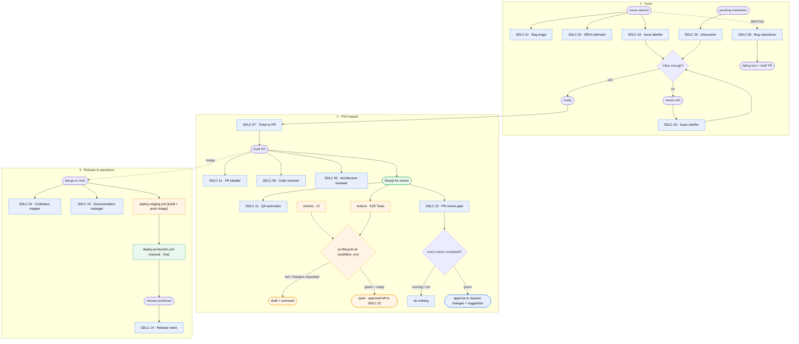
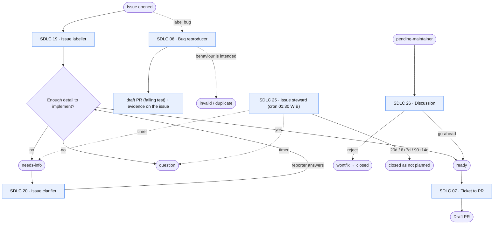
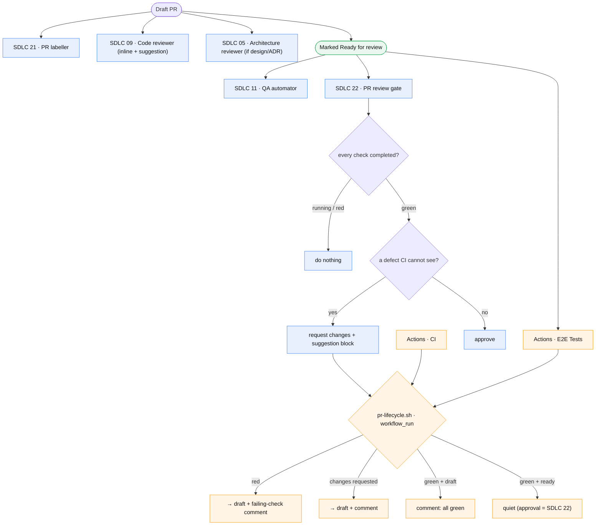
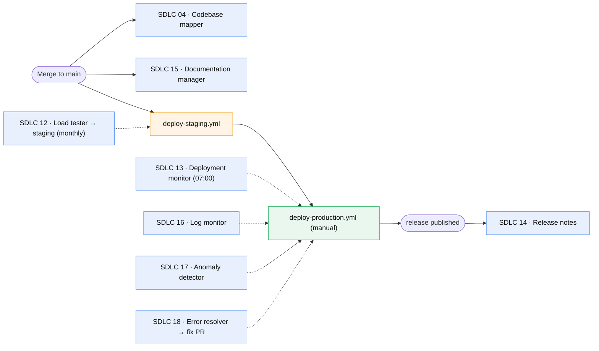
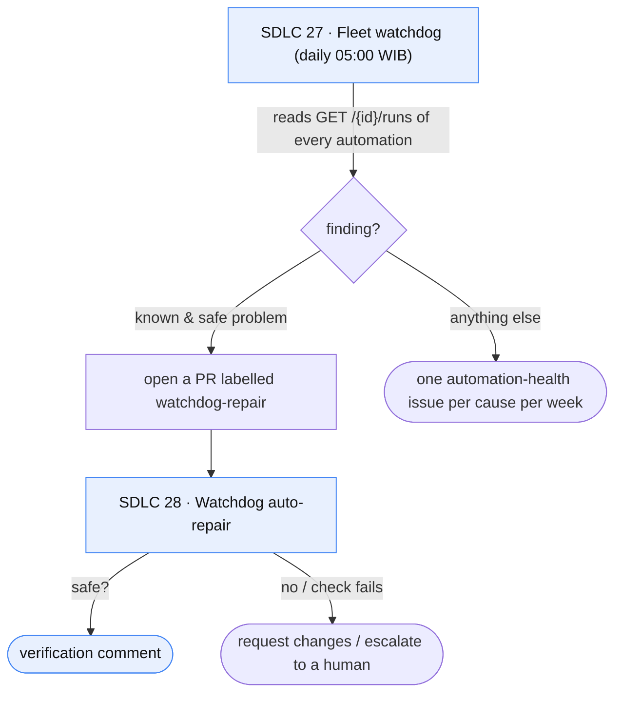

# SDLC automation flow

The pipeline that carries a change from a filed issue to production, split
across two lanes that each do the part they are good at:

- **Cloud automation** (`app.all-hands.dev`) — an LLM agent that reads context
  and makes a judgement: triage, labelling, review, writing a fix. It never
  merges, and leaves the draft/ready decision to a human or the review gate.
- **GitHub Actions** — fixed consequences that must fire reliably and must not
  cost tokens: the red-CI draft revert, the duplicate sweep, the label-mismatch
  check, the deploys. The rules live in `.github/scripts/` so they run by hand.

Cloud cron schedules are in **Asia/Jakarta (WIB)**; GHA schedules are **UTC**.
Every comment trigger carries a footer guard, because an automation posts
through the same account as the reporter and would otherwise re-trigger itself
(incident #680).

## End to end

## Issue lifecycle

## Pull request lifecycle — the CI gate

## Release & operations

## Fleet supervision

## Scheduled fleet (Cloud cron, WIB)

| Time | Automation | Job |
|---|---|---|
| 01:30 daily | SDLC 25 · Issue steward | age out stalled issues |
| 05:00 daily | SDLC 27 · Fleet watchdog | health of all 28 automations |
| 07:00 daily | SDLC 13 · Deployment monitor | failed/stuck deploy → issue |
| 07:15 daily | SDLC 16 · Log monitor | log patterns → issue |
| 07:30 daily | SDLC 17 · Anomaly detector | metric anomalies → ticket |
| 07:45 daily | SDLC 18 · Error resolver | production error → fix PR |
| 09:00 daily | SDLC 23 · Bug hunter | proven bug → issue + draft PR |
| 06:00 Mon | SDLC 24 · Standard scout | standards divergence → `pending-maintainer` |
| 08:00 Mon | SDLC 03 · Feedback ingestion | feedback clusters → issue |
| 08:15 Mon | SDLC 10 · Coverage expander | test gaps → PR |
| 03:00 1st | SDLC 12 · Load tester | k6 vs staging → regression |

Scheduled Actions: `duplicate-sweep` (daily, closes a duplicate 7 days after the
warning) and `load-tests.yml` (daily 18:00 UTC = 01:00 WIB).

## Why it is shaped this way

- **There is no CI event in the OpenHands webhook.** The GitHub integration
  knows `pull_request`, `issues`, `issue_comment`, `push`, `release` and
  `pull_request_review` — not `check_run` or `workflow_run`. So SDLC 22 cannot
  be *waited* on until CI is green; it acts when triggered and checks the check
  runs itself, doing nothing while any is still running. A precise green gate
  needs the bridge: `pr-lifecycle.yml` (already on `workflow_run`) calling
  `POST /api/automation/v1/{id}/dispatch` — that needs an `OPENHANDS_API_KEY`
  repo secret.
- **Deterministic consequences belong to Actions.** The red-CI draft revert, the
  changes-requested revert, the 7-day duplicate close and the label-mismatch
  check are scripts, not agents: they must fire on time and cost no tokens.
- **Warnings never block.** `pr-description-checks.yml` only comments; it cannot
  fail a build or a release.
- **Rollback is manual.** SDLC 13 reports a bad deploy; it never rolls back.
- **Review proposes the fix.** SDLC 05/09/22 post GitHub `suggestion` blocks so a
  fix applies in one click.
- **Self-comment guard is mandatory.** Every comment-triggered automation keeps
  the `This comment was created by an AI agent` footer check (#680).
