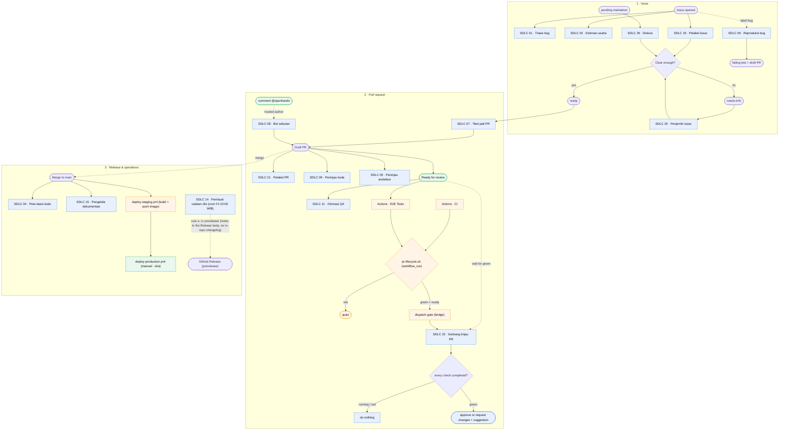
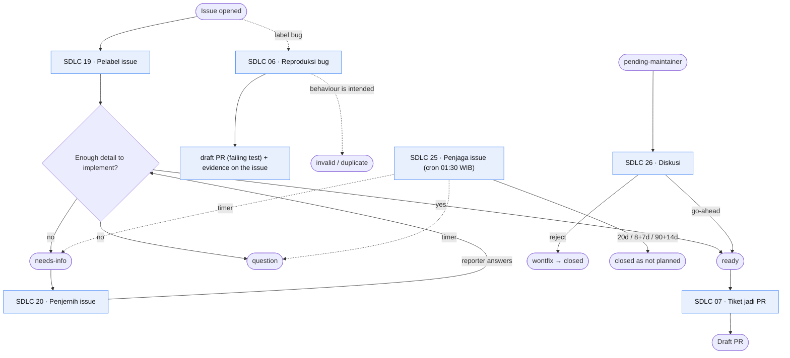
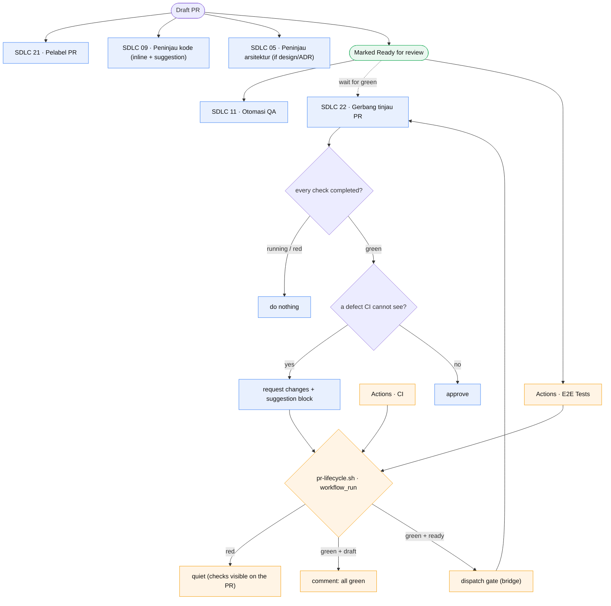
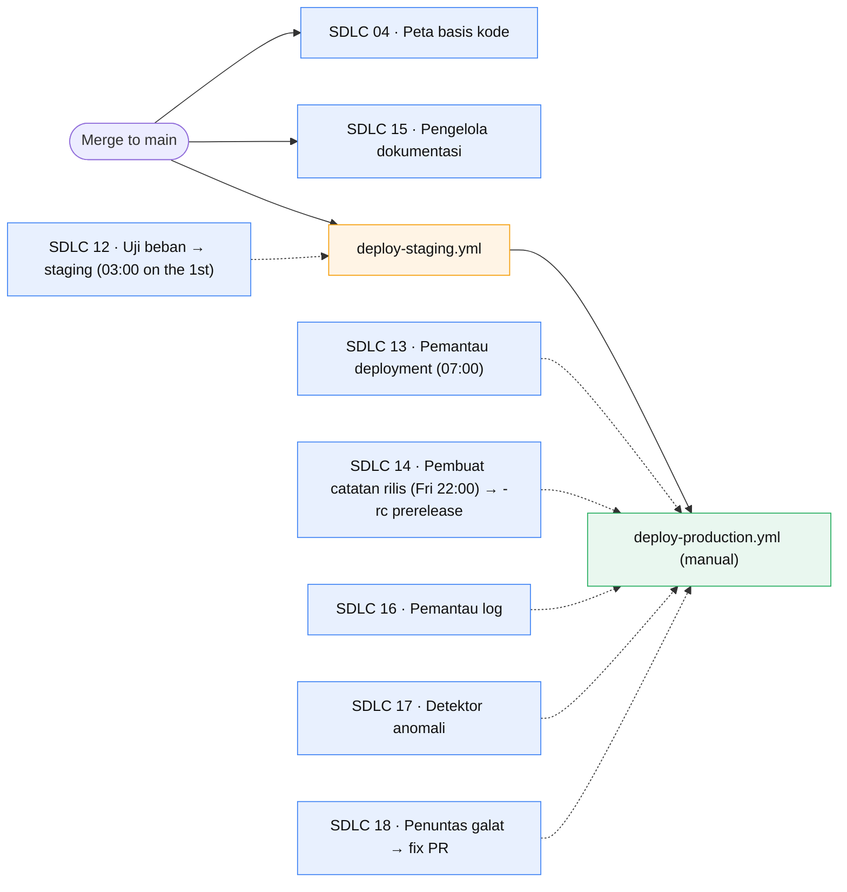
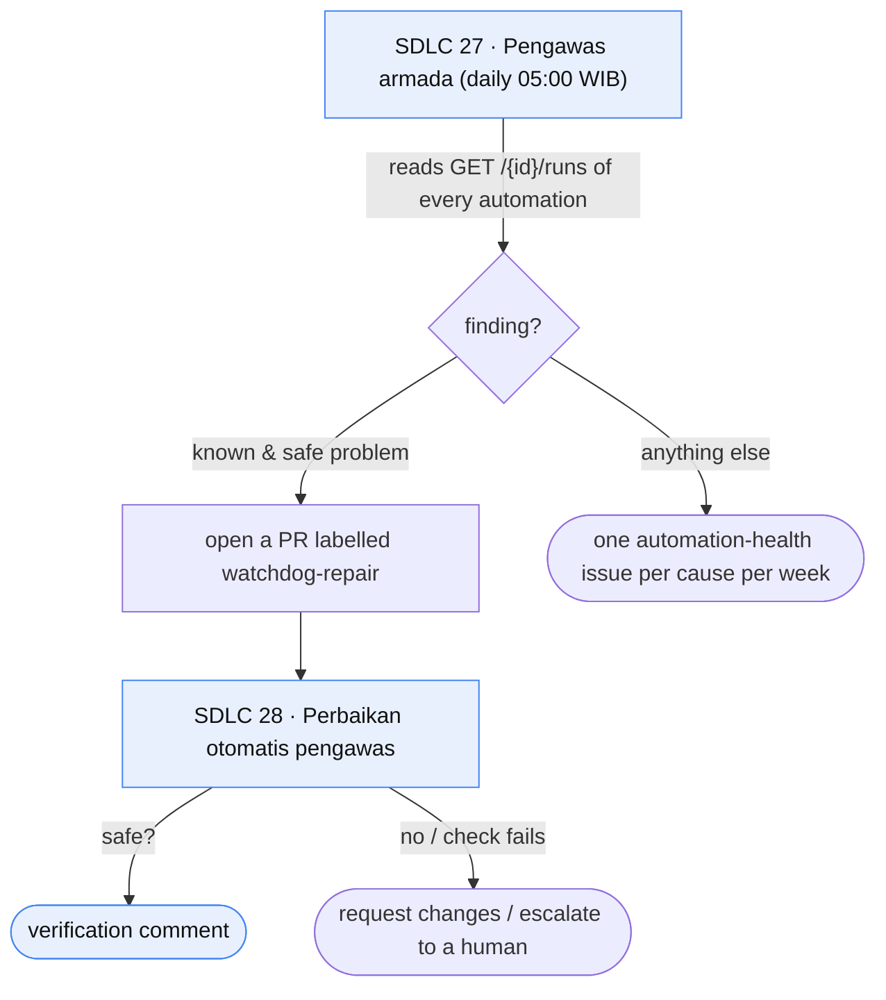

# SDLC automation flow

The pipeline that carries a change from a filed issue to production, split
across two lanes that each do the part they are good at:

- **Cloud automation** (`app.all-hands.dev`) — an LLM agent that reads context
  and makes a judgement: triage, labelling, review, writing a fix. It never
  merges, and leaves the draft/ready decision to a human or the review gate.
- **GitHub Actions** — fixed consequences that must fire reliably and must not
  cost tokens: the CI-result bridge that dispatches the gate, the duplicate
  sweep, the label-mismatch check, the deploys. The rules live in
  `.github/scripts/` so they run by hand.

Cloud cron schedules are in **Asia/Jakarta (WIB)**; GHA schedules are **UTC**.
Every comment trigger carries the footer guard
`!icontains(comment.body, 'This comment was created by an AI agent')`, because an
automation posts through the same account as the reporter and would otherwise
re-trigger itself (incident #680). SDLC 08 (mentioned below) instead sets
`destination: continue_conversation`, so every mention about one PR/issue shares a
single conversation and a burst cannot exhaust the sandbox pool.

## End to end

## Issue lifecycle

## Pull request lifecycle — the CI gate

## Release & operations

## Fleet supervision

## Scheduled fleet (Cloud cron, WIB)

| Time | Automation | Job |
|---|---|---|
| 01:30 daily | SDLC 25 · Penjaga issue | age out stalled issues |
| 05:00 daily | SDLC 27 · Pengawas armada | health of all 29 automations |
| 07:00 daily | SDLC 13 · Pemantau deployment | failed/stuck deploy → issue |
| 07:15 daily | SDLC 16 · Pemantau log | log patterns → issue |
| 07:30 daily | SDLC 17 · Detektor anomali | metric anomalies → ticket |
| 07:45 daily | SDLC 18 · Penuntas galat | production error → fix PR |
| 09:00 daily | SDLC 23 · Pemburu bug | proven bug → issue + draft PR |
| 06:00 Mon | SDLC 24 · Pemindai standar | standards divergence → `pending-maintainer` |
| 08:00 Mon | SDLC 03 · Serapan umpan balik | feedback clusters → issue |
| 08:15 Mon | SDLC 10 · Pemindai celah uji | one high-risk test gap → issue |
| 22:00 Fri | SDLC 14 · Pembuat catatan rilis | cut the next `-rc` prerelease → notes in the Release body |
| 03:00 1st | SDLC 12 · Uji beban | k6 vs staging → regression |
| 08:30 1st | SDLC 29 · Audit kematangan | rate the 18 items → one issue |

Scheduled Actions: `duplicate-sweep` (daily 01:30 UTC = 08:30 WIB, closes a duplicate issue or
PR 7 days after the warning). There is **no** `load-tests.yml` in
`.github/workflows/` — SDLC 12 (Cloud cron) is the only load runner today; the
only changelog comes from SDLC 14's Release body, not a workflow.

## Identity — who acts as whom

Two GitHub accounts carry the fleet, and the split is deliberate: the account
that *writes* an artifact is never the account that *approves* it.

| Account | Role | Automations |
|---|---|---|
| `adminypc` | Author — creates issues and pull requests | 03, 04, 06, 07, 08, 10, 13, 15, 16, 17, 18, 23, 24, 27 |
| `cipansor-bot` | Communicator — comments, labels, reviews, approves | 01, 02, 05, 09, 11, 12, 14, 19, 20, 21, 22, 25, 26, 28, Audit |

- A pull request must be attributed to a writer, so an automation that opens one
  keeps `GITHUB_TOKEN` (`adminypc`). Everything else posts through
  `GITHUB_BOT_TOKEN` (`cipansor-bot`).
- `SDLC 22 · Gerbang tinjau PR` is the only automation that may `APPROVE`. It
  runs as `cipansor-bot`, a different identity from the `adminypc` author, so
  GitHub accepts the approval; a bot that approved a PR it wrote itself would be
  a self-review and is rejected.
- Each automation is a custom runner with a secret allowlist: `GITHUB_TOKEN` is
  always present, `GITHUB_BOT_TOKEN` only for the communicators. The preset
  runner forwards every secret and is not used.

## Why it is shaped this way

- **There is no CI event in the OpenHands webhook.** The GitHub integration
  knows `pull_request`, `issues`, `issue_comment`, `push`, `release` and
  `pull_request_review` — not `check_run` or `workflow_run`. So SDLC 22 cannot
  be *waited* on until CI is green; it acts when triggered and checks the check
  runs itself, doing nothing while any is still running. The bridge makes the
  green gate precise: `pr-lifecycle.yml` (on `workflow_run`) dispatches SDLC 22
  the moment every required check passes, so the gate never races a fresh CI
  run. It needs an `OPENHANDS_API_KEY` repo secret.
- **Deterministic consequences belong to Actions.** The CI-result bridge, the
  7-day duplicate close and the label-mismatch check are scripts, not agents:
  they must fire on time and cost no tokens.
- **A red CI or a changes-requested review never reverts the PR to draft.** The
  PR stays open and the failing checks are visible on it; the gate posts the
  request-changes review and branch protection holds the merge. Reverting to
  draft was tried and removed — it hides work in progress and a human can mark
  it ready again without the lifecycle guard's help.
- **Release notes live in the GitHub Release, not in a file.** SDLC 14 runs weekly,
  cuts the next `-rc` prerelease and writes the notes into the Release body from
  the conventional commits since the last official release; it never writes
  `CHANGELOG.md` into the repository and never opens a changelog PR. The official
  (non-`rc`) release is a maintainer's manual act.
- **The fleet is the framework plus its plumbing.** SDLC 01–18 map one-to-one to
  the 18 Agentic SDLC items; SDLC 19–28 add the label/lifecycle pipelines, the
  proactive hunter and the watchdog. SDLC 29 is a monthly audit that rates the
  same 18 items and names the weakest, so the fleet can be steered deliberately.
- **Warnings never block.** `pr-description-checks.yml` only comments; it cannot
  fail a build or a release.
- **Rollback is manual.** SDLC 13 reports a bad deploy; it never rolls back.
- **Review proposes the fix.** SDLC 05/09/22 post GitHub `suggestion` blocks so a
  fix applies in one click.
- **Self-comment guard is mandatory.** Every comment-triggered automation keeps
  the `This comment was created by an AI agent` footer check (#680).
